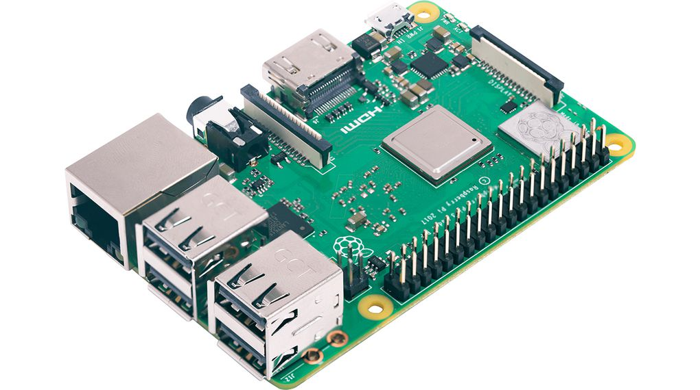
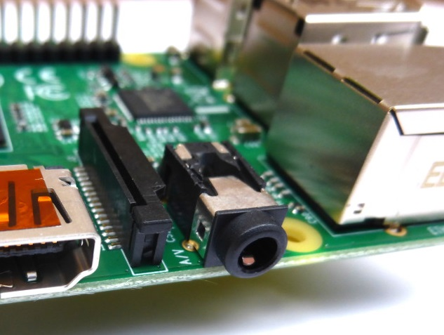
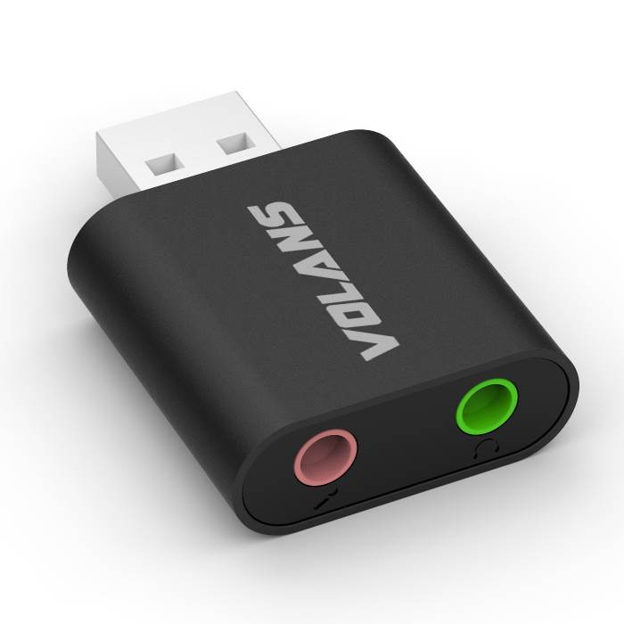

  

#### *In this chapter, the plans behind a voice encrypting headset for circumventing the new bill*

## Parley
##### *- an external voice encrypting communication device*

  

### The Concept:

Parley is a bluetooth based communication device with a trick up its sleeve. Parley encrypts your voice data before it has even left the device, allowing for encrypted communication across devices and networks that may be considered insecure; more specifically, parley aims to circumvent any possible attacks or disruption of privacy caused by the new [AA bill](https://twitter.com/hashtag/aabill) proposed by the [Australian Government](https://www.aph.gov.au/Parliamentary_Business/Committees/Joint/Intelligence_and_Security/TelcoAmendmentBill2018).  

### The Theme:
While it may not be entirely clear how Parley relates to the theme of (dis)connecting together, the title may have given a hint on where I plan to take this. In the age before the internet, recording devices and phones, people were able to have private conversations without worrying about being overheard by some unknown person across the other side of the planet, the concept was simply impossible at the time.  
Nowadays, in the hyper-connected age, it's almost impossible to say who can listen in on a conversation that two people may be having, or where that person may be in the world (or if they're even a person at all). Sure, we may like to think our communications are encrypted and trust the companies who provide these services, but with the new bill proposing that these companies should decrypt communications if asked (possibly even installing backdoors) can we really trust them?  

##### tl;dr: Parley wants to bring back the privacy of in-person *(disconnected)* conversations in this online *(connected)* world.

### The Build:  
While Parley will, for the most part, require components similar to what a normal bluetooth headset has, to achieve the encryption in a suitable time for voice communication a more powerful processing unit will most likely be required. A prototype running on a computer will provide me with more information on this, however as it stands, here is the proposed equipment list:  

**- Processing**
  
As this is just a prototype, parameters such as portability and efficiency aren't as important as showing that the project is feasible and will actually work. As such a model such as the Raspberry Pi 3 B+ may be used to show that Parley is in fact something that can work, and this chip should provide all the necessary processing power (hopefully) and connectivity (bluetooth, wifi and usb peripheral support) that this project will require.  
*Note: after running a prototype on a computer, this chip/board may change to something with a lower power requirement depending on how intense the encryption turns out to be.*  

**- Audio**  
*Out:* A simple 3.5 mm audio jack (already present on the pi) to allow the use of headphones (or also included in option below)  
  

*In:* The raspberry pi does not have an audio-in interface present on the device, so alternative options such as a usb soundcard must be used (this includes 3.5mm audio in and out, so can possibly be used for both)  
  

**- Encryption**  
*This area is going to require some research, here are some of initial ideas on how this can work:*  
For voice over IP (VOIP), voice data is translated into a digital format for transmission, this means that we can encrypt the audio data recorded from the microphone before it is transmitted to the external device for transport over the network. There are a few options here such as block cyphers and stream cyphers (as well as public key and symmetric key cryptography) and they each have their own pros and cons (for example, padding in block cypher mode may corrupt the audio data).  
In addition to this, the encryption must not be too computationally intensive and be able to be performed very quickly, if this is not the case then communication latency and quality will most likely suffer and make the device unusable for a normal conversation (as a result of this, public key crypto will most likely not be suitable for encryption of the audio data, however there is still a possibility for it to be used in [some kind](https://en.wikipedia.org/wiki/Diffie%E2%80%93Hellman_key_exchange) of [key exchange](https://en.wikipedia.org/wiki/Key_exchange)).  
*Note: depending on the chosen method, it may also be required for the Parley devices to perform a key exchange in addition to the voice transmission, if all transmissions are bespoke then this could be done at the start of a voice call, however if the voice call is happening over an existing medium (such as skype) then this would need to happen externally, and in advance. If this is the case then some server architecture (such as NodeJS) or P2P communication protocols will be required.*
There also exists the possibility of messing with the audio signal itself by playing noise or distorting the signal in some way, this process would then be inversed on the other side. With this method however, it is still possible to decipher the original audio stream without knowing how it has been changed as the audio information is still present in the signal, only distorted.

**- Software**
*Small summary of some of the expected software that will be used in the project*
* Raspberry Pi OS: [Raspbian Stretch](https://en.wikipedia.org/wiki/Raspbian)
    * PI as Bluetooth Headset: [There already exists some resources](https://scribles.net/enabling-hands-free-profile-on-raspberry-pi-raspbian-stretch-by-using-pulseaudio/) for setting up a raspberry pi as a bluetooth / hands-free device, however further research and testing will need to be done to check if it's applicable to this application.
* Key exchange server (if required): [NodeJS](https://nodejs.org/en/)
* Proof of concept prototyping: [p5.js](https://p5js.org/)
* 3D modelling: [Blender](https://www.blender.org/)
* 3D printing software: [CURA](https://ultimaker.com/en/products/ultimaker-cura-software)

### The Timeline:

**Milestones:**
* Basic prototype running locally on p5 (PC)
* Basic prototype running across the internet on p5 (PC)
* Audio in/out working on the Raspberry Pi
* Raspberry Pi accessing the p5 server prototype example and transmitting/receiving audio
* Raspberry Pi connecting as a handsfree device with phone
    * Audio transmission and receiving works with raspberry pi as bluetooth device
* Raspberry Pi can encrypt and decrypt audio streams
    * Raspberry Pi can encrypt and decrypt voice streams
* Encrypted voice conversation between 2 raspberry pis
* Encrypted exchange between 2 raspberry pis as bluetooth devices
* Full encrypted transmission using raspberry pi as bluetooth audio device across the internet
* 3D model mock-up and test print
    * Final 3D model print
* Construction of all in one device using pi(s) and 3D printed models
* Final version and tidy up of code (with comments etc.)

**Milestones on a timeline:**
*Considering the blog posts and other deliverables are integral to the project, I'll be using the deliverable timetable as a base to show the progress for Parley.*  

| date    | week | post topic                                                                                   |
|---------|------|----------------------------------------------------------------------------------------------|
| Dec 22* |    5 | Publish the artefact plan                                                                    |
| Jan 4*  |    6 | Completed a basic prototype using a PC (*possibly p5*), complete research into using [RPI as a bluetooth headset](https://scribles.net/enabling-hands-free-profile-on-raspberry-pi-raspbian-stretch-by-using-pulseaudio/), ordered parts to build final product                                                                                    |
| Jan 11* |    7 | Parts have arrived, RPI is able to connect as a bluetooth (*hands free*) device with a phone |
| Jan 18* |    8 | Audio transmission and receiving works with the RPI as a hands-free device                   |
| Jan 25* |    9 | Work on encryption of audio in communication                                                 |
| Feb 1*  |   10 | Communication using the RPI with encrypted audio is functional                               |
| Feb 8*  |   11 | Design of 3D-mockup completed, prototype printed and tested                                  |
| Feb 18  |   12 | Final device complete and working in 3D printed case, [design rationale](/deliverables/03-design-rationale/) due                                                                    |
| Feb 25* |   13 | Code tidied up and commented in preparation for public release of source code and documentation on GitHub (the "launch" blog-post)                                                                                        |

(* next to the date indicates there is a blog post due on this date)
### The Collaboration:
None... yet (get in contact with me if this interests you).