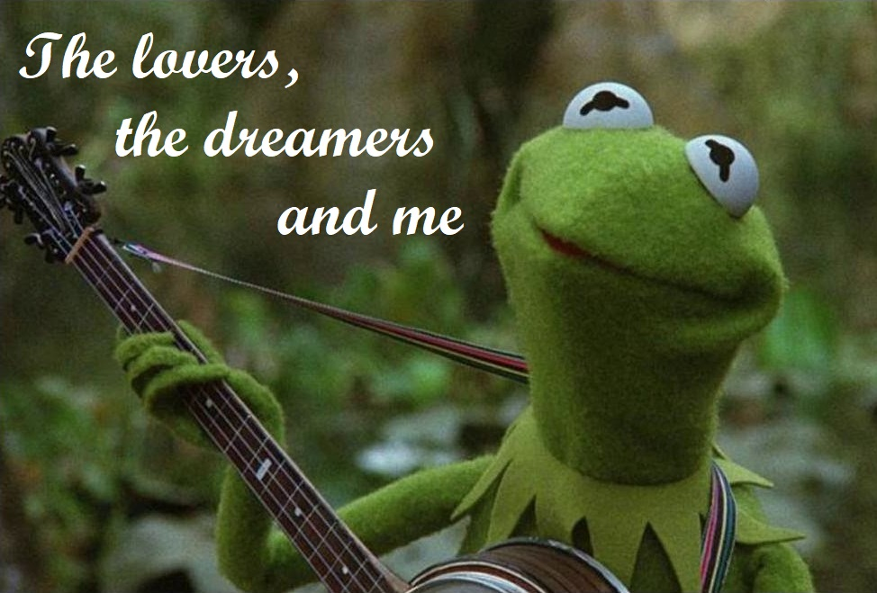
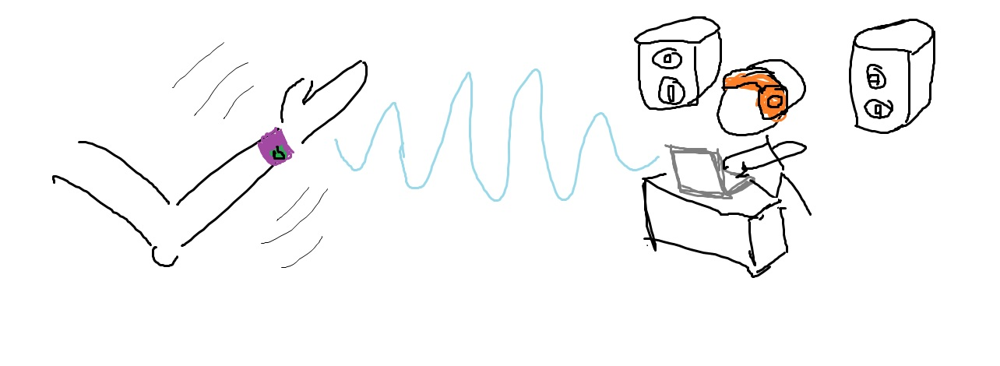

 *"... the lovers, the dreamers and me"*

That's right friends, I am going to use my bare hands to create a device that lets you control the music around you. And not just any music, live music created with [code](https://www.youtube.com/watch?v=G1m0aX9Lpts). I want the audience at a live coding gig to collectively affect the code and therefore the music it generates. There can sometimes be a disconnect between an improvisational performer and the audience experiencing their music. You rarely get an indication of whether the audience is enjoying the music during the performance. Granted, a live coder may not always value the audiences' enjoyment highly, but in some settings, like in a club, this information can be very valuable. In a club, you are coding to keep people dancing. I think guaging the activity/motion of dancers in a club can help club-goers collaborate with the live coder, or at the very least, inform the live coder of which music they like dancing to. So, I'm proposing a wearable device which can collect motion/temperature/pulse data from each person and uses the data to control parameters which dictate e.g. the tempo or rhythm of the music. Ok, you get the picture, now let's get on with the design.
 

#### Plan A (B, C, D, E, F, G)
When I say design, I mean it in the loosest possible sense. I have no idea what could go wrong and I struggle to settle on one idea. So lets, you and me, accept the mess which follows for what it is; a very very very rough initial design.

I want the device to be a wristband. Its lightweight and will hopefully be cheap, making it convenient to distribute at da club.
There are a few basic components I will need; A battery, a wifi module, a microcontroller (possibly), an accelerometer, fabric/material for the band. I want to start with just collecting motion data and see where that gets me. There are two options I can take with the interpretation of the data. One option is to determine the variation of the motion and use this to classify the level of activity. e.g. If the average readings are staying above some threshold, the activity level of that person would be classed as high. If I find the motion alone isn't enough to make this classification, I might add a temperature/pulse sensor, but at this stage I can't see it helping. Based on the activity level, the live coder can thicken/thin the music to make the music more interesting or the mellow out the vibe. The other option is to use the data to deduce rhythms the dancers are making with their body. As a dancer tires, they might slow their movement down. Spikes or changes in the accelerometer readings will be used to extract a rhythm (no idea how I'll do this yet) wihch will be used to change rhythm parameters in the code.

As for the electronic componenets, well... I'll be travelling to some exotic places, so it all depends on whether I can find the electronics I'm looking for in the next two weeks.

if(lilypads_found_next_week){

Since I'm potentially going to incorporate some temperature and pulse sensors, I want my device to be as flexible as possible so that the sensors can come into enough contact with the skin as required for accurate readings. So I have decided to go for Arduino Lilypad electronics. The Lilypad products allow you to sew on the components with conductive thread which will allow for a lot more flexibility. The only downside is the connections between components could be a bit loose. I should also think about what kind of material I want the bands to be. Ideally it should be thick and stretchy so that connections from the stitching don't come loose while still allowing for a snug fit on the arm. If the stretchyness of the fabric is going to become super problematic, then I'd opt for a non-stretchy fabric with an adjustable strap. 
I will use the AMX3d Lilypad Arduino as the main controller and use the XBee 802.15.4 as the wifi module. It requires no manual configuration which I thought would be good since I'm just starting out. But man oh man is this going to be chownkey :( All of these components are fairly large and also aren't the cheapest option.

}
elseif(esp8266_found_next_week){

I was orignally curious as to whether I could get away with just using the ESP8266 (which has built in wifi capabilities) with an accelerometer. However, I'm not sure if the processor can handle the Wifi code on top of reading from the sensors. Word on the street is that the ESP32 is much better to use as a stand-alone module without an additional microcontroller. It's dual core UwU. At least its comforting to know there are options. As for the accelerometer, MPU-6050 is an I2C 3 axial accelerometer which seems like a good option. Unfortunately, ESP8266 doesn't handle I2C in its hardware so this will have to be handled in the software leaving any GPIO pin available for use. Also, I'm not sure how this will scale with the addition of more sensors. But, this is the ideal option since it will make the device extremely compact.

}
else{

drawingBoard.flush();

self.get_shitTogether();

}

For the software, both the Lilypad Arduino's and the ESP8266 can be used with the Arduino IDE programmed with C++/C. Here is a quick [setup](http://www.whatimade.today/esp8266-easiest-way-to-program-so-far/) guide for adding the ESP8266 to the IDE. There are a lot of well documented example projects for both the Lilypads and ESP8266 which will be a big help.

#### Some Milestones

Here come some bullet points and dates :B

- **January 10th:** I would like to acquire everything I need for the compact version of the bracelet with the ESP8266 and, if I'm lucky, the Lilypads as well. I aim to connect everything up and familiarise myself with the libraries by then. I might not be able to find the exact components I want. In which case, I will try to find the next best thing and get something connected and working.

- **January 15th:** By this time I reckon I should have a clear idea of how I want to aggregate the data and how it will affect the live coding code. I found a few Arduino OSC libraries for the ESP8266 on Github, so maybe that would be a good option. OSC works with [Extempore](https://extemporelang.github.io/), the live coding language I'll be working with. Again, I could be really unlucky with finding microcontrollers/components over the next two weeks, in which case I'll switch the completion dates for these two tasks.

- **January 25th:** Prototype Baybeeee. All things going well, I hope to have an MVP finished. I'm talking bare minimum, I move my hand with the wristband on and it changes some part of the live coding music. I would love love love to have a few wristbands finished by this time  and maybe a few more sensors if its appropriate, but I have some (healthy) scepticism about whether I can aggregate the data and have it meaningfully
affect the music. But that is the dream, that is the goal.

- **and beyond:** I really don't think I am capable of planning past January. I will have just under two weeks in Feb to cleans things up and it will act as a much needed cushion since I have a bad habit of changing my mind in the last minute. New year, new me?

Cool, wish me luck. Until next week. See you then :)