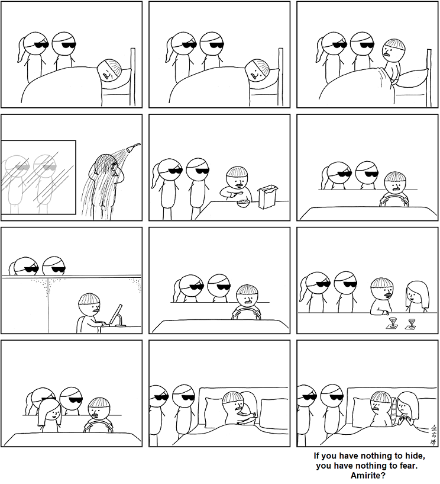
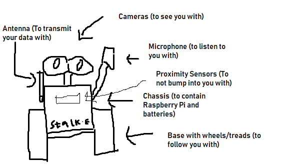

Comic licensed under CC-BY-NC 3.0 USA. By Abstruse Goose https://abstrusegoose.com/433

## Why should we care about corporate surveillance that a user "consents" to?

I was asked this question after my privacy presentation at BIT. If a user is okay with providing data to a private corporation in exchange for a service, should we still push for privacy? After all, corporations do not have police forces and are not assumed to be malicious, so on the surface, civil liberties concerns with government snooping does not apply.

I brushed it off mentioning that governments can still get hold of the data from the corporations[^ShiTao], and obliquely referred to the fact that corporate surveillance, in part, enables the massive suppression of information going on in China. After all, if Microsoft or WeChat or w/e could not monitor a users messages, they would not be censor information the government finds objectionable.

But why should you, a person living in a country with strong free speech tradition, limitations on government power, and views that are largely within the acceptable range[^Nitschke] care about corporate privacy?

One answer is that on some philosophical level, it just "feels" wrong. I personally would prefer that corporations not have profiles on exactly when I'm awake, my location history, my hobbies etc.

However, the threat posed by this is worth examining further.

## The Dossier Society

The phrase "Dossier Society" was, I believe, coined by David Chaum in his 1985 Article ["Security Without Identification"](https://www.cs.umd.edu/class/fall2015/cmsc414-0201/papers/chaum-identification.pdf), where he mentioned "computers could be used to infer individuals’ life-styles, habits, whereabouts, and associations from data collected in ordinary consumer
transactions.", and posited that this could have a chilling effect on individual behaviour.

This has become especially pervasive today, with smartphones being widespread. Even without resorting to side channels, apps not only have our transaction history, but [location](https://www.nytimes.com/interactive/2018/12/10/business/location-data-privacy-apps.html), [speech patterns](https://myactivity.google.com/), [social circles](https://facebook.com) ([even without explicit consent](https://theconversation.com/shadow-profiles-facebook-knows-about-you-even-if-youre-not-on-facebook-94804)), [browsing history](https://newsroom.fb.com/news/2018/04/data-off-facebook/) ([even in Private Browsing](https://panopticlick.eff.org/)) etc.

This data is typically used for targeted advertising which, [even if Facebook claims otherwise](https://www.nytimes.com/2018/12/12/opinion/facebook-data-privacy-advertising.html), is equivalent to selling your information to the individual advertiser.

I posit that if this has not affected individual behaviour, it is due to people simply not being aware of the level of tracking present in their day to day lives. To back this claim, I point to the apparent shock in response to stories like [this](https://www.nytimes.com/2018/12/18/technology/facebook-privacy.html), or even the fact that they are stories at all. You could adopt a consequentialist approach, and claim that showing you relevant ads does no harm, and even might be beneficial. After all, connecting you to say, an indie band that you might like benefits both. However such gross violations of privacy take on a tragedy of the commons element, as can be seen with it's [effects on elections in the United States](https://en.wikipedia.org/wiki/Facebook%E2%80%93Cambridge_Analytica_data_scandal) and elsewhere[^FilterBubble].
And as Glenn Greenwald pointed out in his [privacy TED Talk ](https://www.youtube.com/watch?v=pcSlowAhvUk), people do value privacy even if the say otherwise. After all, you would not be willing to disclose your email passwords to me, even if I pinky promised to not do anything with that information.

Now, there have been legal attempts to enforce privacy, like the European GDPR. However, as the above New York Times piece shows, this is not sufficient. We simply cannot trust third parties to handle our data. While post-violations reprucussions might be helpful, they are but slaps on the wrists for corporations. And any actions you might take after, say, election results have been altered, is too little too late.

## Artefact Plan

This brings me to my final artefact plan.

Unfortunately, my previous plans w.r.t meshnets turned out to be unfeasible due to monetary constraints, and side channel attacks due to time constraints. [David has me firmly beat](https://cs.anu.edu.au/courses/china-study-tour/news/#david-flores-condezo) on the low cost Orwellian surveillance front. So I am weaseling out by building a kinetic sculpture exploring the theme of the Dossier Society. It aims to provoke people, by surveilling them physically in the same way as they are surveilled by Google, Facebook, et. al. online.

As such my plan is to build a swarm of robots that physically follow you, documenting exactly what you do. There are a few considerations to exactly how I build this, outlined below.

### Hardware Requirements

The robot is relatively simple. It needs to be see and listen to you, and move to follow you around.

So it needs

1. A wheeled base, so that it can move around. I haven't settled on any particular one. I will probably buy an RC Car or a ready to go robot chassis.

2. A small computer: I will need a computer to drive the robot, and also to sense and transmit the data it recieves. I am going with the Raspberry Pi 3 Model B+, because it provides a fair bit of compute power while having wide community support.

3. Cameras: Raspberry Pi Camera Module V2

4. Ultrasonic Sensor: HC-SR04 - Backup obstacle avoidance system.

5. USB Microphone (optional) - If I can get speech recognition working without resorting to online APIs.

6. Battery - to power the whole thing

Everything except the camera and mic can probably be placed in the chassis, giving us the form factor below:

#### Form Factor

Name and outward appearence subject to change.

### Software Requirements

The software part is unfortunately hard to plan before hand, because most open source solutions don't consider power constrained environments, so it will be see as we go. But my rough idea is to use ROS on top of Raspbian, along with frameworks like OpenCV to track the person.

### Milestones

| date   | week | post topic                                                                                 |
| ------ | ---- | ------------------------------------------------------------------------------------------ |
| Dec 24 | 5    | Publish the artefact plan                                                                  |
| Jan 4  | 6    | Finalise part list, order. Basic Computer Vision expermentation on PC.                     |
| Jan 11 | 7    | Build Physical robot. Have object tracking code working.                                   |
| Jan 18 | 8    | Have robot physically follow object                                                        |
| Jan 25 | 9    | Build second robot. Robot-Robot and Robot-Computer communications/data sharing.            |
| Feb 1  | 10   | Voice recognition, if local experiments are successful. Ad serving based on inferred data. |
| Feb 8  | 11   | Buffer Week                                                                                |
| Feb 18 | 12   | Polish artefact, have it up for display.                                                   |
| Feb 25 | 13   | Post code on GitHub.                                                                       |

(Table shamelessly stolen from Brent's Week 5 Blog source.)

[^ShiTao]: This, for example, can be seen with Yahoo divulging [Shi Tao](https://en.wikipedia.org/wiki/Shi_Tao_%28journalist%29)'s identity to the Chinese government.

[^Nitschke]: Even in Australia, we can find our [speech restricted](https://www.abc.net.au/news/2015-10-26/philip-nitschke-agrees-not-to-encourage-suicide/6884948) if the system finds our views particularly abhorrent. Some of even come with [jail time](https://arstechnica.com/tech-policy/2010/01/simpsons-powerpuff-girls-porn-nets-jail-time-for-australian/).

[^FilterBubble]: Lest you dismiss Cambridge Analytica as a one off, or believe that direct sale of data is the only possible harm, I encourage you to read up on the [filter bubble](https://en.wikipedia.org/wiki/Filter_bubble).
