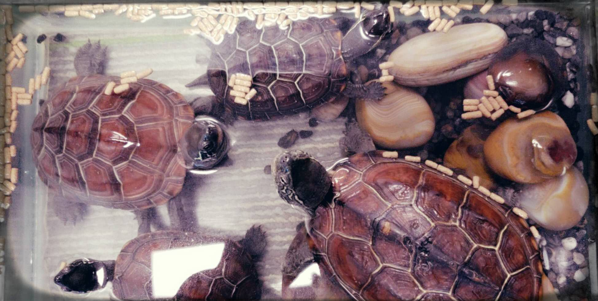

This is my artefact plan for final IoT individual project.

## Project Brief Description

Luckily, I kept my initial idea in Week 3 until now about the ***Intelligent Pet Tortoises Feeding***.

In the current stage, the theme and most detailed functions for the project are both *fixed* through the past three weeks... The **inspired background introduction** and my **expected functions** for the final project can be found in [my Week 3 Rough Project Idea post](https://cs.anu.edu.au/courses/china-study-tour/news/2018/12/06/kathleen-w3-project-idea/) **"Happy Aquarium" Project** section~

To conclude, I want to make an artefact which can be used for common tortoises' tank and mainly considering the tortoises' living requirements:
- land-water swap
- feed
- temperature
- lighting
- water changing (*maybe* considered) -- depends on the detection of water turbidity

As the whole artefact can be seen as an union of multiple functions, in my following *implementation plan* and *timeline*, my main idea is to **finish a whole function first and then come to the next different function**.

## Detailed Implementation

###  Whole Requirements

Hardware is my most confusing part as said in previous posts. While through recent researches, I know more. :)

For *microcontroller*, I decide to use **Arduino Mega 2560** or **Arduino UNO R3**. As *mega* has more pins, it satisfies huge I/O requirements. Given multiple functions, many sensors and operators could be used, *mega 2560* gives enough support for my IoT project. While if through future precise counting for required pin number, *UNO* is also enough, I will use classic *Uno r3* as my beginning~

For *Internet communication*, I will use **ESP32** board, as an advanced version of *ESP8266*, although I don't think I will use Bluetooth and other special support in it.

Considering the most common cases, I think I will use **C (C++)** for most *programming* part. It's the time to systematically learn the language... :-P

### Multiple Functions

Every function build can be divided into 3 sections, and I ***plan to follow the 3 steps for each function design / build***:
- receiving data from sensors
- PC data handling:
	- make sensors' data (human-being) readable
	- *better* to show and record data in website
- sending commands to operators through:
	- automatically analysis from real-time data (pre-defined central command codes)
	- real-time remote commands through Terminal *or better* through my own website

I will introduce my brief implementation idea for each function following the above 3 sections. [ No detailed design or diagram will be shown this time (although I draw a bit)~ ==> Just to keep the whole project mysterious and make you more excited for my future *project diaries*~ ↖(^ω^)↗ ]

- ***Land-water swap***:
	- *sensor*  : **photoresistor**: stronger brightness shows it is "basking time", and then we need to incline the tank and thus make the "stone" side above water.
	- *pc data* : record brightness & corresponding data for the physical operator; automatically adjust the slope.
	- *operator*: mainly use physical principles, such as **lever principle, pulley system**.
- ***Feed***:
	- *sensor*  : **turbidity sensor** and real-time clock.
	- *pc data* : record turbidity & corresponding data for the physical operator; better to allow *both* automatic command and human-being remote command.
	- *operator*: may use 	lever principle or existed automatic feeding device.
- ***Temperature***:
	- *sensor*  : **water-proof temperature sensor**.
	- *pc data* : record temperature; automatic command -- heating if lower than the default temperature.
	- *operator*: heater -- while not sure whether directly control the heating function or physically control the switch of a traditional heater.
- ***Lighting***:
	- *sensor*  : **photoresistor**.
	- *pc data* : record brightness; human-being remote command.
	- *operator*: lamps -- can choose several different power ones to make multiple brightness levels.
- ***Water changing***:
	- *sensor*  : **turbidity sensor**.
	- *pc data* : record turbidity; automatic command -- changing water if turbid than default.
	- *operator*: water changing device -- may need to control "squeeze" for the device use.

## Detailed Timeline

Except the 1st BIT teaching month, less than 2 months are left for the IoT project. I divide the time into 2 main parts: in the *first 3 weeks* I will stay in *China*, finishing ideal framework design for all functions and at least finish **one whole** function build; and then I will come back to *Canberra*, finishing all other functions and final conclusions in the *left 1 month*.

Detailed timeline is shown below: [ *Stage* is used as "intermediate milestones" to better check my task completion conditions ~ ]

|**Stage** |**Week**|  **Start** | **End**  |                                   **Main Tasks**                                                                                                                                                                                                    |
|-------------|------------|--------------|-------------|--------------------------------------------------------------------------------------------------------------------------------------------------------------------------------------------------------------------|
| *CHINA* |           1 | 24 Dec    | 30 Dec   | device shopping & detailed design for each function & GitHub preparation                                                                                                                                        |
| *CHINA* |           2 | 31 Dec    |   6 Jan   | begin "land-water swap" function build *(simplest PC command, without making website)*                                                                                                                |
| *CHINA* |           3 |   7 Jan    |  11 Jan   | finish "land-water swap" function & *(if time left)* begin "feed" function                                                                                                                                               |
| *CBR-1* |           4 | 15 Jan    |  20 Jan   | finish "feed" & begin "lighting"                                                                                                                                                                                                               |
| *CBR-1* |           5 | 21 Jan    |  27 Jan   | finish "lighting", (if enough time) water changing                                                                                                                                                                                  |
| *CBR-2* |           6 | 28 Jan    |   3 Feb   | finish "temperature" function                                                                                                                                                                                                                  |
| *CBR-2* |           7 |   5 Feb   | 10 Feb    | optimize codes, remote control website interface and final artefact appearance & final debug & multi-function arrangement                                                             |
| *CBR-2* |           8 | 11 Feb   | 14 Feb    | final check the artefact and codes (especially for *15 Feb* **GitHub**) & begin writing *18 Feb* **design rationale** & prepare *o-week* **exhibition** (slides, ...) |

Looking forward to the artefact design / build process in the future! See u next year~ All best wishes!  ^_−☆

---

## Reference

*The "merry-christmas.jpg" in the end is from https://image.baidu.com/search/detail?ct=503316480&z=0&ipn=d&word=圣诞节快乐&step_word=&hs=0&pn=80&spn=0&di=30470&pi=0&rn=1&tn=baiduimagedetail&is=0%2C0&istype=0&ie=utf-8&oe=utf-8&in=&cl=2&lm=-1&st=undefined&cs=2721463595%2C3277845195&os=251961676%2C686707389&simid=0%2C0&adpicid=0&lpn=0&ln=1863&fr=&fmq=1545648887460_R&fm=&ic=undefined&s=undefined&hd=undefined&latest=undefined&copyright=undefined&se=&sme=&tab=0&width=undefined&height=undefined&face=undefined&ist=&jit=&cg=&bdtype=0&oriquery=&objurl=http%3A%2F%2Fb-ssl.duitang.com%2Fuploads%2Fitem%2F201511%2F30%2F20151130003842_wkY4c.jpeg&fromurl=ippr_z2C%24qAzdH3FAzdH3Fooo_z%26e3B17tpwg2_z%26e3Bv54AzdH3Fks52AzdH3F%3Ft1%3D9lclnnb0a&gsm=1e&rpstart=0&rpnum=0&islist=&querylist=.*
