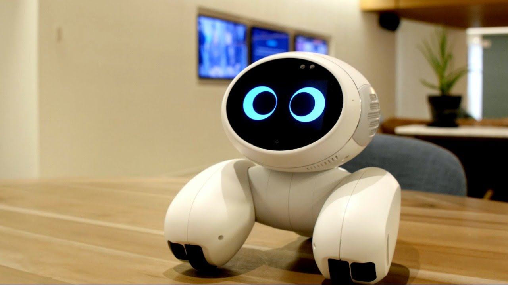

Image obtained from: https://www.youtube.com/watch?v=yVstq2ybotI

# Project Description

## Introducing; _SharePet_.

SharePet is a robot pet. Like any other pet, you can play with it, feed it, pet it
and all other sorts of things with it. You walk by, and it will notice you. You pet it, and it will purr. You forget to feed it and it will die.
Just like pets too, SharePet also requires responsibility.
Conventional pets allowed for people in the same household to share this responsibility and fun of the pet. Sharing responsibilities with someone else can bring two people closer.
Unfortunately, if the two of you do not live in the same space, it is impossible to share the responsibility of any pet, as the pet can only ever occupy one living space at a time.

Well until now. Here's the catch with SharePet; The person who you choose to share the responsibility of this pet does not have to
share the same physical space as you. Conceptually, they'll be only one pet that the two of you
are taking care of. In reality, there will be two identical pet robots that will mimic each other in real time, one for each owner
seperated by distance. Say, for example, one person is petting the robot pet and the robot pet is reacting (happily)
to the pet. The physical pet of the other owner, although not being petted physically, will also react to the pet, as if
the person is is right there. In essence, SharePet is a pet robot you can look after with someone else wherever they are.

SharePets objective is simple, it seeks to connect two people seperated by distance by simulating:

- Sharing the same space
- Sharing a responsibility

## (dis)connecting together

This project seeks to explore new ways of connecting
people. Us as humans are designed to create connections with others through face to face interactions.
Only in recent history with the development of technologies and postage that we are now able
to connect with others who do not share the same physical space as us. Long distance relationships
of any kind were difficult to maintain - and to an extent still are today. Although today it
is possible to see and hear the people we care about through video chats, we always still prefer
direct interactions with these people rather than through our screens. What else is missing in these
digital interactions? What aspect of connecting with people do video calls still lack?

What I believe is missing is non-verbal interactions. The sort of interactions where you don't say a word
to each other but still feel connected. The sort of interactions where two people are in different worlds,
but sharing something together. The sort of interactions where two people share something.
Video calls can't replicate this, but SharePet can. SharePet seeks to connect two people
apart in previously unavailable ways. In essence, SharePet objectives as
outlined previously will bring about a new type of long distance connections.

## Design

Technically speaking, the artefact as a whole consists of two physical robots or nodes. The two nodes will be placed
in two different physical spaces and will record data about the real world through it's
multiple sensors. The nodes will then do two things; provide an output to the data from the sensors
(which will most likely be a real world action) and also sending a command to the other node.
This command will be received by the other node and this node will also provide a similar output.

So far, the vision I have for the artefact is pretty simple. I have many ideas and still wish to
expand upon and add complexity to it. But as a base milestone, SharePet will look like the following:

- It will have a small Display Panel to mimic eyes
- Numerous sensors to detect the real world
- Speaker to play sounds for reactions.
- A static container to contain all this.

# Hardware

For Hardware, I have decided to use Arduino for two main reasons: I am already somewhat familiar with it, and Arduino has extensive amounts of documentation
regarding previous similar projects and supporting libraries. These two factors I believe can help me significantly in my plans.

As it will need to connect to the Internet, I will be looking to order a WiFi shield for the board so it can connect to the internet.

The Input devices for the ideas I have so far are the Light Sensors, The Temperature Sensors, the Microphone and the PIR Motion Sensor. These sensors will be the ones
that will allow the pet robot to sense the world.

Output devices will be mainly used for how the Pet Reacts to the inputs received from the world. The Output devices I have in my plan right now are a simple speaker, an LED Display Screen and
simple LEDS. The speaker will play noises and sounds. The LED Display Screen will mainly be used to mimic eyes of the pet (not as input though, only animation of eyes). LEDS will simply be
used for general debugging but also other reactions.

As I am creating two physical robots, I will be needing at least two of each of the components I have listed below.

## Hardware Specifics

- Microcontroller: Arduino Uno Board
- Input Sensors:
  - Light Sensor
  - Temperature Sensor
  - Microphone
  - PIR Motion Sensor
- Output Devices:
  - LED Display Screen
  - Speaker
  - LEDS
- IoT Devices:
  - [Arduino Wifi Shield](https://www.arduino.cc/en/pmwiki.php?n=Main/ArduinoWiFiShield)

# Timeline and Workload

Each week, I will focus on a different aspect of the artefact. Every week I will be adding
new functionality to the artefact and progressively building SharePet up.

In the first few weeks, I will be focusing on the Pet Functions, that is, functions that
provide the pet robot's main purpose. This will consist of allowing the robot to
sense the world through sensors and react appropriately through certain outputs. In this phase I will also be doing some research on
the side exploring:

- What makes a pet a pet?
- What makes us care and love a thing that is not human?
- How do pets react to the world usually?
- How are human connections affected by these functions?

In the last few weeks, I will be focusing on the IoT aspects of the artefact. In this phase,
I will mainly be devising ways for the two pet robots to communicate to each other over the
internet. Like the previous phase, I will also be doing some more research delving into questions
such as:

- What kind of data will I be transmitting over the internet?
- How will I transfer the data? Asynchrnously with a Buffer? Will I need a data store?
- How will I handle mutual exclusion and race conditions?

| Week |   Date   | Phase         | Detail                                                                                                                                                                                                          |
| :--: | :------: | ------------- | --------------------------------------------------------------------------------------------------------------------------------------------------------------------------------------------------------------- |
|  1   | 24/12/18 | Initial       | Further Research, Component Acquirement, and familiarisation with development environment                                                                                                                       |
|  2   | 31/12/18 | Pet Functions | Input Sensors Develop code for and install the Light and Temperature Sensors                                                                                                                                    |
|  3   | 07/01/19 | Pet Functions | Input Sensors Develop code and install the Microphones and simple cameras for motion detection.                                                                                                                 |
|  4   | 15/01/19 | Pet Functions | Outputs: Display Panel Develop code for Display Panel used to mimic eyes for pet robot                                                                                                                          |
|  5   | 21/01/19 | Pet Functions | Outputs: Noises and Speaker and LEDS Develop code and sounds to play as a reaction to certain inputs from sensors **Milestone**: Robot pet can react appropriately to outside stimuli in the presence of people |
|  6   | 28/01/19 | IoT Functions | Setup IoT environment and architecture to allow message passing between the two nodes                                                                                                                           |
|  7   | 05/02/19 | IoT Functions | Develop code that will communicate one pet node's action to another and vice versa\*Milestone\*\*: Both pet node's react to stimuli present to only one pet node                                                |
|  8   | 11/02/19 | Finishing     | Design and create final container for artefacts, testing code and other finishing touches.                                                                                                                      |

I will be working on this project alone. Although, there is a possibility that
the things I aim to be doing will overlap with some other students artefacts. As such, I am
very much open to the idea of collaborating together on some aspects of my projects. I have
already communicated with some other students in collaborating with them in regards to my sensors.

Thats all for now. Merry Christmas and Happy Holidays. See you after the break :)
