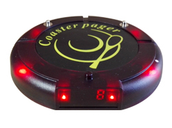
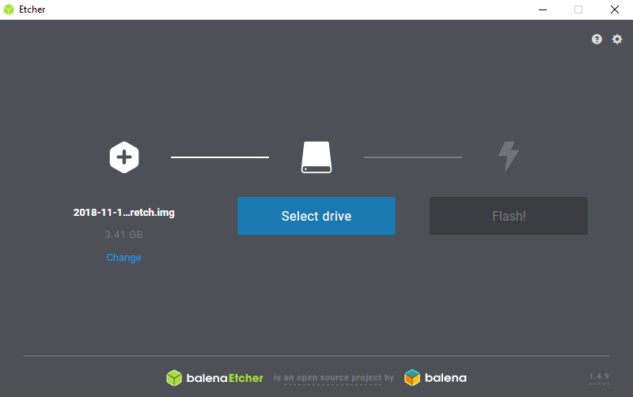

<p></p>

#### _In this chapter, a change of plans and how to get spotify playing on a Raspberry Pi_

## Catalyst Jukebox

#### _A jukebox for the modern age, but with a twist_

After much thought and discussion, I have decided to change my project for the final time _(hopefully)_.  
My new project will be to produce a spotify based jukebox for the modern era, but with a twist.  
Jukeboxes have fallen out of popularity in modern times, only finding use in places that keep them around for their novelty, or where the average age of the patrons means they grew up with them. In today's hyper connected world, there is simply too much new musical content being released for a traditional jukebox, with physical media and such, to be viable.  
A simple solution to this is to have an internet-enabled streaming-based jukebox, allowing users to select songs not just from a single physical library, but from all over the internet. This would increase the versatility of a jukebox massively while also reducing the physical requirements (no storage of media anymore), only some circuitry and an internet connection.  
There is an issue with this idea however, it's rather boring and loses some, _if not all_, of the charm and characteristics that comes with a jukebox. For one, there is no way to identify who put on a song if they're just some person on a smartphone somewhere in a room (which is like 99% of people nowadays), and when comparing this to a jukebox: it is very obvious when someone goes up to the machine and starts interacting with it, which is soon followed by the song they selected coming on making it very easy to put a song to the face.  
This interaction has the potential to open up a new line of communication with someone you may not have said anything to previously because they just put on your favorite song, or perhaps it's something you haven't heard before and you wanna find out who it is _etc._  
In addition to this, if you're using your phone to select the song, chances are you aren't just going to stop using it afterwards, which means even if someone _knew_ who requested the song, the very nature of what they are continuing to do will definitely impact any conversation that may arise, or probably dissuade it from happening in the first place.  
To remedy issues like these, I propose two additions that hope to create some quirks and charm in this modern take on a jukebox, while also tying back in with the theme of (dis)connecting together.

**#1**  
When requesting a song, the user will be given a small device, very similar to the 'food ready' notification discs you get at some restaurants / pubs etc. _(restaurant pager/buzzer)_  
  
_Note: image [sauce](https://tylermcginnis.com/async-javascript-from-callbacks-to-promises-to-async-await/)_  
The user will keep this with them for two reasons, one will be explained in the second point below, and the other is that there will be a button on the jukebox that will make the buzzer of the person who added the currently playing song light up. The idea behind this is that it will act as a conversation starter and aims to bring people together, even if the method for requesting the song isn't the same as an older jukebox, the device will fill in the disconnect between requester and song, for example:

- if you want to know what the current song is
- chat about the song
- find someone with similar music tastes
- etc.  
  then it is possible with just the press of a button.

**#2**  
_Note: Video contains coarse language_

<p></p>
When requesting a song, the user will be instructed to connect their phone to a charger which will be located inside a small box, this box will then lock and the user will be presented with the 'song buzzer', detailed above, which will act as the key to unlocking the phone box allowing the user to retrieve their phone again.  
*"But won't people just immediately trade the buzzer for their phone, making both of these points invalid?"*  
Well you haven't let me finish yet, if a user removes their phone before their song has played then it will be removed from the queue and will not be played. This means that in order for a user to hear their song, they must leave their phone locked away, and keep their buzzer on them, allowing them to be contacted by other people via the 'locate requestee' button on the jukebox.  
In addition to this, if they remove it while the song is playing, then the song will stop playing and skip to the next song and right at that moment the person will be right next to the jukebox machine, meaning everyone knows where to look to see who is disturbing the flow and ambience of the room.  
*Note: alternatively it could be impossible to retrieve the phone while the song is playing, however this has the drawback that in an emergency people will be left waiting to grab their phone, but on the other side if it happens too often then it may become annoying to anyone listening to the music.*  
This hopes to remove the barrier of the smart phone and means that people may actually have their eyes up and looking around, facilitating interactions and making them much more approachable.

#### The theme

These two points together hope to bring back more wholesome social interactions unmarred by the existence of one's smartphone and to facilitate _real_ connections over the art of music. And this ties back in with the theme beautifully, IoT connected devices facilitating interactions away from IoT connected devices, sounds like (dis)connecting together to me.

### The Technical:

The high-level structure of this project looks something like this:

- Catalyst Jukebox
  - Raspberry Pi 3
    - run the spotify music client
      - can drive music out of the 3.5mm jack or through a usb sound card (preferred)
    - run the web server or at least facilitate the web connectivity
    - manage the phone connections to detect and link connections / disconnections with requesters
      - currently the Pi 3 has 4 usb ports, potentially expandable with a usb hub (powered?)
  - LCD Screen (connected to Pi)
    - communicate info / instructions to users
    - provide links in the form of QR codes
    - potentially display song information if requested
- Song Buzzers
  - must be able to communicate with the Pi 3
  - traditionally done with RF
  - possible also to move to bluetooth
  - need some way to link locks with the buzzers
- Smartphone
  - have internet access with a browser
    - users can add songs to the queue by pasting a link to the song in a browser window
  - be recognizable via usb connection to the Pi
    - won't need to access files, just detect connection / disconnection
  - connect via micro usb, usb-c or thunderbolt

### Current Investigations:

#### Setting up the Pi

I chose to use Raspbian desktop for this project as it has the ability to run headless, but also with a ui. This is important as future development may lead to the use of a screen, which will not require a switch to a new OS to facilitate the use of said screen.
_installing Raspbian desktop_

- download the [Raspbian Desktop](https://www.raspberrypi.org/downloads/raspbian/) image from the [Raspberry Pi Website](https://www.raspberrypi.org/)
- (windows) download and install [etcher](https://www.balena.io/etcher/)
- flash the raspbian image to a microsd card (preferrably 8GB+) using etcher  
  
- boot the Raspberry Pi
  - update software
  - enable ssh, set hostname, enable networking, locale etc.

The Pi should now be on the same lan as you, allowing you to connect via SSH and removing the need to have peripherals connected to the Pi

#### Running Spotify on the Pi

One of the most crucial aspects of this project is getting spotify to run on the Pi (preferably in headless mode). So far I have found 3 ways of achieving this:

- [Mopidy](https://www.mopidy.com/) + [Spotify Extension](https://github.com/mopidy/mopidy-spotify)
- [Spotify Web Playback SDK](https://developer.spotify.com/documentation/web-playback-sdk/)
- [Raspotify](https://dtcooper.github.io/raspotify/)

**Mopidy**  
This is the initial project that I found and have looked in to using, I have successfully got the Mopidy daemon running along with the spotify extension, which is able to log in to my spotify premium account. Unfortunately, I have only learned recently that Mopidy uses an older library which does not support spotify connect (this basically allows other spotify apps on the same network to control the device remotely), as such I would need a dedicated front end to get this to work. And with no develpment made in this area for 2 years by the spotify team, it seems unlikely this will remain supported.

Still I have spent some time with it so here are some of the basic instructions:

- install [mopidy](https://docs.mopidy.com/en/latest/installation/raspberrypi/#how-to-for-raspbian)
- follow the [install instructions](https://docs.mopidy.com/en/latest/installation/debian/#debian-install) for debian
- enable the mopidy service to run as a service on startup using:  
  `sudo systemctl enable mopidy`
- install the spotify extension using:  
  `sudo apt-get install mopidy-spotify`
- visit the [mopidy authentication page](https://www.mopidy.com/authenticate/#spotify) and link it with your spotify _premium_ account, this will give you a client id and secret
- add the following fields to the mopidy config file:

```
[spotify]
username = yourspotifyusername
password = yourspotifypassword
client_id = client_id value from mopidy.com/authenticate)
client_secret = (client_secret value from mopidy.com/authenticate)
bitrate = 320
allow_cache = true
allow_network = true
private_session = true
```

_Note: if you have spotify linked with Facebook, you'll need your [device password](http://www.spotify.com/account/set-device-password/)_

- check the logs with: `cat /var/log/mopidy/mopidy.log | grep spotify` and make sure spotify is signing in

If you can see spotify logging in then the daemon and extension are working as expected.

**Spotify Web Playback SDK**  
This is spotify's new _(still in beta)_ web playback SDK, it provides a spotify connect client as well as the ability to control the music being played within the browser.

Here is an example I quickly whipped up using the [p5](https://p5js.org/) template from [COMP1720](https://cs.anu.edu.au/courses/comp1720/). It provides a connect client that is able to toggle the playing of music by clicking the mouse on the canvas.

```
const token ='YOUR_TOKEN';
var player;
var webPlaybackReady;
var playerSetup;

function preload() {
    webPlaybackReady = false;
    playerSetup = false;
    window.onSpotifyWebPlaybackSDKReady = () => {
        console.log("Web Player is Ready");
        webPlaybackReady = true;
    };
}

function setup() {
    createCanvas(windowWidth, windowHeight);
}

function draw() {
    if (!playerSetup && webPlaybackReady) {
        playerSetup = true;
        player = new Spotify.Player({
            name: 'Catalyst Jukebox Prototype',
            getOAuthToken: cb => { cb(token); }
        });
        playerInit(player);
        console.log("Player init");
    }
}

function mouseClicked() {
    if (playerInit) {
        player.togglePlay().then(() => {
            console.log('Toggled playback!');
        });
    }

}

function playerInit(p) {
    // Error handling
    p.addListener('initialization_error', ({ message }) => { console.error(message); });
    p.addListener('authentication_error', ({ message }) => { console.error(message); });
    p.addListener('account_error', ({ message }) => { console.error(message); });
    p.addListener('playback_error', ({ message }) => { console.error(message); });

    // Playback status updates
    p.addListener('player_state_changed', state => { console.log(state); });

    // Ready
    p.addListener('ready', ({ device_id }) => {
      console.log('Ready with Device ID', device_id);
    });

    // Not Ready
    p.addListener('not_ready', ({ device_id }) => {
      console.log('Device ID has gone offline', device_id);
    });

    // Connect to the player!
    p.connect();
}
```

Unfortunately, I have not had time to test this with the Pi, and am unsure if this will work and how it will perform. The [website](https://developer.spotify.com/documentation/web-playback-sdk/#supported-browsers) seems to indicate that Linux is supported, but I will have to test if this translates to Raspbian.  
In addition to this the Pi will also be running the web server, usb scripts, communicating with the restaurant pagers and the like. As such running the audio out of a javascript browser window may increase load unnecessarily when compared to local options.

**Raspotify**  
This is my newest find, it was a one line install (`curl -sL https://dtcooper.github.io/raspotify/install.sh | sh`) and I am able to use spotify connect to play music on the Pi and hear it coming through the 3.5mm jack. This will most likely require some fiddling with other tools as I am unsure how to control playback using this method outside of another device / smartphone. Perhaps a mixture of the Web Playback SDK and Raspotify may provide the optimal solution.

### Other blogs

It appears that [David H](https://cs.anu.edu.au/courses/china-study-tour/news/2018/12/24/DavidHorsley-week5-blog/#hardware-and-software-requirements) and [Oliver](https://cs.anu.edu.au/courses/china-study-tour/news/2018/12/24/oliver-5/#the-plan) are also doing a musical themed project, which may also use the Spotify API. Their work with the API seems to be around song suggestions, which would be useful for my project as well because if there is no songs being requested, then there should still be something playing. In the future if I get around to this stage I may contact them and see how they found the best results when using this song suggestion part of the API.

### Closing Notes

The github link for the project: [https://github.com/bschuetze/catalyst-jukebox](https://github.com/bschuetze/catalyst-jukebox)  
It is currently empty as work I have been doing has involved things such as keys and passwords in files that I would rather not make public, but once I sanitize them I will add them to the repo.
