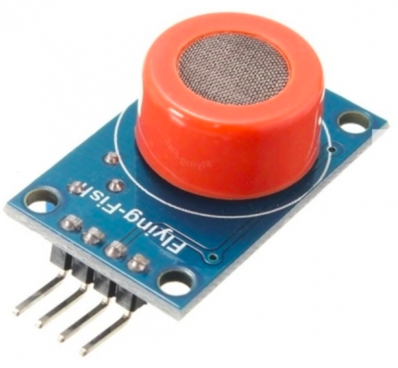
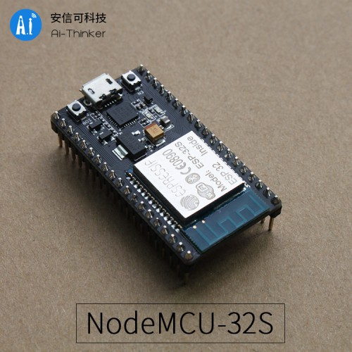

## Transdermal alcohol sensor

During research I found a tiny [transdermal chip](https://www.sciencedaily.com/releases/2018/04/180410161141.htm) which could be implanted just under the skin and transmit the blood alcohol reading to a smart device. The chip (developed by engineers at University of California, San Diego) runs on just 970 nano watts of power and can be powered externally so it doesnt require a battery. This helps to reduce the size of the chip which is crucial if it is to be implanted under the skin.

The chip, even though it might be extremely accurate and passive once implanted, is not feasible for short term use which the PS Band is intended for. The chip has only been tested in controlled lab environment and is not commercially released, so getting our hands on one will be next to impossible. Also, I'm guessing not many people would be keen to willingly inject a biosensor in their body.

The more interesting part here, is how the chip monitors the BAC and figuring out if that technology could be used in the band for passive, non-invasive monitoring. The chip contains a sensor with alcohol oxidase, which is an enzyme that only reacts with alcohol to generate a byproduct which can be detected electrochemically. These signals can then be transmitted wirelessly to the user's smartphone.

## Backscattering

One of the main issues to address with the PS Band is its battery life (The device should ideally last atleast 6 hours). However, It's not as simple as just using a bigger battery as the band cannot be too bulky.

I am looking into a data transmitting technique called [ambient backscatter](https://www.wikiwand.com/en/Ambient_backscatter). Essentially, it works by receiving radio frequency signals from another device (such as a smartphone), modifying them, and then sending them back to the device. Backscattering does not require a battery or power connection which might considerably reduce the amount of energy required to power the band.

## Alcohol Sensor

We received the alcohol sensors on Wednesday (2/1/19) and will begin expirementing with it next week.

## Microcontroller

In the last blog, I mentioned that we were looking at using Adafruit ESP32 Feather. Although, it is a great microcontroller which met our needs, we were unable to find it in Australia and the only way to obtain it was to get it shipped from overseas. The expected shipping times ranged between 1-2 months which was cutting it close even in the best case scenario.

Therefore, we decided to go with [NodeMCU-32S](https://docs.platformio.org/en/latest/boards/espressif32/nodemcu-32s.html#id1) which was shipped from Sydney instead and expect them to delivered by early next week.

### cu next week..