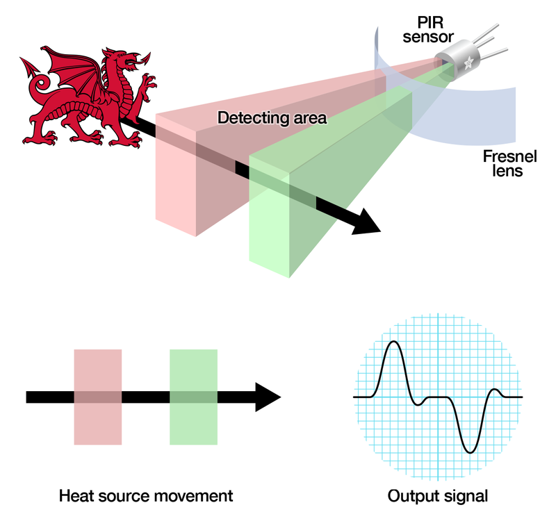

Last week on Ripples in The Red Dragon, I wrote up a plan for my project..
This week follow me in a journey as I work on my artifact & explore the field **Internet of Things**,
Delve into my mind as I share my ideas, passion, and knowledge that I steadily built upon my time and experience in Beijing.
I look forward to our time together and to exchanging invaluable concepts. :)
For **LIT** photos documenting my work see below ↓

## Artifact

### Research done this week
This week I have been researching similar IoT solutions to my current artifact.
 While researching I found an IoT company called: Humanyze.. and it is very creepy.
### Humanyze
Humanyze uses badges that look like traditional employee identification badges but they’re much more robust. The company equipped these bad boys with not just radio frequency identification (RFID) and near field communications (NFC) sensors — of which libraries and the retail industry already widely use — but it also on-boards the badges with Bluetooth, an infrared detector capable of tracking face-to-face interactions, an accelerometer, and two microphones.

The badges link up with beacons placed around the office to detect where an employee is at any one time. The microphones, on the other hand, creep frighteningly close to Big Brother territory but they don’t have the ability to record conversations. Instead, the mics measure tone, volume, and speed, along with potentially monitoring stress. The data processes in real time and delivers directly to managers in the form of an aggregated, anonymized view of their teams.

I found this incredibly disturbing because one thing is monitoring where employees are but this is a whole new level of employee monitoring...

### Infrared Sensor
This week i've also been focusing on researching how Infrared Sensors work because there are multiple variables that affect the sensors input and output, and since I have never worked with one before i thought this would be a very important and challenging aspect of the artifact.

### What i've been working on
 At this stage of my project I have been experimenting & testing out the limitations of the Adafruit Trinket M0. I have also started programming the infrared Sensor using python to output to the console motion has been detected whenever theres motion in front of the sensor and to output no motion detected when there isn't any.

### Problems Faced
I have faced a problem with the infrared sensor i purchased, the sensor seems to have a 1 second delay when detecting whether there is motion or not. This is not ideal at all as it will interfere with the ammount of work calculated everytmie adding 1 more second than there should be and sometimes overlapping the motions if there is 1 second of no motion. However for the purpose of this project I have decided to not concern myself with this problem too much as essentially this artifact is only a prototpe for what it could be.

## Warm Regards
To conclude this post, I look forward to my progress next week in finishing programming and starting to setup the connection to the database/network.

Ciao.

