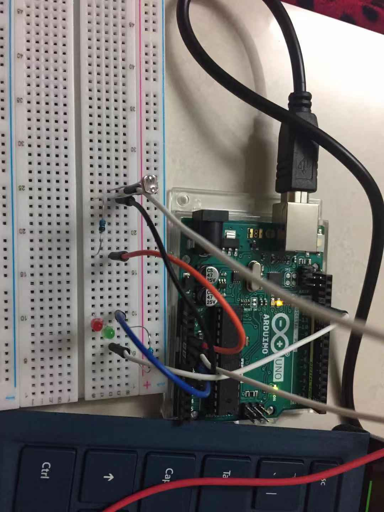

## An online course

For the last two weeks, I took an online course on [mooc](https://www.icourse163.org/course/HNU-1001978008). I have learnt some basic knowledge about Arduino Uno and know about some applications of it. The tutorial page of Arduino offers many resources and I have seen some examples of it. They are very impressive.

## Several simple experiments

At the time when I was taking the online course, I have tried some basic experiments. I have used Arduino board, breadboard, USB cable, LEDs, wires, light sensor, resistors, piezo speaker, potentiometer, and so on.

Use light sensor to control the LEDs
- I connect light sensor with a resistor and two LEDs, and set up the parameters. When the the light is blocked from the light sensor, the LEDs are on. So the light sensor here can be worked as a button that when we touch it, the LEDs are on. The LEDs are off when we take back our hands.

Use potentiometer to change the tone of the piezo speaker
- I adjust the potentiometer to change the pitch of the piezo speaker.

Gradually change the color of the RGB LED
- I use the RGB LED to gradually change the light color.
