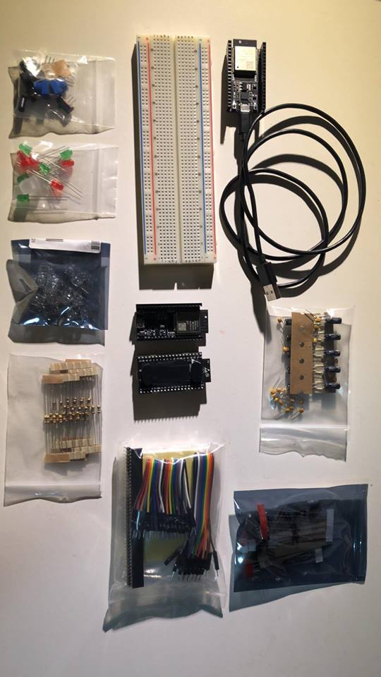

## Some Vernacular

Coming into the world of IoT and especially with the ESP32, the first thing you notice is that there are a lot of third party manufacturers who also create "ESP32 Boards". This requires one to be very precise with their language. What happens is that Espressif will design a **System on a Chip (SoC)** which is the core processor. It will be connected to an antenna, radio, peripherals and GPIO pins (all closely packed together ) to form a **Module**. The module that I'll be using is the ESP-WROOM-32, [datasheet here](https://dl.espressif.com/dl/schematics/ESP-WROOM-32-v3.2_sch.pdf) which contains the versatile ESP32-D0WDQ6 SoC.

Now here's where it gets interesting. Third party companies will purchase either SoCs or Modules from Espressif, otherwise known as **Original Equipment Manufacturer (OEM) hardware**, and will build their own **boards** around it. These boards will have different pin layouts and peripherals and all have ever so slightly different names and different documentation. For safety's sake (to maximise availiable documentation) I've purchases Espressif's own DevKitC. A **development board** such as DevKitC has most of the pins fairly accessible, an easy way of putting code onto the module (via USB-C), and buttons to flash or boot the board.

## Placing an order

This week I finally settled on a devboard to program the ESP32 on. Not all boards are made equal, as can be seen [here](http://esp32.net/#Hardware). Unfortunately the two Australian IoT shops that I tried were either closed or sold out of development boards for the ESP32. I settled on purchasing from Adafruit, who also have some interesting blogs on [Strip LEDS](https://blog.adafruit.com/2018/09/26/new-product-adafruit-neopixel-led-strip-with-3-pin-jst-connector-60-led-meter-0-5-meter/) (which they sell by the meter) and [ESP32 projects](https://blog.adafruit.com/tag/esp32/). They were able to ship the product in 5 days.

One of the requirements of the Glowstick it to well ... Glow! To avoid the mess of soldering I also bought the parts to use a breadboard to prototype. The main advantage being the "Plug and Play" development mentality. Along with the breadboard it included piranah RGB LEDs, assorted LEDs, capacitors and wires. The Piranah LEDs are interesting as they sit in a small metal housing with four struts which also serve as the three cathodes and common anode of the RGB LEDs. They can also be used as either [indicators or illuminators](https://learn.adafruit.com/all-about-leds/what-is-an-led).

I purchased:

- Three ESP32 Devkit-C Development Boards
- A Breadboard
- The Adafruit Electronics starter kit, a box of assorted components (leds, resistors, jumper leads etc.)

## Choosing a framework

With the hardware all squared away the more difficult question this week has been choosing a framework and toolchain for development. I am using PlatformIO to write, flash and debug the code. The coding framework is an ongoing question which will be answered further as more investigation is done The two main contenders are the Arduino Stack and the Espressif IoT Development Frameword (ESP-IDF). The base requirements that needs to be satisfied is that framework supports BLE Mesh.

### Arduino and Neil Kolban

Arduino is a very popular framework with a lot of documentation and community support. A lot of the examples of using BLE on the board are written in Arduino frameworks. Neil Kolban has done a lot of work researching and writing added documentation to ESP32 technologies. His [book](https://leanpub.com/kolban-ESP32) , which I’m trying to work my way through, has been very informative and easy to understand. He has written a number of libraries for the ESP32, including a [BLE library](https://github.com/nkolban/ESP32_BLE_Arduino), which is written for the Arduino framework. It provides higher level encapsulation of BLE state and state transitions in C++, but I am of yet unsure if it can implement BLE Mesh networking.

### The Official Package

The ESP-IDF offers low level interfaces that fall just short of "register poking" on the ESP32. These are the native APIs that most other libraries, including Arduino components are mapped to. This means that the ESP-IDF can also implement Arduino components. The framework also expressly includes support for BLE Mesh networking, although the code is in v0.5 Beta. The ESP-IDF is a much more alive repo with commits only 14 hours old at time of writing. This means it is a messier repo with documentation that is less explanatory and without as many guides. It also does not come with the cleanliness of some of the Arduino frameworks.

However as there seems to be no definitive, simple library for BLE Mesh on the ESP32, the ESP-IDF will have to do as I am yet to find an equivalent Ardunio library. Down the track if I was to it could be implemented as a component anyway.

There is a good [forum post](https://www.esp32.com/viewtopic.php?t=5669) written by Neil which further outlines some of the differences, although he posits it mainly comes down to personal choice.

## Beginning a repo

I've also opened up a [skeleton repo](https://github.com/oliverwljohnson/iot-stick). As most of this week has been configuring PlatformIO and deciding on a framework there isn't much there, but there will be soon!!!
