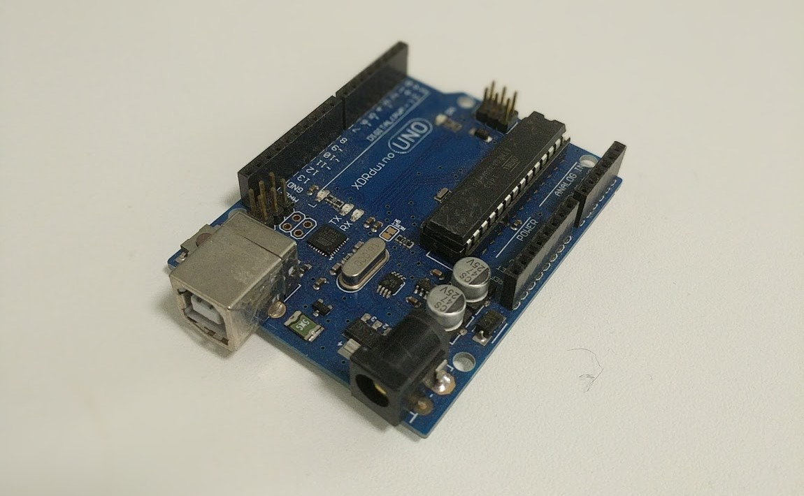

# Refamiliarising myself with Arduino

As mentioned in my previous blog post, I have chosen to use an Arduino as my micrcontroller of choice. One of the reasons I chose it was due to the fact that I possess some experience in developing for it. I had ordered new Arduino boards slightly before new years for me to use in my project.

As I was awaiting awaiting the new Arduino Boards I had purchased to come through, I had sought to refamiliarise myself with the environment which I have not touched in more than 2 years. I dug up my little highschool archive box and found my old not really arduino-arduino board, alongside some other cool sensors, resistors and cables I used in my old school projects.

Old Arduino board I used to play around with and have resurfaced for this project. Image obtained from author's personal collection

I redownloaded all the necessary programs and files to program in arduino and started looking through simple tutorials on arduino.
A useful resource I found was to go through the tutorials provided by the arduino website.
https://www.arduino.cc/en/Main/Tutorials
I also found reading through my code for my old school projects helped significantly in refamiliarising myself with arduino and how it worked.

In the end, I was able to come out of this week with more confidence in writing code for arduino and understanding more advanced arduino code I will surely need to dive into in the future.

# Light Sensors

Light Sensors are one of the sensors I had specified to include in my project plan as one of the many input devices for my pet robot. I have decided to use a simple Light Dependant Resistor to detect light.

Using my very rusty arduino skills I have just brushed up on, I created a simple program that could read the input from the connected LDR, print out the value, and turn on an LED when it is below a certain threshhold. I found the following site very helpful in both understanding and creating this program I have made:
https://maker.pro/arduino/tutorial/how-to-use-an-ldr-sensor-with-arduino

## Pet Behaviour using Light sensors

So I've got the light sensors working, now how do I actually implement it in my artefact?
The way I will be using the light sensor is as an input for specific set of pet behaviours. Mainly, it will be used by the robot to determine when the room it is in is dark.

This leads to several different possible pet actions:

- If the room is dark, we can have the pet sleep
- If the room is bright, the pet can do other activities

In addition, besides simply the state of the room, we could also perform certain pet behaviours based on transition of the lighting:

- If the room is dark than suddenly goes bright, we have the pet wake up
- If the room is bright than suddenly goes dark, we could have the pet prepare to sleep.

From these specified behaviour, I have programmed the board to react to the light levels of the room. As I have not yet programmed the specific behaviours of the pet, I have simply used print statements in the arduino to determine which behaviour the pet robot should be exhibiting.
One of the crucial steps in creating this input program was to determine what constitutes a room that is well lit and one that it's owner is prepared to sleep in. From my tests of using the LDR I have come up with the following thresholds based on the readings that I measured.

- Well lit room = >300
- Dimly lit room/shadow above sensor = 100 - 300
- Unlit room at night = 100

The result of this program now will allow my pet to react to

# Repo

I have started the repo for one of the deliverables of this course. Although it is still empty, it will soon be full of my code, oddly worded commit messages and description.

See you next week!
