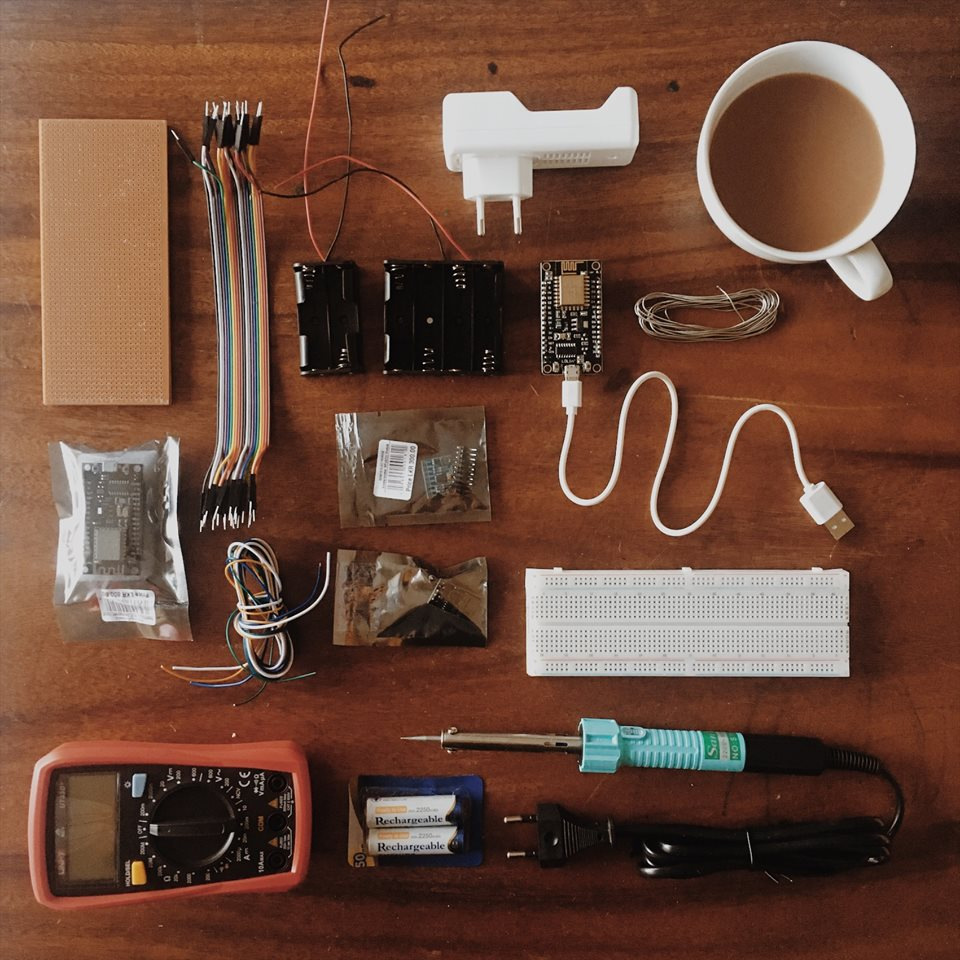

There's this rickety little staircase on the edge of a dusty street (whose name is too long to mention here) in Kandy, Sri Lanka. The succession of wooden planks were wedged between a shop selling leather sandals and its neighbouring competitor. At its summit sat an electronic shop which had seen better days. And in its bowels lay everything I would need to get my IoT project up and running.
I had no plans to waste any time in this shop so this had to be quick; I was going to be in and out.

1 hours after entering, I left a proud new owner of;

- Two NodeMCU ESP-12E Wifi modules
- an MPU6050 accelerometer
- a breadboard
- a bunch of jumper cables
- a soldering iron
- some tin lead wire
- pliers
- reacharable batteries
- battery cases
- a battery charger
- a fondness for the inefficiency and disarray inside this shop; and in Sri Lanka in general.

## Mo Drivers Mo Problems

Hokey kokey. So, I came to Sri Lanka two weeks ago and tried to find the chips I needed here. The ESP8266 and the MPU accelerometer were available, but I had to order them into the town I stayed at. It took about a week to for them to arrive. The lilypads weren't even in the country, so I didn't bother ordering those. The plan is to order them in Australia if necessary, but I think the ESP should work fine. The only problem is that it's a bit bulky and I will need to solder components/use wires where possible to make everything fit nicely on a bracelet.
I've successfully set up the Arduino development environment and installed the necessary libraries for the NodeMCU ESP-12 board, but installing the drivers and finding the correct port has caused some issues. I initially didn't think the NodeMCU needed an additional driver, so I tried to load an example blink-LED program onto the board without installing any drivers. There were only two COM ports (3 and 4) visible to the IDE, so I tried both and I got this error "Error: espcomm_upload_mem failed". There could have been for a few reasons, including not installing the proper drivers, having a faulty cable/board. I didn't receive my second board till yesterday, so I haven't had a chance to test the blink-LED on it, but I was fairly certain that the issue wasn't due to the board/cable. There were a few sources saying the NodeMCU doesn't require you to install a driver and some sources did. So, I tried installing the CH340g driver which is the one most sources claimed was required. When installation was complete, I received a message saying something along the lines of, 'the installation is complete, the driver has been pre-installed'. I should mention, I'm doing this on a Windows 10 machine. Yhen I tried loading the blink program again and I got the same error. When I checked in my device manager, there was no sign of the driver being successfully installed. I would have expected CH340g to appear under "ports" in the device manager, but alas, there was nothing there. I then found a source saying that, on Windows 7/8 and possibly 10, the driver installation of unsigned drivers doesn't work properly if secure boot is enabled. So, as suggested by this [How to Geek post](https://www.howtogeek.com/167723/how-to-disable-driver-signature-verification-on-64-bit-windows-8.1-so-that-you-can-install-unsigned-drivers/), I rebooted my machine with the secure boot disabled and entered into a test-mode. After the driver installation completed (for the 3rd time now), I still couldn't see the driver appear under ports in my device manager. And this time, I couldn't see any ports appear in the Arduino IDE. Welp. I will keep looking for a solution to this on my windows machine. If I am unable to get it working by tomorrow, I will try installing it on a MAC.

## Mucho Interactions, Many Thanks

Last time, I mentioned that I wasn't sure whether I wanted the motion data to be aggregated and mapped to some value measuring the activity level of the person, or if I try to look for patterns in the motion of one person (device) and map these to a looped rhythm. Since I can't make up my mind, I will try to implement both use cases. If they are both successful, I will add a button which will control the mode of interaction the device is in. It would also be nice to indicate which mode the device is currently in, so I could add in a couple of LEDs too. There are a few things I found to read which address the issue of mapping motion to music which I will leave below. I've only skimmed these, but I'll have a better look and talk about their ideas next week. See you then :)

- [Music via motion: transdomain mapping of motion and sound for interactive performances](https://www.researchgate.net/publication/270819549_Music_via_motion_transdomain_mapping_of_motion_and_sound_for_interactive_performances)
- [Making Motion Musical:
  Gesture Mapping Strategies for Interactive Computer Music](http://www.brown.edu/Departments/Music/sites/winkler/research/papers/making_motion_musical_1995.pdf)
- [MAPPING MOTION TO SOUND AND MUSIC
  IN COMPUTER ANIMATION AND VE
  ](http://citeseerx.ist.psu.edu/viewdoc/download?doi=10.1.1.46.1826&rep=rep1&type=pdf)
- [Shaping and Exploring Interactive Motion-Sound
  Mappings Using Online Clustering Techniques](https://hal.archives-ouvertes.fr/hal-01577806/document)
