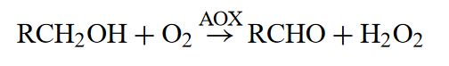

Parts have arrived — I am meeting with Chinmay this weekend to collect one of the 3 ESP32 boards we have ordered, and we can start on writing the software for communication between the ESP32 microcontroller and phones.

## Sweat based Alcohol Sensing: Cool Chemistry

I've had a lot of previous experience working with alcohol oxidation reactions—a semester of my high school chemistry was spent studying wine alcohol oxidation and the factors that drive it. However, my knowledge is limited to titration methods which require a bunch of lab equipment and [carcinogenic substances](https://en.wikipedia.org/wiki/Potassium_dichromate#Safety). So I've been reading up on the potentiometric methods I mentioned in last week's blogpost, specifically the chemistry behind it and what equipment we would need to replicate these sensors ourselves — and I must say I'm really enjoying the reading and gaining background knowledge part of this project.

To get a better understanding of the alcohol concentration readings using potentiometry, I found a [literature review]() to summarise the common chemical methods used in portable alcohol concentration sensors.

The common vein in these potentiometric methods is the use of either of two enzymes: alcohol oxidase (AOx) or alcohol dehydrogenase (ADH) to covert alcohol into ionic compounds that we can pass a voltage across to measure the current supported by the presence of the ionic compounds.

The process using ADH requires a co-enzyme (NAD+) and needs to be close to the ADH enzyme without becoming linked to it. I don't understand the specific chemistry of these processes entirely, however, as the review hints, the AOx-based methods are somewhat simpler.

Now the first thing that occurs when AOx, the enzyme that must come as part of the party-safe band skin patch, comes in contact with sweat is the oxidation of the alcohol:

Based on this reaction, we can measure the alcohol content indirectly in two ways — either we measure the decrease in concentration of dissolved O2 or the increase in concentration of H2O2 around the site of AOx application.

Neither oxygen nor hydrogen peroxide allow current to pass through them, so we must ionise these compounds. There are electrochemical ways (potentiometric methods) to measure the concentration of either of these two chemicals.

Oxygen based electrochemical approaches are well documented and there is a straightforward method (the Clark-type O2 electrode) involving Platinum cathode and Silver Anode. This has the advantages of being very selective — the platinum is a classic catalyst for the oxidation of oxygen species (being used in automobiles everywhere to neutralise carbon monoxide and nitrous oxides in similar reactions). We won't be affected by other substances dissolved in the user's sweat. But the fact that we're using oxygen, a chemical readily available around us, means that an effective "seal" around the skin by a patch is necessary — or our readings will be polluted by the background levels. I also have a feeling the platinum and silver electrodes... won't be the cheapest parts we'd have to invest in for the sensor.

The hydrogen peroxide based approaches were really finicky — involving modified AOx enzymes and other niche chemicals, some of which degrade weeks or months after synthesis. However, in 1996, Prussian Blue was found to be a better catalyst for the reduction of H2O2 than Platinum — allowing for accurate readings without the finickiness mentioned above. This is also the chemical pathway used by last week's [paper]() to measure the alcohol content in sweat.

There's a lot to consider here. I'm not entirely sure which chemical pathway would be best/cheapest for our task.

## Parts and Costs

This weekend, I'll read into how I can get my hands on the chemicals I've mentioned this week, and make an update on whether it would be feasible for us to continue on the path of making the sweat-based alcohol content sensor.