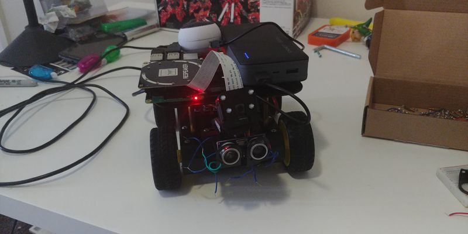

## Build Status

### Mobile Platform

I decided to go with the DFRobot Pirate, and the Romeo Arduino Microcontroller for the physical platform, because core-electronics had a bundle.

The good thing is that the build was much simpler than I expected. Closer in complexity to Real Grade Gunpla, than Master or Perfect Grade. The more annoying part was that the manual contains no information on how to wire everything together. And the length of cable provided was nowhere near sufficient. To overcome this, I've ordered additional wire and a breadboard so that I can experiment with the wiring without it disintegrating the moment something moves.

### Platform Controler

On the controller front, things are smooth as ever. I am using the Raspberry Pi 3 Model B+ with the PiCam V2 and Pimoroni pan and tilt kit, which works flawlessly. Object tracking took literally zero effort, because turns out Pimoroni already had a [tutorial on how to do exactly that](https://learn.pimoroni.com/tutorial/electromechanical/building-a-pan-tilt-face-tracker).

I will need to adapt it so that it can follow the person around next week, but that will happen only after I have the robot base wired up.

Though, since I already have a secondary Arduino anyway, perhaps it would have been better to just wire up the pan/tilt servos to that instead of buying a separate hat.

## Further Thoughts

I have also been looking at voice recognition. The pretrained models for Mozilla's [DeepSpeech](https://github.com/mozilla/DeepSpeech) can recognize my speech in real time on my desktop using my GPU, a Nvidia GTX1080. So maybe I can attach a microphone to the rig and stream the audio to a remote server for recognition.

If I am going to stream my data to the cloud anyway, one option I'm considering is employing Google's Speech to Text API. While their default privacy practices are reprehensible, they do provide [deletion commitments for their Cloud platform](https://cloud.google.com/security/transparency/). I am not entirely comfortable with piping them data, and honestly wouldn't in normal circumstances, **but** this is a graded assignment, and I would prefer not losing marks if DeepSpeech didn't perform well in noisy, real world environments.

### Drainage

**Warning:** Spoilers for There Will Be Blood.

Unfortunately, because of just how tiny the Raspberry Pi and Pi Cam are, the setup looks more adorable than creepy.

So I have been thinking of how I can amplify the impact.

An often overlooked aspect of privacy is the powerlessness of an individual. Even if an individual holds out by not having Facebook accounts and by using DuckDuckGo, their data can end up in the hands of Corporations through surrounding people.

Much like the oil under Eli's lands draining through the surrounding lands, companies we have no direct relationship with still end up profiling us. I have no Facebook account, but I have shared my contact details with people who do. And in all likelihood, their devices came preconfigured to share data with Facebook. This strips out any ability for me to not "consent" to them gaining information about me, short of withdrawing from society altogether.

So, perhaps I could also investigate this theme. My idea would be to hook myself up with a microphone and/or add microphones to various points exhibition, and have them record conversations. I would have these conversations beamed to my companion robot, that would look up advertisments related to what we were talking about.

I would attach a small screen to the robot, that would be able to display said information. Again, appearence wise, it wouldn't be much - the robot is barely shin height, but hopefully actually having conversations recorded and transcribed in near real time would have some effect of creeping people out,

P.S. There Will Be Blood is [screening at the NFSA on the 21st of January](https://www.nfsa.gov.au/events/there-will-be-blood).

_The content of this blog post is licensed under CC0_
