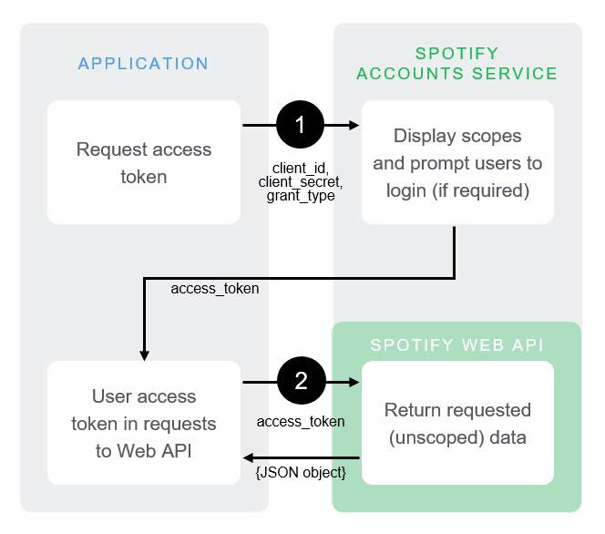

## Cheap Cords

This week I laboured over the ESP-IDF, trying to implement the environment on my local machine after the dev boards arrived on Saturday. While the docs were reasonably simple, I was got hung-up after the UART to USB drivers were installed but my device did not appear in the device manager. Despite the red Power LED lighting up and the WROOM module running hot. After finding these [troubleshooting forums](https://www.silabs.com/community/interface/forum.topic.html/cp210x_drivers_probl-MXX0), it recommended I use a Microsoft Windows SDK tool to see the inputs from my USB port (USB Video Class Device Viewer).

As it turned out the cord which I had cannibalised from my Girlfriend's Mother's car charger didn't have the wires to transfer data only power. As it turns out I wasn't the only one to [suffer the perils of a cheap cord](2019-01-11-ushini-week-7.md), with Ushini and I falling prey to cost cutting measures.

## A Meeting

As mentioned in the [Project Plan](2018-12-24-oliver-5.md), David and I ment up this week to discuss our progress and intentions for the next week. He has had sucess this week in implementing a BLE Provisioner on one ESP32 that provisions another ESP32. We spent most of our meetining walking through the IF BLE Libraries which while well documented in some areas, rely on tedious macros and unexplained terminology in others. While talking we discussed the idea of a BLE Advertising network. One could roll out Broadcast nodes on the ESP32 into public spaces. We could ask businesses to pay to put their brand on the broadcasts, as people are walking around they can get notifications about certain brands. With a bit of data collection and analysis specific products could be advertised at different times, e.g. a coffee shop in the morning and a pub in the afternoon.

We agreed that we'd both try to move past the BLE tutorial and write our own BT models.

Meanwhile I've been trying to implement the Spotify API in a simple JavaScript Application. The idea is to learn how to use the Web API in an accessible environment before loading it onto the board and having to configure the HTTP protocol myself.

#### The Spotify API

First thing is to create a Spotify App on there developer platform which I've done but hasn't been published yet. To be able to access the API each request must pass in an authorization token in the header. There are three oAuth2 flows, but as we don't need specific user data (only seeded reccomendations) we use the [Client Credentials Flow](https://developer.spotify.com/documentation/general/guides/authorization-guide/#client-credentials-flow). By passing in a registered app's ID and Secret one generates an authorization token. With this token POST Calls can be made to generate seeds using their Browse API.

The last and only time I wrote JavaScript was for the Intelledox Hackfest where I learned and implemented the Google Maps API in a short 48 hours. I'm using the reccomended Node.js and Request libraries to write the appropriate requests. There are fundamentals that I don't understand that I'm trying to wrap my head around. A useful tool has been duping calls into cURL on the command line. This does not yield much code but has been a useful tool to wrap my head around the APIs.

A very high level intorduction into RESTful APIs if you're interested can be found [here](https://www.smashingmagazine.com/2018/01/understanding-using-rest-api/).

## Next Week

We are meeting again on Sunday. We are running a bit late and are going to push out Sprint 1 deadline to later in January. Its intersting how much we over estimated it would take to complete a "rudimentary task" of implementing a BLE Mesh network.

I hope to have a proper .JS app which can handle the data by the network before I post next week.