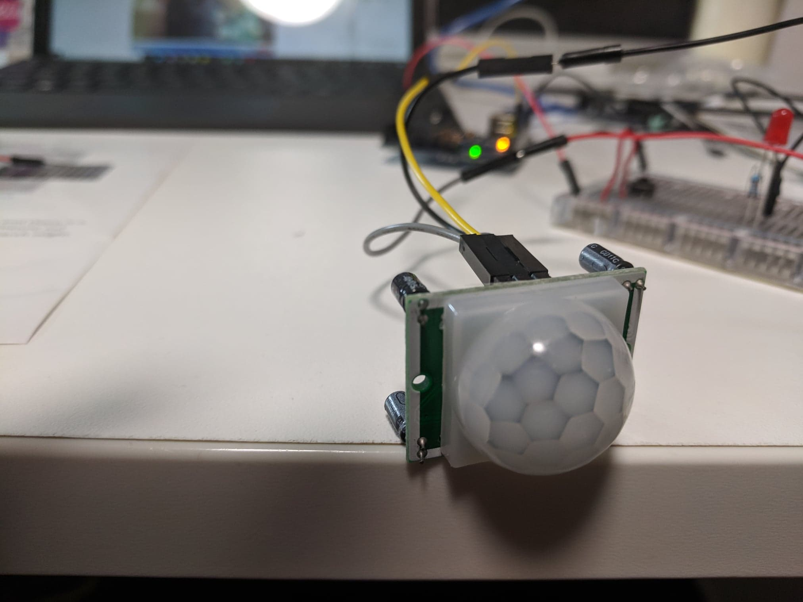

5 Weeks till Presentation!

A brief summary of this week: I focused on creating the actual main program of my pet node in relation to the input and focussed on getting the Motion Detector working (with varying success :( ). I also researched more deeply into the theme at hand and came up with some new ideas on the direction of my project.

# What I've Been Working on

## Main Program and Control Flows

This week I started working on the actual program of my robot pet. This included simple steps when booting up the pet for the first time to declaring variables that would be useful moving forward such as hungerLevel, sleepyLevel, etc.

Because I have only gotten the sensors and a few LED's working, it is far from an all encompassing program. I would still need to expand on it once I am able to program the output and gain access to the internet. But I had already begun thinking about the control flow of my program and how my robot would interpret the world. I used a lot of if statements in my initial program to allow my robot to observe the world without a command from its user.

I also begun implementing time into my code. Using the arduino time library (more detail can be found here: https://playground.arduino.cc/code/time) I had already begun programming timed events such as sleeping, eating times, and etc to my robot.
The plan in the future when I "internetify" my artefact is for it to be able to receive live or UNIX time, which will be incredibly useful when trying to synchronise the two nodes in my system.

## PIR Motion Sensor

One of the features I would have liked to implement in my pet is for it to detect when a human is moving or walking by. I can do this by using a PIR Motion sensor.

Image of the PIR Motion Detector Image obtained from author's personal collection

How these things work is actually pretty simple. They are sensitive to Infrared Waves (which if you still remember highschool physics, we all emit) and can detect when a warm body like us moves past it by comparing it to the ambient infrared wave length without us whizzing by it. I had tested it out and even integrated some of it's code into my existing program.

Unfortunately, I encountered a problem with my Motion Sensor. It seems like it is not sensitive enough for me to be able use it appropriately. Everytime I walk pass the sensor or move my hand in front of it does not register as a motion. I have yet to come up with a definite solution to this problem. One theory I have is it is simply not set to be sensitive enough to be able to detect my presence effectively, which I can ammend by somehow changing the senssitivity. Another theory so far is that the part may be faulty and unable to actually detect motion. To prove this theory I will have to purchase another PIR sensor the upcoming week.

# New ideas

## Touch

I did a bit more research on my ideas and came across an interesting application called Couple.

Couple is a messaging application for, well, couples. It has all the features of a normal messenger but you'll only have one contact there, your significant other. One of the key features is something called thumbkiss. With thumbkiss, one person can touch the screen of their phone, and if the other person touches in the same spot on their phone, their phone vibrates.

<iframe width="560" height="315" src="https://www.youtube.com/embed/NkveWyiU4Go?start=107" frameborder="0" allow="accelerometer; autoplay; encrypted-media; gyroscope; picture-in-picture" allowfullscreen></iframe>
https://youtu.be/NkveWyiU4Go?t=107

Yes, it sounds super cheesy, I know. But this feature highlights an aspect of human connection that is missing in a lot of these long distance relationships; touch. Sight and Sound can be replicated through a simple video call. But touch, is hard to transmit over long distances. This thumbkiss is an example of one way we can emulate touch.

This has given me a new idea for my SharePet. Out of all the features I had previously listed out in my planning for SharePet, not one feature emulated a sense of touch. Therefore one feature that I would like to implement in my artefact is this thumbkiss feature.

What I might do is use a touch screen panel instead of a simple LCD Panel to draw the eyes of the pet. This would deliver the exact same functionality as previously. But it would allow the user to interact with the eyes and allow my artefact to implement this thumbkiss feature.

# Theme discussion

Over the course of the few weeks, I have realised I have steered slightly off the direction I intially planned when coming up with this idea. I see myself working more on features and functions that focus on emulating a shared space, rather than features and functions to emulate a pet. I am beginning to see that this should be the primary goal over of my device, to emulate a shared space, not for a pet robot to necessarily exist. Even the new ideas I have come about stem from my willingness to emulate a shared space, rather than adding a new pet feature like barking.

This goes back to the theme we were assigned from the beggining of this course. The theme is (dis)connecting people, meaning my artefact should generally focus on the connecting part of the artefact rather than it's general commodity as a robot pet.
I want to focus more on the sharing space aspect, rather than a pet aspect.

# Where to Next?

So far, I have been focusing on inputs and sensors in my artefact. From Light sensors to Motion Detectors, these sensors allow the artefact to interpret the world around them. I may still add more sensors in the future, but will now start shifting my focus to other essential aspects of my artefact, such as alklowing the device to communicate to users and other devices, a.k.a output. Most of the code I have written simply emulates outputs via print statements and yet to be able to communicate with anything else. So the natural progression of my project is to start moving on to these things.

## Outputs

I want to begin exploring how what output I would like to use for my pet nodes. The main method I have initially planned was using a speaker to emulate pet noises and using a touch screen (which I just ordered because the idea came to me this week).
Next week I want to begin to start developing the exact outputs I would like for my pet node in regards to the speaker. This will involve sourcing and designing sounds that are appropriate and coding it into my pre-exisiting program.

## Internetifying my thing

While I am still waiting for my Arduino Wi-Fi shield to arrive in the mail (thanks ebay), I am planning to start doing more in-depth research on the exact specifics on how I would like my devices to communicate. Key questions I would like to begin exploring are:

- What kind of communication protocol will be used to communicate between two pet nodes?
- Will I need some sort of buffer or cloud store to store data rather than communicating directly?

Now I'll end this blog with a Joke, something I haven't done in awhile:

A programmer was arrested for writing unreadable code

He refused to comment.

### References

Joke: Reddit user u/Automated-Waffles
https://couple.me/
https://learn.adafruit.com/pir-passive-infrared-proximity-motion-sensor/how-pirs-work
https://playground.arduino.cc/code/time
