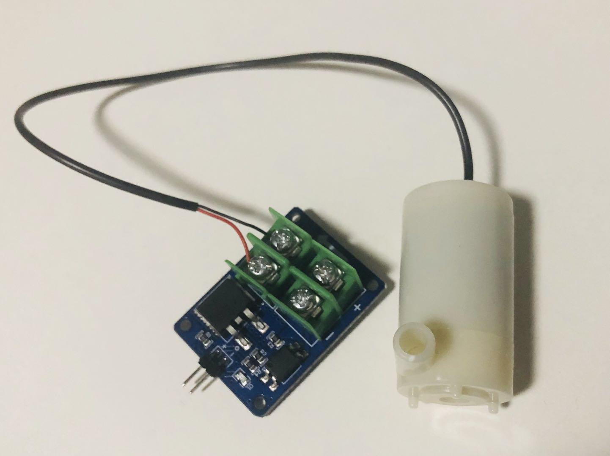
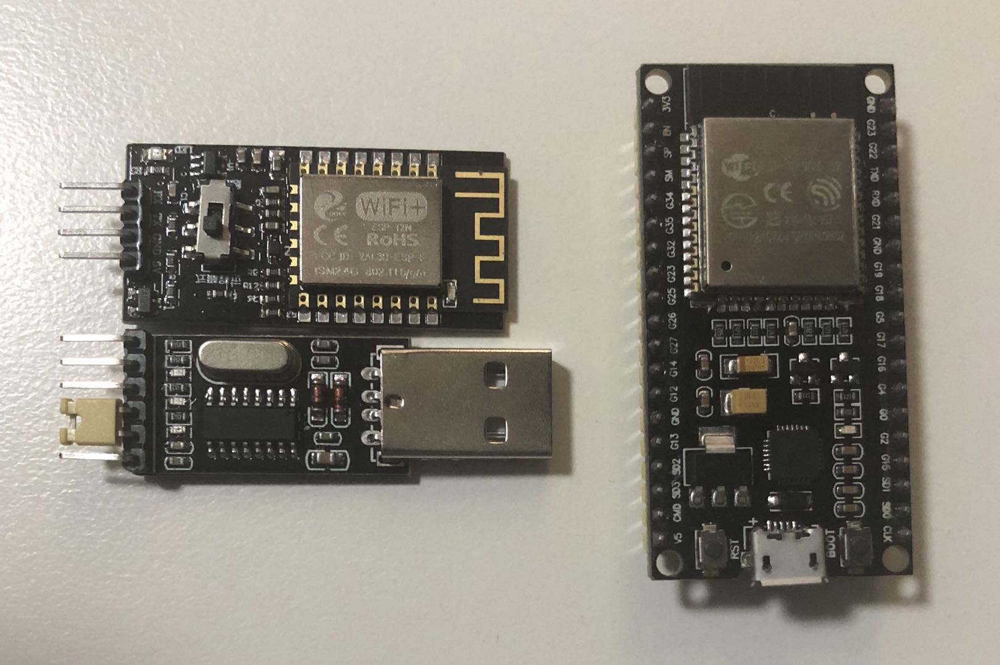

As title shown, the most important thing I did this week is coming back to Canberra. Actually I did not do much job this week with few-day packing, travelling and pure rest, but I'm still trying to handle problems I pointed out last week and new exploration comes out as well at the end of this week.

## Work on Various Components

Mainly trying to deal with *the first 3 duties* pointed out [last time](https://cs.anu.edu.au/courses/china-study-tour/news/2019/01/11/china-stage-project-diary/), I continue working on individual tests on different components for the final artefact before I'm back~

An important decision I've made is that I have chosen to **make a special box specially as my intelligent tortoise home**! I initially plan to make an artefact that can transfer a common box to a relatively professional home for tortoises, or even goldfish, while through the whole research way, I changed some of my idea.

A Chinese IoT "intelligent **fish** aquarium" artefact need to [be pointed out here](https://www.arduino.cn/thread-48829-1-2.html). (Although it's all in Chinese... "SORRY for that :(" You may find the main idea from inside pictures.) It is the one that I found most similar to my artefact. Although it gives me the initial idea "what the intelligent family aquarium looks like", I will have different main designed functions, such as "feeding" and "land-water swap", and use absolutely different devices, considering my experience as tortoise owner~

I found that I could not easily combine all functions suitable for both tortoises and goldfish, mainly through research on existing heating devices for the 2 creatures. For fish aquarium filled of water, the standard heater is with long length and needs to be put inside water *(as shown in the Chinese artefact)*~ While for tortoise aquarium, we need to use *thin* heater specially for low water level~ So, I will just make the project special for tortoises, as it will be possible to consider more detailed tortoises’ habits~

In addition, considering the safety problem and the time limitation, for the heating device part, I will not use the original heating pipes, instead, I will **use the existing professional heater with plug**. I consider 2 methods for control: One is using a "machine hand" to control the plug board button (whether with power), thus controlling the corresponding device. It isn't a good way at all and will never be used in daily life, while it makes sure everything is designed by myself ~ Another way is using a remotely controlled ["smart socket"](https://www.mi.com/us/mj-socket/), which becomes popular in China recently. Of course, I prefer the latter one.

Another milestone needs to be recorded is, finally, I finished my "digging holes" and "stick" ***handwork*** job! After testing some sensors and devices and making decision to use a whole box for better exhibition effect, I've designed positions for most of components, such as putting "micro servo" and "food container" used for *feeding system* together with the "pulley" system for *land-water swap device*. I also spare space for the led lamp. To keep mysterious, the final things will *not be shown* in pics currently ;P ~

To conclude, for various single components, the *untouched things* are:
- turbidity sensor
- water-proof temperature sensor
- diaphragm pressure sensor *(may use)*

The other left problem is I still do not know how to control pump with my Arduino board~ (Now, I only test to use Arduino board as power supply. A pump broke through the process btw :( ) When I bought the pump online, the shop owner suggested me to buy a **“MOS field-effect tube electronic switch module”** (ignore the terrible translating...) to link pump for control. But I am still not sure how to use it even seeing its circuit diagram. I think it may need to have 5V extra power on the controlled side, while still wondering how to get the special level power. :(

Overall, I may not spare extra time on these things (especially for the untouched part), but will continue studying on them in the later function combination process. So it can be seen as an end for my single components study part :)

## Problem on "Internet" Connecting Part

The largest difficulty I am facing currently is the addition of the Internet part. I pay more attention on *Things* part for the IoT project, while I finally found I ignored *Internet* things too much...

As my current design, actually, all devices can be directly controlled through sensors' data. I will add various conditions for sensors' data into codes, and control lamp, micro servo or corresponding devices which are controlled by relay modules by judging whether they're under special conditions respectively. Through this way, the artefact can mainly reach the "tortoise home" function, while I'm really not sure whether it is still a standard IoT project, as no Internet part seems to be added in! And if everything is designed in this way, I even do not need to use any Wi-Fi module or my ESP32 board...

While trying to add new Internet part, I found large problems with my bought things!

My bought Arduino set has a Wi-Fi module itself, and can be linked with the Arduino board. It has its own APPs to remotely control specific sensors and to connect with peripheral Wi-Fi. But I have different sensors and cannot directly used the existing apps. I contacted the shop, while they are lazy in contacting the technique department and the communication is much harder with the jet lag :( So finally, I only got the reply said that, the board is already combined with the shop's server. And I don't think I could use it by rewriting something.

I have another **ESP32 development board**. But it is an ESP32 board, rather than a single Wi-Fi or Bluetooth module... I think Arduino board and it can be combined to connect to the Internet, while I am still on my way to research the way... For this part, I need to do some urgent research and make final decision quickly, but I'm not sure about anything due to my basic knowledge deficiency... Thanks to Yuze a lot, I accidently found he did relevant research and faced some similar problems as me. Through chatting with him, I make up some professional knowledge for ESP32 board and board communication, which I could not found exact answer through own research.

Currently, considering my whole artefact designed to put more efforts on *Things* part rather than *Internet*, I mainly plan to use "Internet" to store data such as when the lamp is actually on or whether the feeding device is open on time. It is what an outside pet owner is concerned most! I could not guarantee there will be extra time to add further remotely control. But first, I need to quickly find out how to use the ESP32 board and realize the former function~

## Next-week Brief Plan

Through the above discussion, I summarize my next-step plan:

In the coming weekend and the first half of next week, I will find out how to actually build my "Internet" part and how to upload information using the ESP32 board. If I'm still stuck for making relative decisions or confused for the project requirements, I will communicate with Ben as well :)

And since the second half of next week, I plan to begin the whole artefact combination -- linking different sensors and their corresponding devices~ Hope it could reach the expectations!