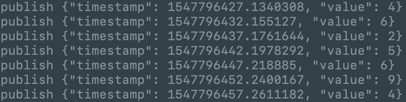
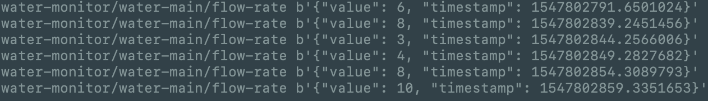
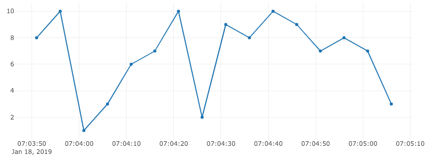

## Connecting the dots

So this week I've been hard at work developing the software package for the water monitoring system, and I have made some great progress so far.

### Software Systems

At the moment, I have three main software systems that all interact with each other:

- **Reporter** - reads sensor data and sends it to the server (also acts on commands from the server)

So far I have made decent progress with the reporter, its structure so far is two loops, one for the send/recv for networking, the other is a read-delay-read loop for the sensor. The plan is to able to set the read-rate as a command from the server, so it can be as frequent as the user likes. In its current state, the reporter generates a random number (in place of actually reading from the sensor) and sends it via MQTT to the server every 5 seconds.

- **Server** - handles the incoming data and stores it

At the moment, the server is a passive consumer of data, all it does is listen on a MQTT topic and saves any messages to the database. The database solution I have chosen is called [tinydb](https://tinydb.readthedocs.io/en/latest/), it is a very lightweight and dependencyless database that uses JSON files to store data. Given the simplicity of the data stored in this project, it is an excellent solution.

- **Interface** - a flask app that serves a simple web page used for controlling and monitoring the sensors, also send out commands for the reporter to act on.

The interface in its current state does nothing but display a graph to test the incoming values from the reporter that are stored in the database. I decided to use [plotly](https://plot.ly/) to graph the data as it is a very polished interactive graphing platform with many great features.

### Software Issues

Software systems are not always as simple as they seem to be. Pipenv is one of those tools that makes you life easier as a developer working with python, but it link any other system has its quirks that make it less useful in certain situations. I ran into an issue that took me quite some time to give up on.

There is a known [issue](https://github.com/pypa/pipenv/issues/210) in pipenv where the dependency hashes are not consistent across operating systems for some reason, and hence installing them fails when the hash-checks fail. I tried many things to make it work but for a lone time I was unsuccessful, so I gave up and went back to the old method of install dependencies with pip. I wasted a good hour or two on that issue alone, and in the process remembered a valuable lesson: sometimes the best option is to give up. There won't always be that perfect solution, sometime you just have to do what works to save hours of trouble for something that makes no real difference.

## Hardware Update

All of the electrical components I need have now been delivered, way ahead of schedule! I now have all the required components to measure and control the flow of water. All that is left to buy is some tubing to connect between the components in a closed loop, and any other tools like zip ties, resistors and wires and some water-proofing gear to complete the inventory for hardware component of the water monitoring system.
