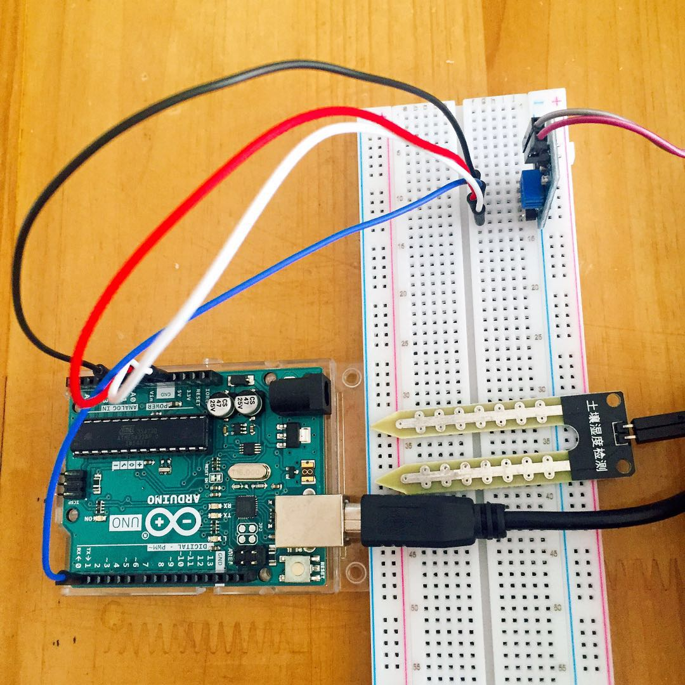
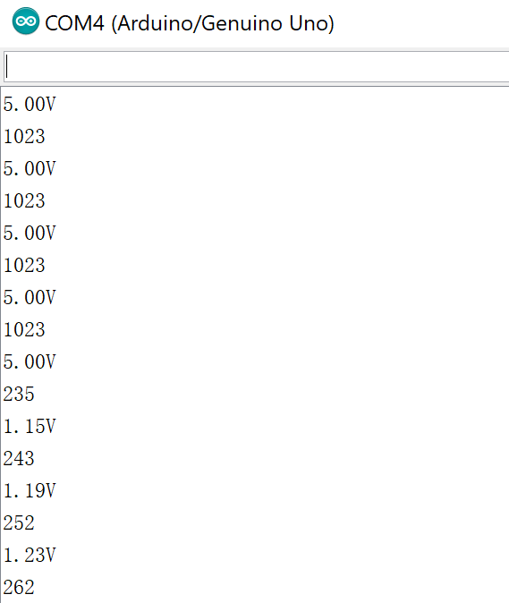
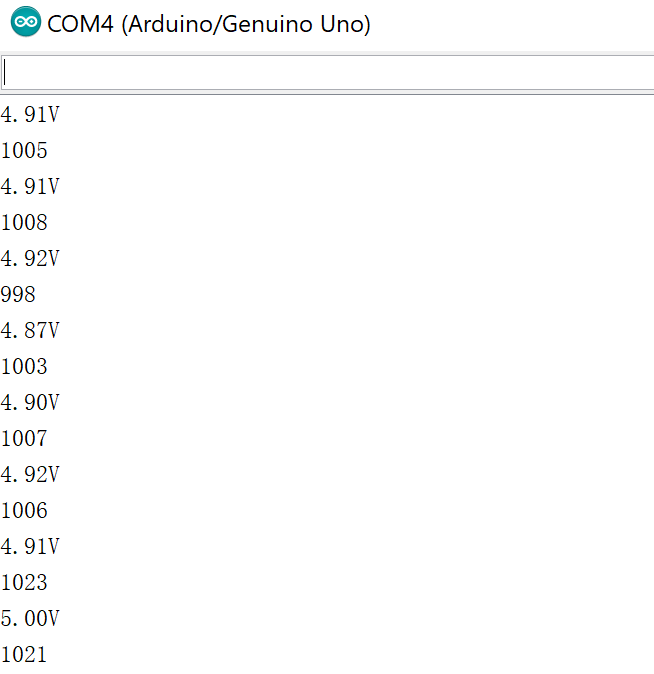

## About this week

### wifi module

Following last week's question, I searched more and found that the wifi module that I'm using can be a wifi client, which means it can connect to an existed wifi. So I mainly worked on getting it connected to wifi.

[This](https://www.geekstips.com/esp8266-arduino-tutorial-iot-code-example/) website has a clear demonstration about the information that I need to achieve the goal. I followed the steps and set up the software environment. Some of the downloads take a long time.

But there are still some problems when I uploaded the program to Arduino IDE. I google the error messages and still haven't find a solution to solve my problem yet. Maybe I need to search more information about this wifi module and update the diary later.

### soil moisture sensor

The good news is that the soil sensor works good now. I have read an online [instruction](https://blog.csdn.net/ling3ye/article/details/51416786) about the usage of the soil moisture sensor and the connection of the wires. The following picture is my connection and it works well.

To get the data from the soil moisture sensor is not complicated. But I still met the problem when trying to get it working. At first I got some errors when I uploaded my code. It was the same error as the time when I uploaded my code for the wifi module. Later I found out that I should use back the Arduino board rather than the Arduino Uno Wifi in the board selection of IDE. I chose back to Arduino board and it worked.

The other problem I met is the port in the IDE is grey for me so when I uploaded it said that I haven't chosen any port. After searching a long time online, it turned out to be a connection problem. I replugged the USB and it worked well.

These are some screenshots of the data shown on the serial monitor from the soil moisture sensor.

We can see the current voltage and another value that can represent the moisture. The value gets higher when it senses the place is dryer. 1023 is the value in the air. We can see the value gets lower when I put the sensor in the water.

When I put the sensor in an actual plant, it just changes for a little bit. Perhaps the plant is very dry at the moment because I can feel the soil is very hard. It shows that the sensor still works good. It can tell the difference between the air and a very dry plant.

Since different kinds of plants need different soil moisture condition, to know the proper moisture for a plant and specify it as a digital value is also a problem for me.

I will keep working on the wifi module and the soil sensor next week.