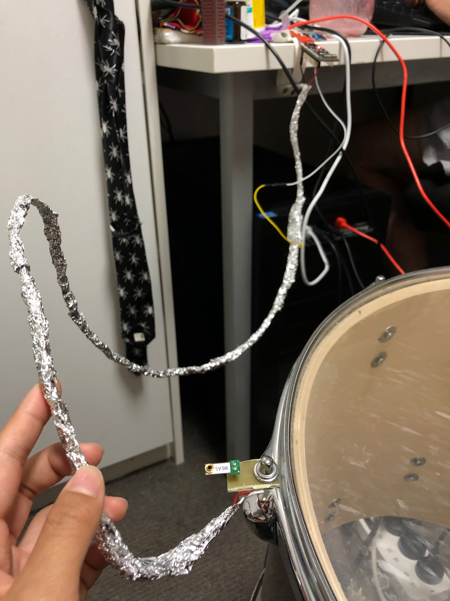
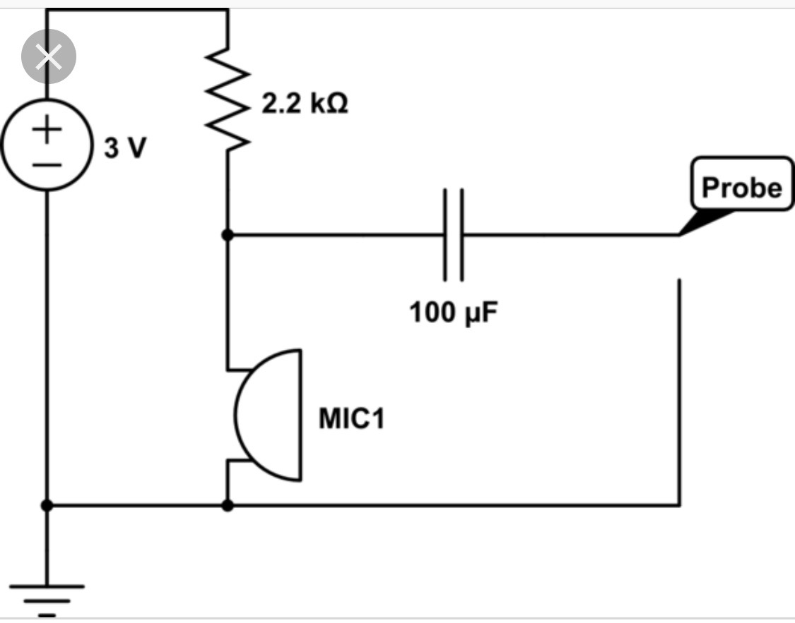

Work of this week includes testing and comparing different sensors and deciding what kind of inputs data (continuous or boolean).

## Capturing the Hits

1. Vibration sensor
   1. First attempt:
      - Setting up: the sensor is connected to the side of the drum rigidly through the board I soldered the sensor onto.
        The sensor is connected to pin4 (IO4) and ground pin on ESP32

        

      - Soldering [Video]
      - Noise: noise floor has higher amplitude than the input at the beginning and
        the returning value of the sensor was going up and down around 2000 (out of 4095, the maximum output the sensor will return).
        To deal with it, I twisted the two wires connetcting different ends of the sensor together and covered them with aluminium foil. The aluminium foil is then connected to the ground pin.
        The noise is reduced to ~600-700, when I hit the drum, the return value is ~1000, which is distinguishable from the noise.
        This should be further improved for the situation when the user does not hit the drum hard enough.

   2. Second attempt
      - Setting up: the sensor is connected to the bottom surface of the drum by blu tack and tape
        [Image: second set up of vibration sensor]
        Advantage of this method compare to the first attempt is that the vibration of the surface of the drum is much larger thus much eaiser to distinguish.
        However, at the same time, the connection is not as rigid.

2. Microphone (Fourior transform) - Set up: The microphones are placed at the bottom surface of the drum, one touching the drum and one not. - The connection between microphone and ESP32 is a bit more complicated than the vibration sensor.
   For microphone, a battery is needed as well as an extra resistor. The circuit I used is showed below. (ESP32 is the power source(3v3 and ground) as well as the Probe(IO4) in this case)
    - Solering and testing: microphone with the above circuit is tested with an
3. Air pressure sensor (There is a hole on each drum and it would produce a puff of air when it is hit, which could be picked up by the sensor)
