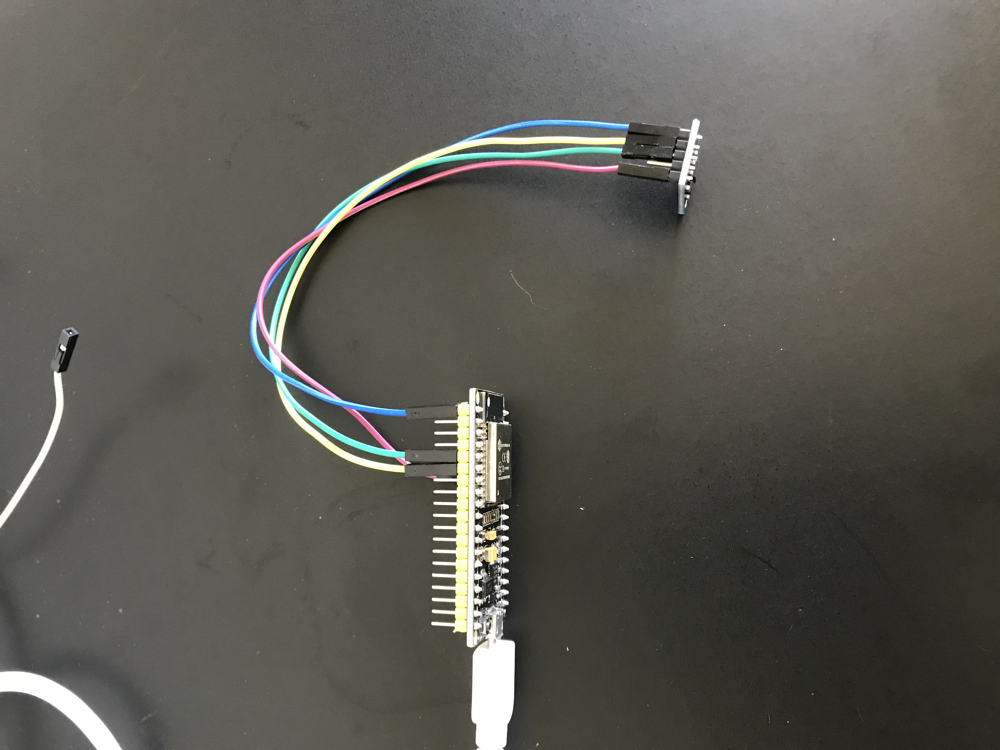

# Project Diary 3

## Overview/Research

I arrived in Perth on the 12th and was then able to check on the status of my microcontrollers. Unfortunately, due to some delivery issues my microcontrollers hadn't arrived yet and I had to rush to a store near my house to purchase new ones. (Hopefully the ones I ordered online arrive soon). The whole situation with the delivery stressed me out but fortunately I was able to pick up 2 ESP 32s at the local store. I've just been playing around with the microcontrollers this past week and have started to write some code to get the accelerometer working.

## Software

On the software side of things, this week I've mostly just been setting up the microcontroller on my laptop and playing around with it. I had all the ESP-IDF files already installed on my laptop from earlier weeks. However, an issue I came across was that the laptop wouldn't recognise when microcontroller was plugged it. Thus, I had to install a driver from the website Silicon Labs. This fixed the issue and I was good to go!

I started by using some of the example code that was stored in the ESP-IDF repository to test out the microcontroller to make sure I knew how to use it and that it was working. I realised that in order to be able to use all the functions I have to export the IDF-PATH each time which is a bit of a pain. I'm sure theres another way to do it which I should probably figure out next week. I started by getting the hello world code going which worked fine because I followed the instructions on this website:

https://docs.espressif.com/projects/esp-idf/en/latest/get-started/index.html

I tested out the touch sensor code as well and tried to make sure it was outputting different values on the terminal as I touched the GPIO pin and everything seemed to work fine. I finally then started a new project on VSCode. I decided to use one of the existing projects a base for the project just so I'm not completely lost. Then, I began to start writing out the basic functions to get my accelerometer working. Since, the accelerometer has an analog output, I must use the analog to digital converter in order to read in the values. I'm using the following website to help with writing code:

https://docs.espressif.com/projects/esp-idf/en/latest/api-reference/peripherals/adc.html#_CPPv217adc1_config_width16adc_bits_width_t

## Hardware

As for the hardware, I had a bit of an issue with the accelerometer because it had more I/O ports than the number of pins on the accelerometer so I had to cut one off in order for it to fit. Once, that was done, I did a bit of research to know which pins on the accelerometer were meant to be connected to which pins on the microcontroller. I decided to use GPIO pins 33 and 34 for this because those are the analog to digital converter pins. So, I connected the x and y to those using the jumper wires I had purchased. I connected both the GND pins to each other using another jumper wire. Finally, I connected the VCC to the 3V3 pin on the microcontroller. I used the following website to figure out the connection between ports:

http://www.esp32learning.com/code/esp32-and-adxl345-sensor-example.php

Then I realised I need to solder the I/O port piece into the accelerometer. I do not have a soldering kit so that is something else I will need to look into next week.

## Inspiration

I went back to do some research on existing smart toothbrushes this week. The difference between my aretefact and existing toothbrushes is the fact that my toothbrush will send information to the dentist. This is the main selling point of this toothbrush is that it will encourage users to keep up with their brushing habits through their dentist finding out. This will also assist the dentist because it will give them an idea of the patients brushing routines. Most current smart toothbrushes help users by giving them brushing advice having apps that connect the toothbrush to their phones. However, having the app doesn't mean that the user is going to follow the advice given on it. By giving this information to the dentist, it will ensure that the patient will improve their dental hygiene through public shaming.

## Questions/Next Week

Over the next week I will be working on getting the accelerometer to work and print outputs on the terminal.

1. Get my hands on a soldering kit / how to solder?
