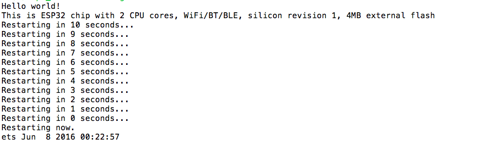
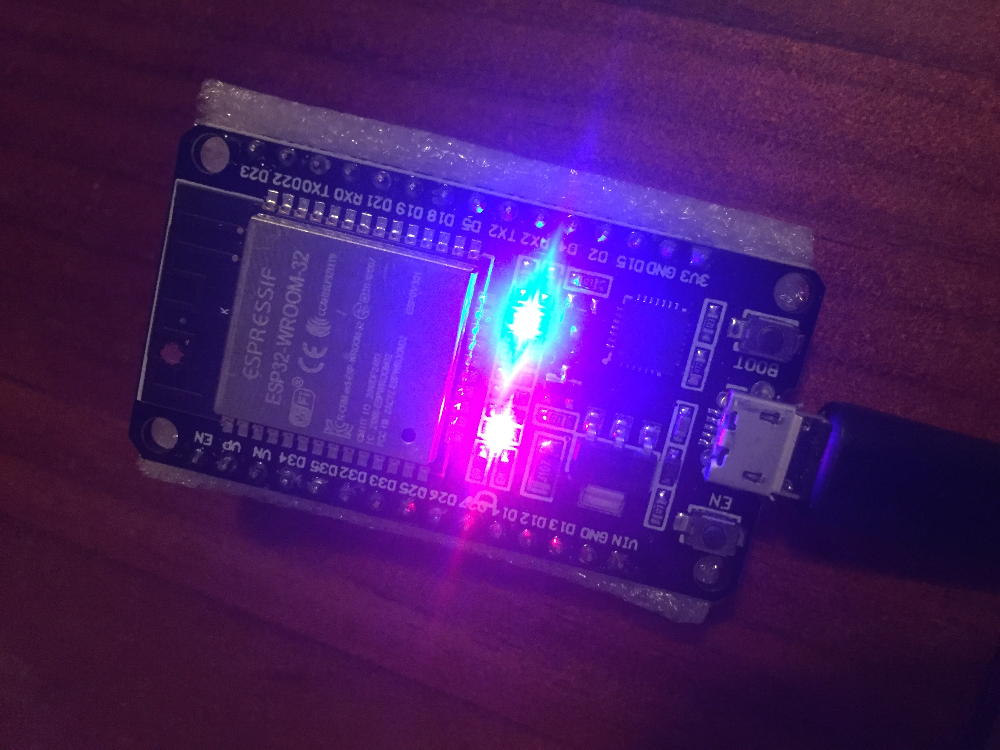
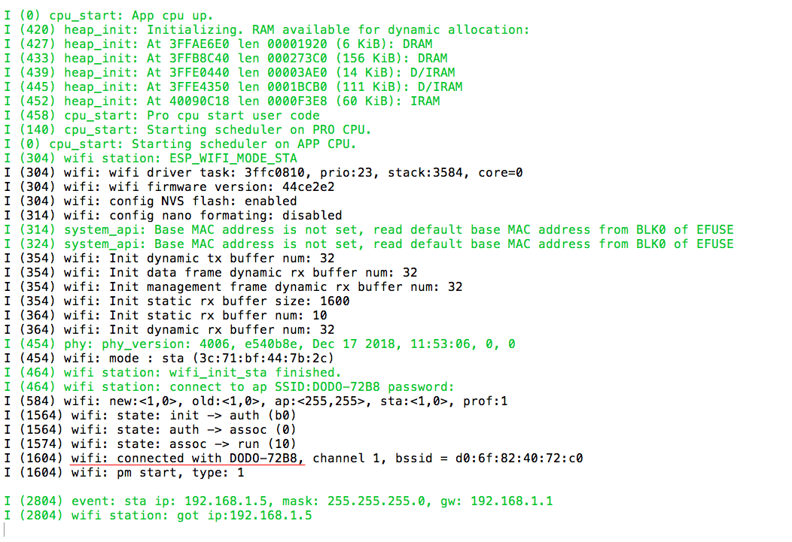

## Playing around with the board

### Hello World!

Starting off from where I left off last time, I was finally able to get the board to run hello world.

My approach last week was trying to use only the specific libraries that the main file required, however, that didn't work (I'm assuming because the libraries might have other components they are dependant on).

To solve this issue, I am now flashing the whole esp-idf library to ensure that every file required by the main file is available.

### Blink

After getting hello world to print, I moved onto another classic exercise - making a LED blink. The most challenging part here was figuring out which GPIO pin controlled the LED as it is hard to find documentation for this exact board. However after some research and, trial and error, we got there!

### Wifi

After some basic exercises out of the way, it was time to focus on the 'internet' part of IoT by connecting the board to Wifi. Although I ran into a few errors intially, mainly to do with the input of ssid and password, it finally connected to WiFi!

Now, I need to do some research on how to send data across the board to the laptop just using Wifi.

## Sensing Alcohol

After a considerable amount of research, Adi and I have come to the conclusion that it will not be possible for us to pursue transdermal alcohol sensing. Unfortunately, we simply do not have access to the necessary chemicals/parts which will be required to build such a thing. Therefore, we will be trying to use the alcohol sensor we ordered to build the PS Band.

## What next?

My goal is now to connect the alcohol sensor to the board and print out the input values in the terminal. First, I will try to do so while the board is still physically connected to the laptop. Afterwards, I will try to connect the board to another power source so there is no physical link between the board and the laptop and try to transmit the same information over a WiFi connection.

### cu next week..