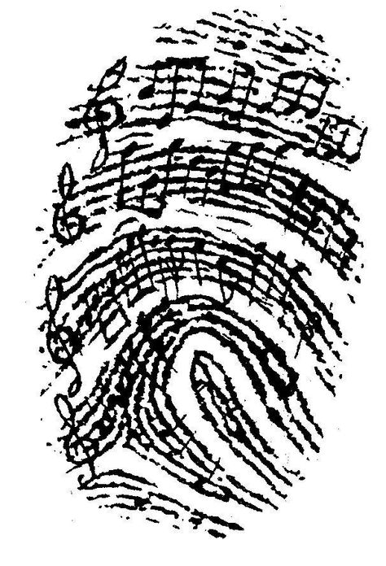
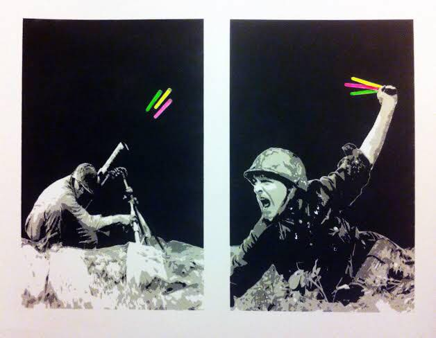
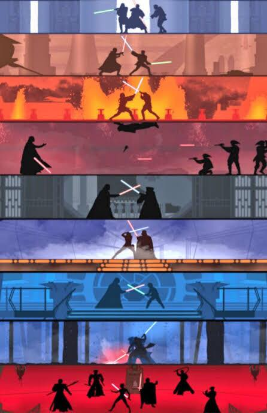

## The SAIAPI or How I Learned To Stop Writiing And Read The Docs

Between struggling with Node.Js asynchronous function calls and the Spotify documentation this week has been a chance to reflect on the progress, purpose and consequences of the Glowstick. My main trauma this week has been trying to get the API to interact with Spotify's AI, the browse functonality. After a number of hours struggling with Node.js request, I finally found a home cooked library, which I instead used their builder functions to extend instad of reading the docs.

#### Progress
According to our technical plan we are running a week late. It's more likely now that we will have to abandon sprint 2 and sprint 3 and solely focus on getting a rudimentary prototype working. I met with David twice this week which has kept the both of us focused on our task. At this stage he's still struggling with the BLE implementation.

Meanwhile I've has sucess with the Spotify API. After spending too long writing my own http requests I found an [npm package](thelinmichal.com) that packs the request calls into api objects. I had to extend the package to accomodate some of the browse functionality that was not implemented. It was this package that I only realised later that I had written a function identical to the library.

I have two JSON dependencies that allow for inputs and outputs of reccomendations, however I may instead pass in variables rather than JSON objects for simplicity. This would mean I would have to de-construct JSON objects before passing them in and reconstruct them before the http request.

    seed-options.json
    {
        // Up to five genre seeds
        "seed_genres" : ["pop", "electronic", "chill", "rnb", "jazz"],

        // Any combination of tuneable track attributes
        "min_danceability" : 0.7,
        "min_popularity" : 50,
        "min_valence" : 0.6
    }

The Seed Options is generated by an ESP32 listening on the BLE network, applying a rudimentary voting algorithm and then sending this file to a server (at this point in time my local machine). We haven't yet implemented this part of the system.

Seed options controls what reccomendations you want. It is used for the [client credentials flow](clientcredentials.com) command `Get Reccomendations`. This key difference between client credentials flow and what Brent has described in his guide is that client credentials are used instead of getting the user's permission.

This will return a Reccomedations object:

    reccomendations.json
    {
        "tracks": [ track1, track2, ... ],
        "seeds" : [ reccomendationObject ]
    }

The `track` object has details about the popularity of the song, a link to play it, it's id, what market's its availiable in and other details. The `reccomendationObject` has details about how many songs the seed object generated and a playlist pertaining to that generation.

These files can then be used by a Web Player yet to be written.

I'm a bit more optimistic than David, but his attitude of a [turnaroud time](2019-01-18-DavidHorsley-week8.md) does give us a way out if we cannot secure an implementation of BLE by late January.

#### Purpose

The main purpose of the device is to give partygoers more control over the music they hear at their favourit club. By Connecting Together as the theme suggests, revellers are responsible for the music of the evening and therefore their own experiences. For the passionate this glowstick forms a vital libertarian tool in the fight against ongoing encroachment of music venues' desires only to play the top 40 remixed with DJ Kahled screams over the top.

[Liljeström et al in 2012](https://journals.sagepub.com/doi/10.1177/0305735612440615), looked at the experimental evidence of the roles of music choice, social context, and listener personality in emotional reactions to music. They found that more intense emotions emerged in participants when they chose the music (as opposed to randomly selected) and when they were listening in a group rather than alone. In a majority of music venues the music tastes are dictated to the listeners with the select Brave trying to yell at the DJ to play something that they like. The Glowstick can agument and expand these intense feelings by letting atendess choose music they want to hear. The collective, group process of choosing or at least suggesting to the DJ what song to play next can develop a strong sense of fraternity.

The Glowstick with its different coloured LEDs representing different genres facilitates a patron's self-election into a particular group. An act that establishes a form of identity, shown in the simple way that a drunken conversation can be born out've the observation, "Oh wooowww, you're wearing BLUE! All of my friends got the yellow RnB one."

Simon Firth draws the link between music identity in his 1996 paper [Music and Identity](http://faculty.georgetown.edu/irvinem/theory/Frith-Music-and-Identity-1996.pdf). The Glowstick allows that link to become much more tangible.

>_"The experience of identity describes both a social process, a form of interaction, and an aesthetic process as Slobin argues, it is the 'aesthetic rather than organizational/contextual aspects of performance' that 'betray a continuity between the social, the group, and the individual' It is in deciding - playing and hearing what sounds right (I would extend this account of music from performing to listening, to listening as a way of performing) - that we both express ourselves, our own sense of rightness, and suborn ourselves, lose ourselves, in an act of participation"_

Our Device aims to bring people together over music, using the same technology that is deciseivly alienating fringe members of our society and irrevocably threatening western democracies.

The role of the internet has been observed to facilitate the paradox that although we are the most connected to there people we have been in all of human history, loneliness is at epedemic proportions. [Of 20,000 Americans surveyed](https://www.multivu.com/players/English/8294451-cigna-us-loneliness-survey/) in 2018, 46% reported sometimes or always feeling alone or left out (47%). It seems as a society we very much are (Dis)connecting together.

#### Consequences

The consequences of our device, I can only imagine will not be too vast. But assuming that this does not stay on a repo relativley obscure to the public, widespread adoption may see a more gamified approach to a night out. I hope that it would spark a conversation around the influences of ones personal music preferences. I'm also aware that group think can morph into mob mentality and the best music may not be chosen. It may also serve as a good lesson on democracy and voting in general.

Below is an example of how the glowsticks may be used to fight and enforce tyranny.

