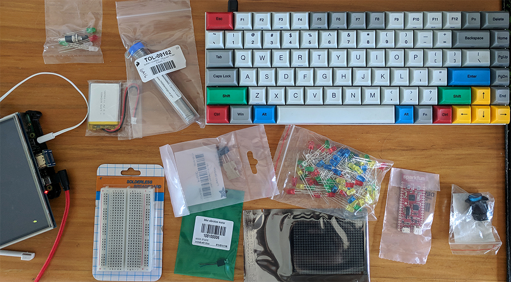
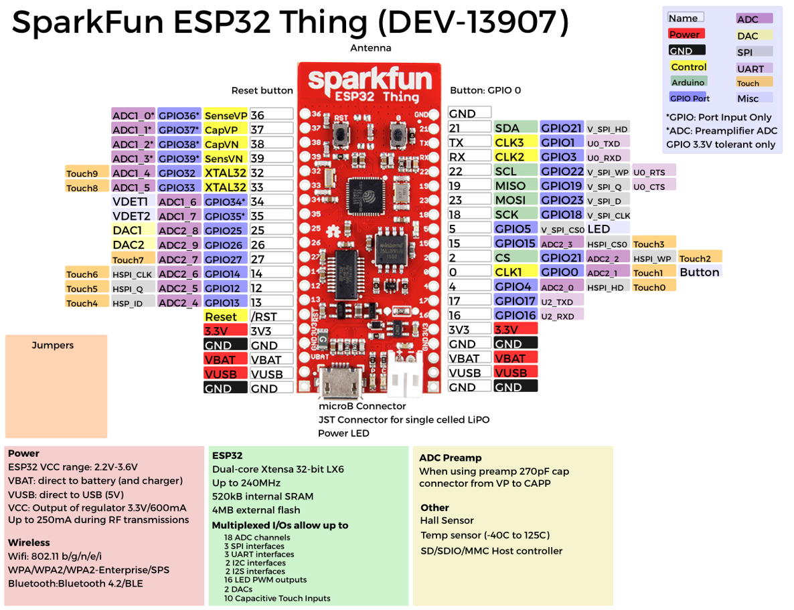
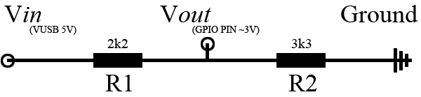
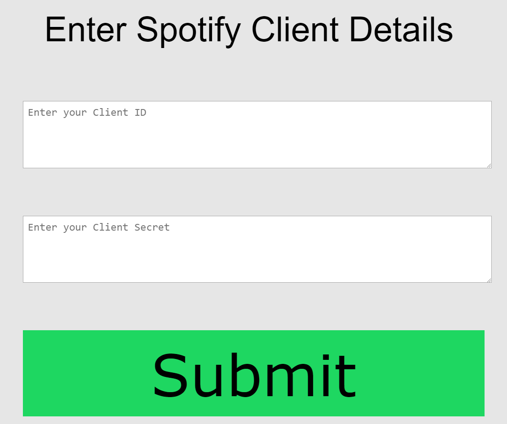

  

#### *In this chapter, assessing the situation, shopping and a more robust Spotify authorization system*

### Tidying up, a plan  
As you may know, I changed my idea from the initial pitch in the week 5 blog. As a result I haven't had the best in the way of detailed plans and timelines. To help remedy this I felt it would be appropriate to sketch out the different components and what software will be running on them and then additionally, what needs to be done.

**Plan:**
* Raspberry Pi
    * Raspotify - running the Spotify client and playing the audio, however not controlled from here.
    * Python
        * Detect the connecting and disconnecting of usbs, communicate with the javascript server to assign them to song requesters
        * Read user input for physical buttons and GPIO pins on the Pi etc.
        * Communicate with the ESP32 'restaurant pagers' and assign them to connected phones (most likely via bluetooth, however LAN messaging may also work)
        * Control the 'locked boxes' containing the phones
    * NodeJS Server
        * Communicate with the python script and link that information with the javascript side (usb connections, song requests etc.)
        * Handle web requests, host the content and communicate with clients
        * Perform the authentication step if HTTPS can't be used
        * Handle the audio control and playlist manipulation
    * P5 sketches
        * Login sketch for the Spotify authentication (may need to run locally if HTTPS can't be used)
        * Main display sketch, will have a QR code linking to the current URL for requesting songs as well as instructions and walkthroughs for using the device
* ESP32
    * GPIO controlling LEDS, buzzer, vibrator and USB detection
    * Python (or similar) script controlling bluetooth communication with Pi

**To-Do:**
* Working audio submission page
* Audio control back end
* Working usb communication with smartphone
* ESP32 to Pi communication
* GPIO control from both Pi and ESP32
* NodeJS <-> Python communication
* Investigate HTTPS or just run auth locally
* QR code generation in javascript
* Restaurant pager substitute (restaurant pagers are expensive)
* Bluetooth communication with restaurant pager substitute

As you can see... there is a lot to do, and not much time to do it all. Enter panic mode?  
*we'll see*  

### Shopping:
Yeah so, those restaurant pagers are quite expensive, and controlling them from, say a python script, may not be the easiest thing, so I've had to look into an alternative.  
[Browsing](https://cs.anu.edu.au/courses/china-study-tour/news/2019/11/01/aditya-chilukuri-Wk7/) [the](https://cs.anu.edu.au/courses/china-study-tour/news/2019/01/11/cg-week-7/#micro-controller-arrives) [other](https://cs.anu.edu.au/courses/china-study-tour/news/2018/12/24/WWW-of-IoT-Part-5/#hardware-and-software) [blogs](https://cs.anu.edu.au/courses/china-study-tour/news/2018/12/24/Namitha-Week-5/#hardware-aspects-of-the-artefact) [has](https://cs.anu.edu.au/courses/china-study-tour/news/2018/12/24/zoey-week5-blog/#hardware) [lead](https://cs.anu.edu.au/courses/china-study-tour/news/2018/12/24/kathleen-artefact-plan/#whole-requirements) [me](https://cs.anu.edu.au/courses/china-study-tour/news/2018/12/24/DavidHorsley-week5-blog/#hardware-and-software-requirements) [onto](https://cs.anu.edu.au/courses/china-study-tour/news/2018/12/24/oliver-5/#the-plan) the [ESP32](https://www.espressif.com/en/products/hardware/esp32/overview), a relatively low power microcontroller that still has bluetooth and wifi capabilities (as well as GPIO pins which will be important for controlling things such as LEDS etc.)

This has also led me to investigating what I will need to replicate the behaviour and function, as well as some extra features, of a restaurant pager. With this in mind I have come up with a bit of a shopping list.  
*Note: not all of these will solely be used for the pager, but are for other parts of the project as well*  
* For the ESP32 I have found this [breakout board by SparkFun](https://core-electronics.com.au/sparkfun-esp32-thing.html), it is a little expensive but I need it ASAP and I don't mind paying a bit more to support a local company in addition to having ready-to-go LiPo power and charging
* To emulate a restaurant pager it needs to be portable, as it already has the connector I can use a [LiPo battery](https://core-electronics.com.au/polymer-lithium-ion-battery-1000mah-38458.html) for power when not connected via usb
* I need [some LEDS](https://core-electronics.com.au/5mm-leds-50-pcs-pack-10x-red-green-blue-yellow-white.html) for grabbing attention as well as general indication lights etc.
* For the LEDs, I also need some [220 ohm resistors](https://www.jaycar.com.au/220-ohm-0-5-watt-metal-film-resistors-pack-of-8/p/RR0556) to run in series so that they don't burn out on the GPIO pins  
*Note: higher resistance is also fine but will make the LEDS dimmer*
* In case the LEDS are not sufficient for grabbing attention, I have also ordered:
    * [a vibrator](https://core-electronics.com.au/mini-vibration-motor-seeed-studio.html)
    * [and a buzzer](https://core-electronics.com.au/piezo-buzzer-ps1240.html)
* For general project bits and pieces I have also ordered:
    * [an illuminated momentary button](https://core-electronics.com.au/16mm-illuminated-pushbutton-blue-momentary.html)
    * [a breadboard for prototyping](https://core-electronics.com.au/solderless-breadboard-300-tie-points-zy-60.html)
    * [and a protoboard for soldering](https://core-electronics.com.au/protoboard-rectangle-2-single-sided.html)

*Update:*  
They arrived!  
  

### The technical
#### Small technical notes  
*Note: I needed to write this down before I forgot about it, while it may seem splat in the middle of this blog, it is important*  
To have a working detection of the USB line in the ESP32, I plan to connect the VUSB pin to a GPIO pin so that we can see when the pin is high / low, indicating whether the usb is connected or not.  
  
*Note: [sauce](https://www.sparkfun.com/products/13907)*  
However, as the VUSB pin is 5V if I connect it straight to another GPIO pin then bad things will happen (as the GPIO pins are rated at ~3V). To stop the bad things from happening, we need a [voltage divider](https://en.wikipedia.org/wiki/Voltage_divider), specifically, we need to hook up a 2k2 resistor to the VUSB source, and a 3k3 resistor connecting that to ground, and then from the middle of these two resistors we will produce the goal of ~3 volts.  
Like so:  
  

### Javascript to server communication  
So as of last blog I was working on some [Spotify authorization](https://cs.anu.edu.au/courses/china-study-tour/news/2019/01/19/brents-update-blog-03/#authorizing-your-spotify-account-and-app) code, in that post I was using the temporary method that requires a refresh every hour (which requires the user to be there and interacting with the API). After some more thought, I decided that this would be tiresome and annoying during the rest of the project, so I decided so just build the infrastructure for the refreshable token and use that instead.  

This follows the first method on the [Spotify authorization guide](https://developer.spotify.com/documentation/general/guides/authorization-guide/), and the main differences between what I have worked on this week vs. last is a much higher level of automation when compared to what I was doing with the second method.  
The new method has a basic (mobile and small screen compatible) login page:  
  
The user enters their client ID and Client Secret and clicks submit, after some basic checks and sanitization a new web request is made to the nodeJS webserver with the information present in the body.  
The web server checks the details of the request and makes sure it came from where it expects before responding with the authentication URL. This is then parsed by the login page and redirects the view to this URL, the user must login and accept the relevant permissions for the app at which point they are redirected back to the login page.  
The page then detects the authorization data in the URL and makes another web request to the webserver to pass this one. The webserver then saves these details in files locally on the Pi as they will be used to make subsequent requests when refreshing the token, it then makes another connection to a different location on the Spotify authorization API passing the parameters that were just acquired, which if all is well, responds with a temporary token to use for authorization.  
This may sound like more of a hassle, however the important part is that this authorization data is stored locally and can be used when booting the server at a later time to get a new authorization token without any user input.  
  
There is a lot of moving parts in this process, so some extra setup is required, here are *most* of the new parts involved with this adaptation.  
* As we need to make sure login requests came from same IP as the webserver, we need to know our current IP, luckily there is a handy package called [node-ip](https://github.com/indutny/node-ip) which does just that  
*Note: this is required as I have not got HTTPS working yet, so these requests need to only occur locally*
    * Usage:
        * if you don't have `node-ip` installed already:  
        `npm install ip`
        * to use it we need to require the package in our webserver.js file:  
        `const ip = require('ip');`  
        * then we can simply check that the request came from our login page using something of the form:  
        `ip.address() == req.address()`  
* Part of the Spotify Auth steps involve a 'state' variable, this is meant to be a randomly generated string that is passed along web requests so that when you receive a response from Spotify, you can be sure it originated from you and also this session
    * To accomplish this I use the crypto package for [better random entropy](https://stackoverflow.com/a/14869745/633183)
    * Usage:
        * unlike node-ip, this package is pre-installed with nodeJS, so we simply need to require it, like so:  
        `const crypto = require('crypto');`
        * we then generate our 16 hex character state variable using the package:  
        `const state = "state=" + crypto.randomBytes(8).toString("hex");`
        * with this we can then ensure all responses came from our request
* I have been using the [fetch api](https://developer.mozilla.org/en-US/docs/Web/API/Fetch_API) to make web requests in my other javascript applications, unfortunately fetch is not available in nodeJS 🙁, luckily there is a package for that, we use [node-fetch](https://github.com/bitinn/node-fetch) to give the same functionality we have been used to with the fetch api in nodeJS
    * Usage:
        * like node-ip, we need to install with:
        `npm install node-fetch --save`
        * again we require the package:  
        `const fetch = require('node-fetch');`
        * and then we are able to make the same calls (*[mostly](https://github.com/bitinn/node-fetch/blob/master/LIMITS.md)*)
* We need to read and write to files, luckily the filesystem module we used with the webserver can fulfil this here.
    * Usage:
        * Require the package:
        `const fs = require('fs');`
        * For writing it is pretty straight-forward:  
        `fs.writeFile("path/file.ext", dataToWrite, callbackFunction(error));`  
        * Reading is also relatively simple, however we need to specify the format to read it in, in our case we have written stings straight to a plaintext file so we want the 'utf8' encoding:  
        `fs.readFile("path/file.ext", "encoding", callbackFunction(error, data));`

#### Issues
I encoutered a lot of issues trying to make my fetch requests match the examples listed on the Spotify authorization guide. This is mostly because they are written as cURL requests intended to be run from a [CLI](https://en.wikipedia.org/wiki/Command-line_interface), after spending a large amount of time dealing with unhelpful error messages and making adjustments, I had an idea...  
And that's how I found [this](https://kigiri.github.io/fetch/) a web app for converting cURL requests into a fetch request. If only I had found this sooner... but nevermind. It's a great tool and helps with learning the fetch api.  

#### In closing

That's mostly it for the new parts this week, of course there has been a lot of work gone in to making these requests and making sure all the callbacks and asynchronous promises don't cause issues but we're getting there.  
But in saying that... panic is setting in with the deadline ever moving forward.  
Until next week.