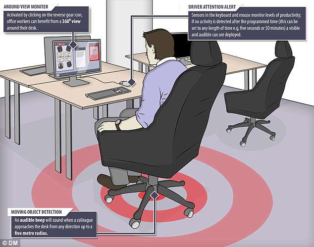
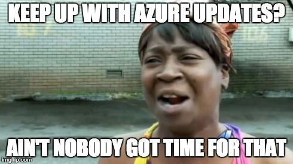
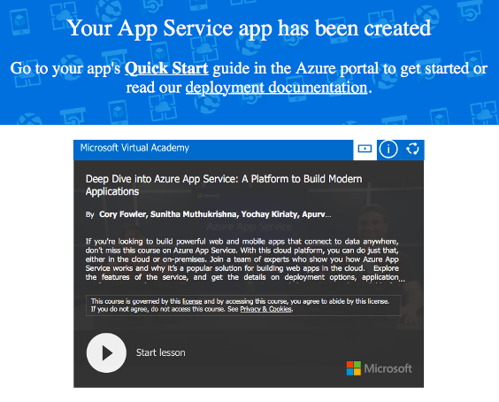
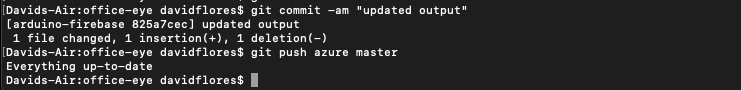

Last week on Ripples in The Red Dragon, I worked on my project, faced unexpected challenges and documented it on my project diary..
This week follow me in a journey as I work on my artifact & explore the field **Internet of Things**,
Delve into my mind as I share my ideas, passion, and knowledge that I steadily built upon my time and experience in Beijing.
I look forward to our time together and to exchanging invaluable concepts. :)
For **LIT** photos documenting my work see below ↓

## Artifact

### Research done this week
 This week I have been researching similar IoT solutions to my current artifact.
 While researching I found something called The BOSS-proof desk.
### The BOSS-proof desk
The BOSS-proof desk is a Motion detection' workstation developed by Nissan that warns the employee if their manager is approaching while also giving a 360° view of the office.

Whether it's checking Facebook or playing games online, there are times when being warned your boss is nearby could have its benefits. Car-manufacturer Nissan has created what its calling a 'crossover' workstation that brings technology typically found in its cars to the office. This includes Moving Object Detection (MOD) which sounds an alarm when a colleague approaches your desk from any direction, with a radius of up to 16 feet (5 metres).
The way it works is detailed in the image below.


I thought it is incredibly humorous and facsinating to see a similar artifact from the perspective of the employee.

### PHP in Microsoft Azure
I have also been researching how to use the Microsoft Azure App Service on Linux to provide a highly scalable, self-patching web hosting service using the Linux operating system, and how to integrate it remotely with Git. This was quite a nuiscance because  lot of the documentation/topics online on this are outdated and relating to a previous version of Microsoft Azure.

This made it annoying and I resulted in just playing around & experimenting until i got some results.


### What i've been working on
 This week i've been programming the Arduino Uno alongside the Infrared Sensor. I've been trying to connect the arduino UNO to the internet to send the infrared sensor data to my firebase cloud realtime database. I have also been using Microsoft Azure to host a PHP Web App that will send the Arduino Data to the database and display it aswell.

### Problems Faced
I faced a big problem which was that when compiled and trying to send the infrared sensor data to the cloud database i would get an error saying "This site requires Javascript to work, please enable Javascript in your browser or use a browser with Javascript support". After some research I learnt that javascript runs on the client (e.g. the browser) so when I send this request from the ESP, the server expected the ESP to run the javascript, which it can't beacuse it's just a microprocessor so I got the error.

```
<html><body><script type="text/javascript" src="/aes.js" ></script><script>function toNumbers(d){var e=[];d.replace(/(..)/g,function(d){e.push(parseInt(d,16))});return e}function toHex(){for(var d=[],d=1==arguments.length&&arguments[0].constructor==Array?arguments[0]:arguments,e="",f=0;f<d.length;f++)e+=(16>d[f]?"0":"")+d[f].toString(16);return e.toLowerCase()}var a=toNumbers("f655ba9d09a112d4968c63579db590b4"),b=toNumbers("98344c2eee86c3994890592585b49f80"),c=toNumbers("067c844a14decb238b6d8dda0e82b764");document.cookie="__test="+toHex(slowAES.decrypt(c,2,a,b))+"; expires=Thu, 24-Dec-19 23:55:55 GMT; path=/"; location.href="http://www.*******.byethost16.com/office-eye";</script><noscript>This site requires Javascript to work, please enable Javascript in your browser or use a browser with Javascript support</noscript></body></html>
disconnecting.
```

To solve this I decided to just go back to my previous idea of hosting it on Microsoft Azure because it doesn't have that javascript security which free f2p hosting sites have in order to stop bots spamming.

Another problem I encountered was that for some reason I couldn't push remotely to the Azure File Directory, i was able to do it once and then afterwards it just kept saying everything is up to date even though that my local files are ahead by 2 commits.

I am still actively trying to isolate why this problem keeps persisiting however after some research and testing I believe that the problem is related to my Git Branch "arduino-firebase", I should've created a new repository instead of just a new branch which has complicated things.

## Warm Regards
To conclude this post, I look forward to my progress next week in continuing programming and building my artifact.

Ciao.

