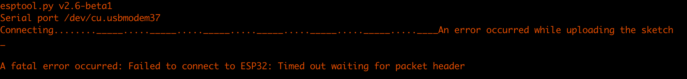
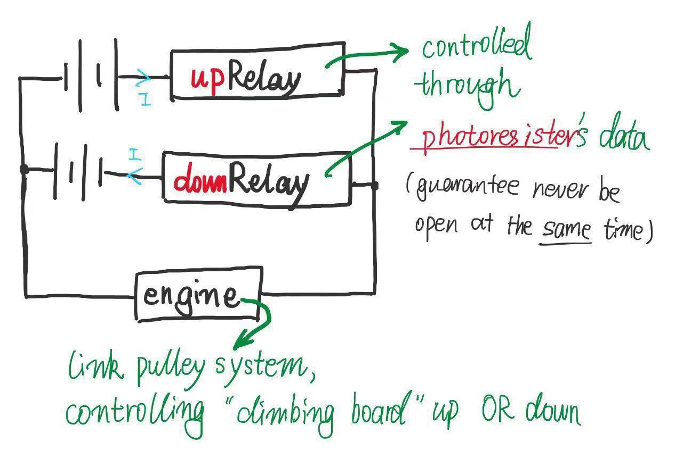
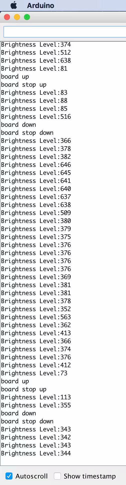
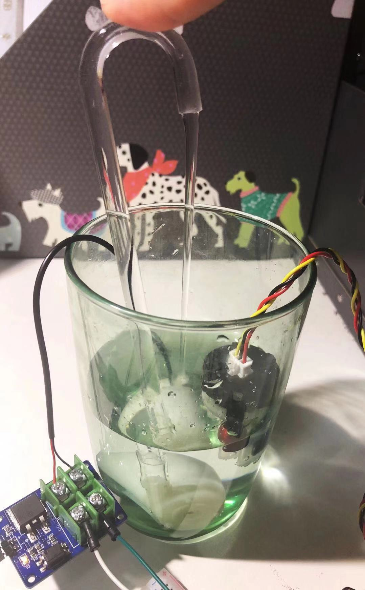

In this post, I will summarize the process of project (as the 2nd stage "CBR-1" of my plan ends as well) and re-edit the plan for the left 3 weeks to ensure finish my design on time, considering the finished components and left jobs. Quite serious then...

## Unfinished Wi-Fi work

As mentioned in ["Problem on 'Internet' Connecting Part" Section](https://cs.anu.edu.au/courses/china-study-tour/news/2019/01/18/cbr-stage-beginning-post/) last week, I really met problem on Internet connection, while sad news is that I still wasn't able to handle it in the first half of the week :( !

In last weekend and the first few days of the week, I was trying hard to search for the way to **connect Arduino board and ESP32 development board (using ESP32 board only as the Wi-Fi module for the artefact)**. I know that ESP32 development board can be used individually as well. While because when I was in China, I already spent much time on learning how to connect single component with Arduino Uno and written some corresponding simple codes. If now I change to use ESP32 development board only, it will be quite a waste of my previous work.

In theory, the development board also has a Wi-Fi module, thus I thought if the Arduino board can connect directly with ESP32 Wi-Fi module, I could use the Wi-Fi function of the board separately as well. But the reality does not affirm “my theory”:(.

Although I could not find direct instruction about how to link these 2 boards, I find some instruments about ESP32 environment setup. I [downloaded](https://github.com/espressif/arduino-esp32.git) esp32 setup file and moved it to Arduino contents "hardware/espressif/esp32", thus "ESP32 Dev Module" (look same as my bought version) can be chosen in "Board" list. However, no program can be uploaded as the instruction shown next:

As majority of online instructions are in Windows system, I try to setup on Windows as well, but it comes to the same error. I'm not sure why this happened, I think it may due to the mismatching for actual "Board" and "Port", while "permutation & combination" also does not work...

It is all my sad story with the ESP32 development board.

I met Kieran early this week outside the office room. He helped me get familiar with Arduino library and how to create basic html. After the chat, for the "Internet" part of artefact, I plan to **send real-time messages about device running conditions to website**. And if enough time left, **"remotely control" button** will be added to the website as well.

I also talked about my problem with the ESP32 development board. With the effort for few more days, I finally took his direct suggestion -- give up the ESP32 development board and **change to new Wi-Fi module**. It may be a good exploration experience... While considering my poor previous hardware knowledge and huge time already spent on that, I also know that if I keep stuck in Wi-Fi connection issue, the time limitation will be a disaster for my final artefact!

With quick decision, I bought a "Arduino UNO WIFI R2". As it has Wi-Fi function itself, I do hope this time, the hardware aspect will save much time!

Thus, I am now on the way waiting for the new board! I'll immediately try my best to connect Wi-Fi once the new board comes. Hope I could overcome the problem this time!

## Current Process

On the same time waiting for the new board, I began writing completed codes for each function: through getting sensor's data and making corresponding judgement, the device can work as expected. I think when new board comes and the Wi-Fi environment is successfully setup, I can "paste" the codes to the following position with little edit. Time is what I'm mostly worried about!

When **compared to my draft timeline** in [Week 5 post](https://cs.anu.edu.au/courses/china-study-tour/news/2018/12/24/kathleen-artefact-plan/), the most significant differences are:

1. _[Good Change]_ I planned to finish one function and then come to the next, while I actually designed all functions and work on them together, to ensure no problem left at last. Actually, for separate sensors and devices, the current progress is good (shown through the project diaries) :)
2. _[Bad News]_ It's my mistake to separate too little time on Wi-Fi connection part in initial plan! I included it in a finished function build line, while ignore it at last when staying in China. I finally found out it's a real challenge when coming back to CBR, and still on the way dealing with that. This part is very important, as it will become the framework for my final codes.

When comparing separate function with my [W5 "artefact planned design"](https://cs.anu.edu.au/courses/china-study-tour/news/2018/12/24/kathleen-artefact-plan/) (_Multiple Functions_ section), only few sensors and operators are changed through my further exploration. I also always share my detailed design for each function in previous project diaries~ I will then show some **_completed "separate function"_** I finished this week (although without Internet connection)~

### Land-water Swap

Considering **the direction of electric current determines the rotating direction of engine for the pulley system**, I designed to use 2 relays together with 2 battery packs to control the engine:

As design, brightness value is first got through photoresistor (light sensor), and if the environment is brighter than the original brightness level (i.e. the got value is smaller than prescribed), the "up relay" will turn on for a little while and pull the board up; if the environment is darker, the "down relay" will be on a while and drop board down. We only need to guarantee that, if the board is already up, it cannot be pulled up for a second time, and vice versa.

The testing "serial monitor" is shown below, and we only need connect the relays with the pulley system to finish the whole _land-water swap_ function finally.

### Water Changing

Another good news is I handled last-week problem for pump:) ! With the successful connection between pump and MOS module, I am now able to **control the pump corresponding to data from the turbidity sensor**: if the water is more turbid than usual (i.e. got small turbidity voltage), the pump will work.

The only unexpected thing in the test is, MOS module switches correctly without connecting to a pump, while whenever the pump is added, the I/O signal of MOS module and pump toggles a lot. With further research, I find it's due to the limited power supply~ Then, that's fine ;)

In final test, I may need to find the common turbidity voltage value for clean water, preparing for exhibition.

### Left Functions

Compared with my "artefact plan", except the above 2 completed functions, **_the following jobs left for other functions_**:

1. Real-time clock module to enable periodic feeding and accurate message record;
2. Use of water-proof temperature sensor;
3. Connection of LED lamp.

Considering the left 3 functions use the above light and turbidity sensor as well, the "completed separate function" job won't be that hard~

In summary, taken our **"(dis)connecting together" theme**, my artefact is meant to scientifically help the outside owner better feed their pet tortoises. Although sensor & operator choice and even the use of "Internet" always change a little through the summer, the initial reason for the update is always to best simulate real-life situations. The highlight function or sensor will always bring the most significant information that owner wants to know. Even if the upload message and operating process are not complex, it is designed to satisfy the owners' and tortoises' basic needs~ That is also the reason, why I spend so much time handling multiple functions at the same time -- without one of them, tortoises may not be happy then ;P !

## Next-week Plan

With the above detailed explanation, I've got my coming-weekend and next-week plan:

If the new board comes early, I will work on the Wi-Fi connection things and build codes' framework to enable each function's addition ASAP.

If the new board is still on the way for few more days, I'll use the first half week to finish the completed left 3 functions.

I will try to make significant progress for both the 2 aspects. See U next week~
