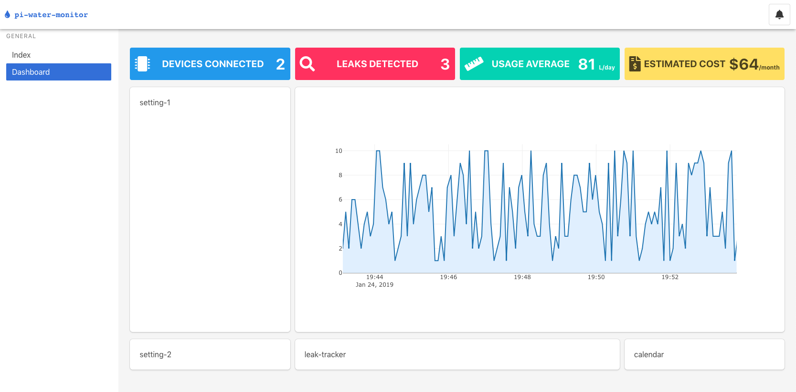

## Progress Update

So I am not by any means on schedule, based on my plan I should have all of the software components basically finalised and working correctly so I can focus on pulling the hardware together into something that works.

Up to this point I do have the most important things done, everything is communicating properly and it does work in its basic form. My vision for this project is perhaps a bit ambitious on regards to how much time I actually have to spend on it. Since I have been very busy doing other important things over the last month finding time to work on this has been tricky. Though I do have a plan of action for the coming weeks. I need a few more odds and ends to execute the hardware part of this project but no waiting is involved to get those as they are all available locally (waterproofing tape, multi meter, zip-ties etc). I will begin constructing the artefact early next week to start testing all the components and bringing the project together, hardware and software.

### Software update

I have spent the last few hours of work on this project developing the web interface to monitor the device and send commands. So far I have a dashboard screen that has some stubbed data, but it also includes a live graph of the output of the reporter (though the data is not real, it still comes from a real source).

There are some empty boxes that I hope to fill with useful information and controls, but time will tell how many of them I can get working properly, they may also end up being stubbed in place of a feature planned for the future if development were to continue. I will outline any shortcomings in my design rationale, especially if they do not work and are there just for show.

### Hardware update

I only need a few more things to get started on building the water monitor.

- Tubing that fits my components (that unfortunately have differently sized fittings)
- Waterproofing (silicone adhesive) tape as a safeguard against water leaks.
- A multimeter for testing my circuits and preventing mistakes.
- A tank of some kind to store a small amount of water (about 250mL) that can be sealed (a jar or bottle of some kind).

All of these things are inexpensive and available locally so I will not have any issues obtaining them.

### Scheduling

Although time has been a valuable but scarce resource recently, I do think that given the current pace at which I am getting things done I will have a good project to present in a months time. Hopefully I do not run into any major issues that have big setbacks because it is possible that I will not be able to recover from something like one of my parts breaking (it was great idea to work with water, I know). Even though I have deviated from my planned schedule, I think that there is enough time left to make something both functional and great.