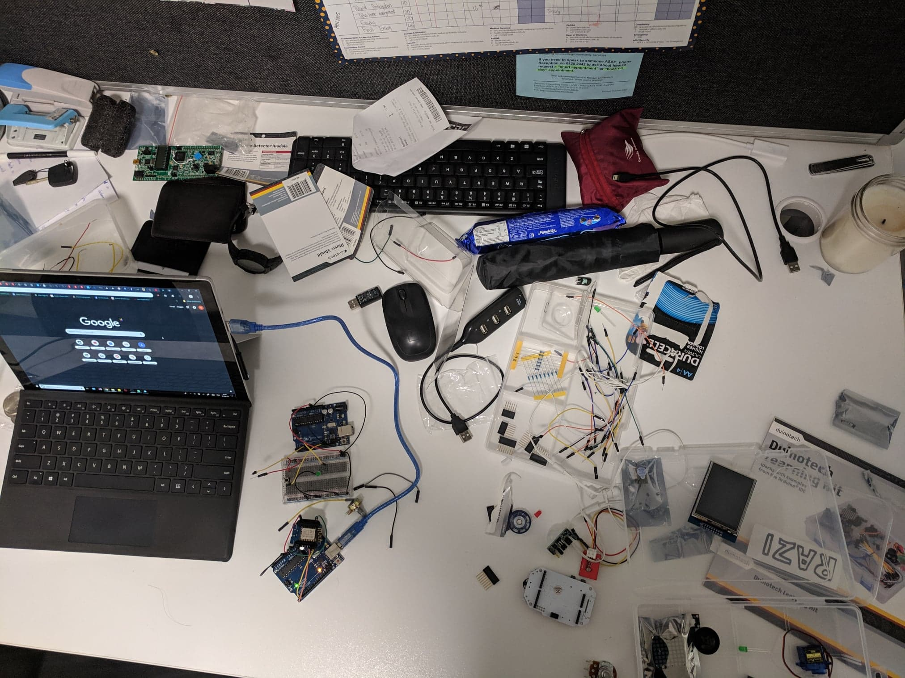
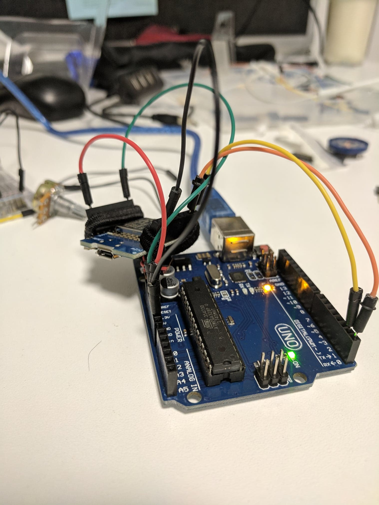

Somehow my workstation keeps on getting messier and messier

3 Weeks till presentation!
# What's in the works
It's been a pretty slow week for me but I have started to look into "Internetifying" my device. I also decided to change the direction of my project significantly, touching on my concerns from last week.
## Wireless Communication
It's weeks away from the main presentation and I have yet to "Internetify" my device. I've got some pretty cool sensors working and also some cool looking outputs, but I still need to actually make it connect to the internet. To do this, I had purchased an ESP8266 Main Board for Arduino which would allow my arduino to connect to Wi-Fi around it.

Arduino with the ESP8266 Main Board

My plan is for the two nodes, consisting of arduino boards, to be able to communicate with each other. This communication will consist of the results of sensors so that both nodes can deliver the same output at the same time.

I did some research on different ways I could accomplish this:
### Email
One suggestion that I found was to use email to send data from one node to another. Each Arduino board node will be connected to the internet and have an email account. One node will then parse data into an email to send to the email address of the other node, which will be read and parsed into an output.

This seems like the simpler option as while researching I did find that using, sending and reading emails was pretty straightforward. Yet, it is quite slow. It is dependent on the email client we use and fast paced or real time data transfer will not be possible with this method.
### Blynk
Another suggestion that I found was using something called Blynk. Blynk is an application that you can download on your phone that offers some pretty cool IoT centric services for DIY projects like mine. Using the Cloud Blynk Server, we can send data between the two nodes over their free server as a live central transaction manager.

We simply need to create a project using Blynk in the application and the Blynk servers will open a bidirectional communication channel allowing us to send data between the two nodes. We can do this by using the library code provided in Blynk.

Yet so far I have yet to concretely implement any Internet to my artefact. I have only managed to research and play around with the ESP8266 module. The reason behind this is because I encountered a few problems:

One of the problems I encountered is the lack of official documentation on ESP8266 boards. There were numerous different libraries and blog posts about it but nothing concrete enough for a beginner like me to use. This made it really difficult for me to start "Internetifying" my artefact.

Another problem that I found was that the module that I had purchased is actually a main board capable of operating without being connected to an arduino board, rather than a module. Many of the tutorials and projects I found using esp8266 used the module and not the main board like I had. Until now I still don't know if interchanging the module with the main board I have is possible. So far I've kind of just winged it and hoped that it would work.
# Redirection
So you know how last week I mentioned that I was gonna find a way for me to use different shields. Well, the bad news is I haven't :(

Using my arduino UNO boards it is difficult for me to use multiple shields such as my LCD screen shield and my MP3 Music Shield. An alternative is to buy a bigger board or find only compatable shields. But this obstacle has kinda spearheaded a change in the direction of my project.

Yes, I know it's sort of late in the timeline to change but I feel the new direction I am pursuing brings my project closer to the theme, focusing on the strengths of my previous ideas while abandoning the features that are only complementary to the experience.

I think right now I am deciding to redirect my project as less of a pet and more of a device to emulate shared space. This meaning that now I am going to focus on features that connect you to the other node rather than features of a pet.

I realised the pet features such as the sounds and eyes on the LCD were not necessarily the things that would connect separated people the most. Instead, it's those features that emulate a sense of sharing the same space. Features that emulate senses and experiences of two people in the same room. That is what I am deciding to focus on.

As a result, I am going to start on focus on but not limited to these features below:
- A synchronous light (both lights turn on when one node requests it to be on)
- Delivering sound (sending sound over to the other node and vice versa)
- ThumbKiss Buttons (similar to the thumbkiss thing I described in last weeks blog post, but instead of using the touch screen, using buttons)
# Where to next
Next week I want to get the Internet of Things devices working by fully implementing my ESP8266 board up and running and be able to send packets back and forth.

In addition, I want to start making a concrete plan for the redirection of my project.

##References:
http://forum.arduino.cc/index.php?topic=246290.0
http://www.geekstips.com/blynk-bridge-another-way-to-communicate-between-two-esp8266/
