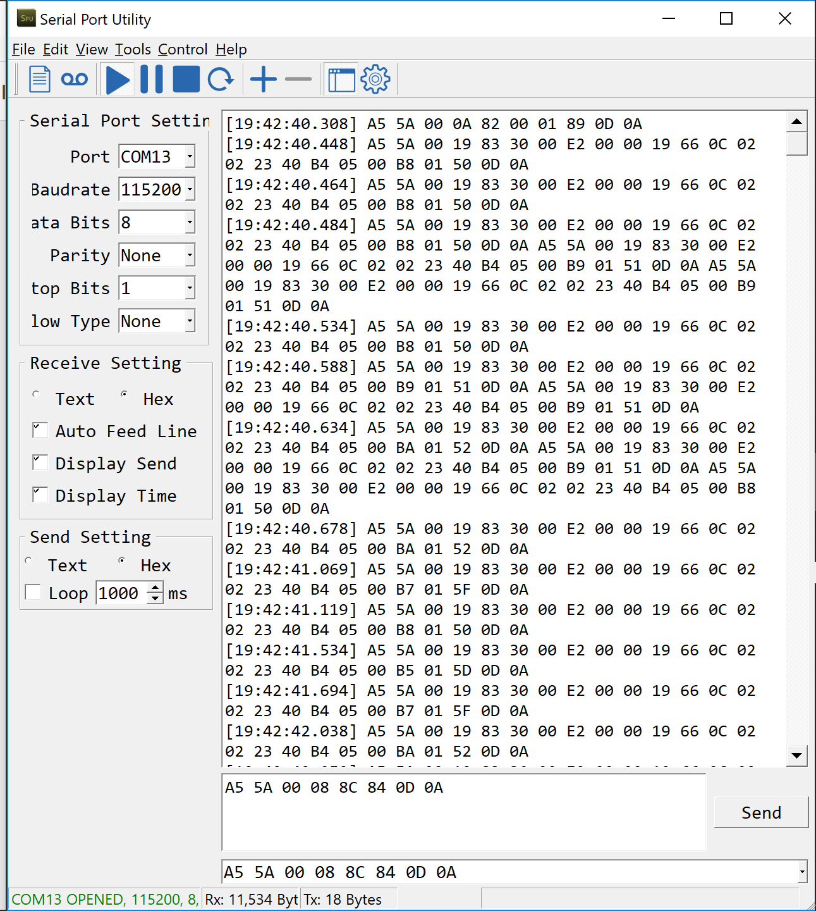
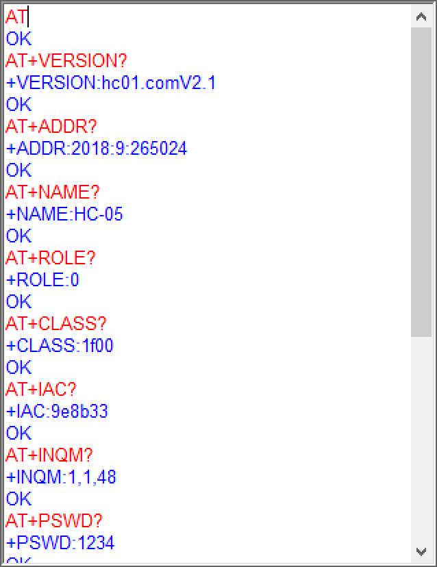

Go straight ahead, it's STC. Turn left, it's Arduino Mega 2560. Turn right, it's ESP32.

I didn't expect there is so much problem when it comes to connect all of the components together... The serial communication between STC and RFID is not stable enough. Even it's wired communication, there is packet lost........... No need to mention the wireless connection via Bluetooth. And yet I haven't started the development of my Android Client... No need to mentioned I have zero experience develop with Bluetooth Module... Currently I am thinking about using ESP8266/ESP32 as software Access Point and setup a simple web server on it. At least by that way I don't need to handle the packet lost on the Bluetooth Side. TCP/IP would back me up. If time permits, I would try to establish the Bluetooth Connection to my phone and improve the stability by extending the communication latency.

Meanwhile I've found out that Arduino has a pretty good library on serial communications. Although I could setup the serial communication by myself on the STC board. I would have to read through the manuals and figure out which register should be configured. I would definitely like to do that by myself if I have enough time, but building basic underlying blocks at this very moment doesn't sound safe at all, and the most complicated part would be how would I handle the receiving and transmitting part properly. There is no way for me to test out whether my codes is robust enough. And even if there was, I won'd have enough time to develop the rest of them after I've convinced myself that the serial code I've written is robust enough.

On the other side, I have successfully controlled the RFID module via one of the serial utility software on pc.

I have also successfully configured HC-05 module. The process it's a bit confusing before I've found out the official manual.

While I was searching for the HC-05 Manual, I've found out that the main feature of Bluetooth 4.2, the Bluetooth Low Energy has something that's quite nice. It could be set in a mode where it keep advertising about itself and reject any device that wants to setup an conncetion with it.

After I've found out that the RFID module could not read tags that are put inside pockets and bag, I've always want to improve this situations, since asking people to have their device exposed their RFID tag in air as much as possible is clumsy (hence user unfriendly). While I was paring my Pixel with the HC-05, I've found out that the signal of HC-05 could easily get through concrete walls ! That's pretty nice ! And since I've already found out the advertising feature of BLE and due to it's energy economical nature. I think this worth some investigations. I've order a bunch ESP32-WROOM board and would test this out as soon as they arrived.

### Back to IoT

I've been thinking about what am I trying to achieve with this Presence and Absence Device. Technically, it doesn't have any sort of sensor. But makes it relate to human beings is that the tag itself is attached to human -- without this, it would never be considered as an IoT artefact.

Standing from a even broader range, I think one of the main characteristic would be, one end of it is attaching to the analogue world. The other end of it is connecting into the digital world, or through the digital world, connects to another dimension of our analogue world. I think its ability to extends the dimension of human recognition is one of the main reason for today's IoT industry being so vibrant.

Until next week ;)
