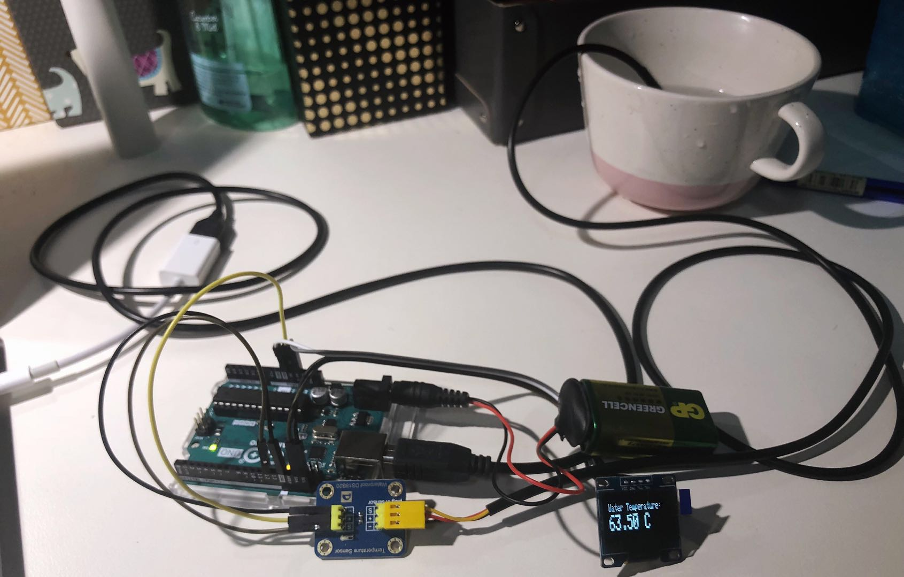
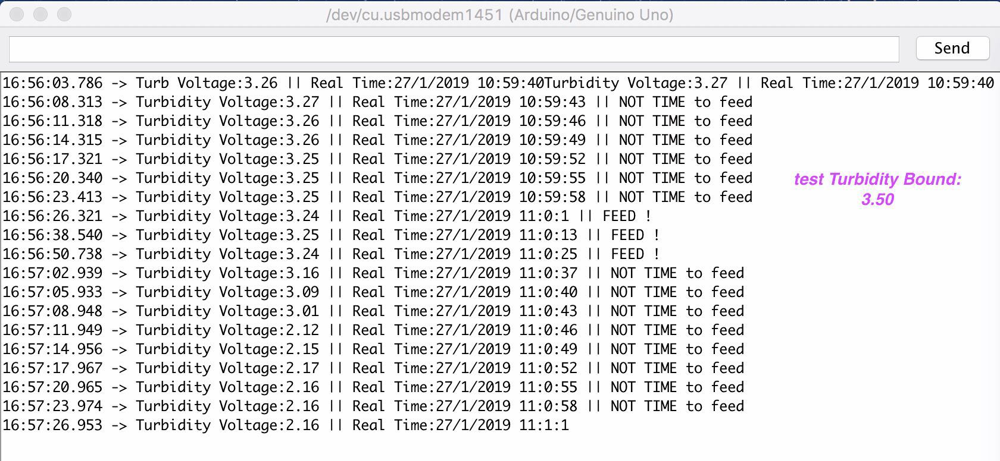
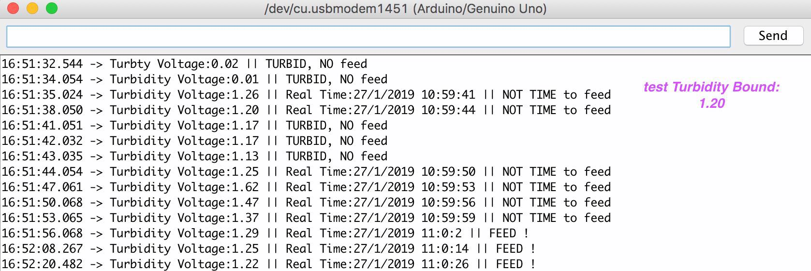

This post is a process update of main sections I include in [last-week "halfway project summary"](https://cs.anu.edu.au/courses/china-study-tour/news/2019/01/25/kathleen-s-halfway-project-summary/).

I mentioned there are 2 parts I planned to contribute to in Week 10, one is the left "completed" functions, another is Wi-Fi connection things. There is a *GOOD* news and a *BAD* news... Let's come to the *good* one first :) ~

## Separate Functions

The *good* news is I've finished all the "separate function" work as plan~  Looks cool!

### LED Lighting

I've successfully connected my 5730LED lamp with Arduino board, and now it can successfully **change brightness level** according to PWM signal. 

As I mentioned before, I don't think it's brilliant to control light in response to any sensor's data: We cannot always turn light on whenever it comes to night. Neither could we do it according to the temperature or position of tortoises...*(Not reasonable.)* Thus, I plan to remotely control light through the website (maybe "button" commands)~ These all make the led function codes very simple, while **need further effort on combination of final "html" part**!

The only problem I met for "lighting" is, the lamp **needs strong power**! Before I finally realize to change new 9V battery, once I attached the LED "VCC" port to the Arduino board, the "port" option in Arduino IDE would disappear... It is also a problem I need to pay attention to on the final exhibition. (While now I've tested the new battery is enough to make the LED lamp and pump work at the same time~)

### Water Temperature

As I don't want to make own heating devices considering the safety problem, the final heating device can be directly controlled by the "remotely controlled socket" as I said before. My completed "temperature" function mainly gets data from the "water-proof temperature sensor". We'll **update the real-time temperature message** on website. Once the owner gets it, he/she can then operate the "smart socket" by themselves.

To make the function more daily efficient, I add an **"OLED screen"** to the final version. Thus, the owner can easily read precious current temperature if they're at home. :)

### Feeding

The function is set as **fixed-time feeding**: I use a real-time clock module and judge whether it comes to the *pre-decided* **time point**, if at that time, the water is **not very turbid** *(if too much food is released without eating, the water will become very turbid, especially for hibernation period)*, we can then release the food with **operation of micro servo**. (The main design and how micro servo works are shown in my [W6 "Beginning Project Diary"](https://cs.anu.edu.au/courses/china-study-tour/news/2019/01/04/beginning-project-diary/), always a long story to introduce this one... ;))

Here are two “serial monitor” screen shots: the 1st shows whether it's time to feed, the 2nd is meant to show the "too turbid to feed" situation *(if it's too turbid, time will not be judged then~)*.

Two extra points need to mention here. One is the feeding time point is better not to be precious to single second, otherwise, we must ensure the "real-time clock module" reads data at the exact second! (It is a bit annoying to count the exact "delay" in codes, also the program needs to begin at exact time and never be interrupted... Surprises always come in life...) So I finally **keep the feeding time as a 30-second period** in the test~ Another thing is the **turbidity data** from the sensor is very **unstable**: every time I use clean water, while the "reference value" changes a lot. It's still a problem for me to decide the final bound for "turbidity judgement".

In addition, the **real-time clock module** will also be used for website update messages. It's better for pet owner to read "time" directly, at the same time finding whether each function is making effort.

### More Consideration for "Land-water Swap"

I considered last-week completed "land-water swap" function again as well. ***It is more reasonable to ensure the "ladder board" will not be pulled up when a tortoise is currently on the "flat board", regardless of the brightness level.***

Thus, with the use of "diaphragm **pressure sensor**", we add double check for the "board up" situation, to ensure the climbing-up tortoises can always climb down later safely~

Here comes to the end of my completed "separate function" codes.

## Continuing Wi-Fi Connection Task

It is the *sad* news, my new Arduino Uno WIFI R2 will not come until this Friday... I miss Chinese delivery quite a lot now :( My parcel has transferred between Sydney and Canberra for extra one week... Hope it can be safely left at reception and end its mysterious tour tomorrow *(considering I am writing the post on Thursday...)*.

I'm on my way to study [Arduino WiFiNINA Library](https://www.arduino.cc/en/Reference/WiFiNINA), still a little confused, while I'll use the new board do more exploration since this weekend. Hope to make great process~

It is also the main part for my ***next week plan***. I hope to finish the Wi-Fi connection build things on early next week, and begin the "html" work *(to some extent, it comes to the project final combination part)* on late next week. See you then~
