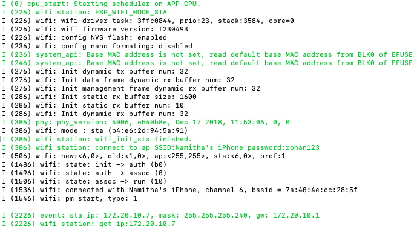

# Project Diary 4

## Overview/Research

This week was super hectic. I finally got back to Canberra and just the whole rush of moving in to a new house was very stressful. I managed to get a couple things done this week mostly with regard to researching how to set the wifi up and send data between the boards. Unfortunately, I wasn't able to get around to actually sending the data through. This put me back a lot and I need to get this done over the next week in order to move onto the next stages of my project and actually starting to build the artefact.

## Software

This week I set up my second board that I will be using to communicate the information from the sensor across to the dentist. I researched the two types of protocols used to send data which are the ESPNOW and the ESPMESH and I decided that ESPNOW will work better for my project since at the moment it is only dealing with sending information from the sender to the other board. I used the example code wthin the esp-idf repository to run the espnow protocol. However, the output only displayed that it was sending along with receiving sometimes. All the other times I had run it with both boards, only sending or only receving would occur.

This week I also got the wifi connection set up on the boards. There are two types : station and softAP. SoftAP is the one that sources the access point of the internet and the station is the one thats using the internet. I used the station to connect the boards to the wifi. I had to initially set my laptop up so it was connected to my mobile hotspot and then change the ssid and password on the given code and then finally got it to connect. Below is a screenshot of the output:

## Hardware

In terms of the hardware, I will be going to one of the physics induction labs next week in order to get access to the labs so I can solder the accelerometer together to get better results when testing.

## New Inspiration

I had a discussion with Chinmay this week and perhaps might look at exploring other options besides sending information board to board. One idea would be to look into the bluetooth feature on the ESP 32 and have the information sent to a phone and then use that to connect the phone to a computer or even send the information through to a website which the dentist can then access.

## Questions/Next Week

1. Physics Lab
2. WIFI!!/ SENDING!!

## References

https://www.quora.com/What-is-%E2%80%98softAP-and-a-station-in-ESP8266%E2%80%99
