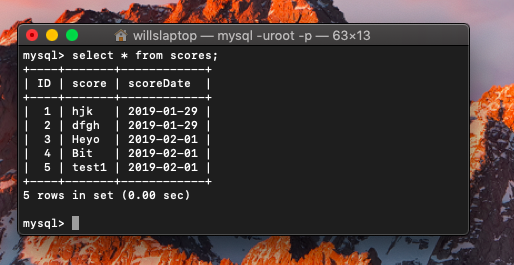
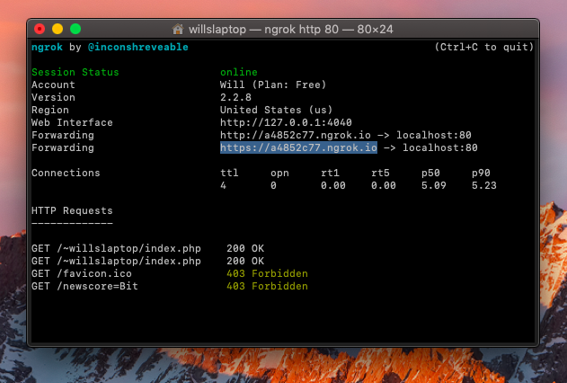

### Closing in

Greating all and welcome back to this blog series.
I am nearing the end of this project and am now focusing on tying all the aspects of the project together.

I now have every aspect of the project working except for the analog inputs which is Zoeys job.

To summarize my previous weeks work I was faced with the problem of uploading data via the ESP32 to a centralised server. To do this I hosted a server on my computer which would respond to a url string input by connecting to a MySQL server (also on my computer) and inputting the contents of the url string. I've also made it so that it requires a second url string parameter to be passed to act as a password. At the moment this password is fixed and this level of security is the lowest possible, but at least its one step higher than having no password at all.

But quickly to address the schedule:

- Conveying information to the server well: Is a milestone and I can safely say that this has been completely achieved. The ESP32 can make HTTP requests and that is all that is required to upload data to the server. In fact I even gave Michelle Zhou who was in China, the URL and it still worked without error.

The next thing on the schedule is to debug and implement a social aspect of the build. Why I though I would be able to make a fully functioning social platform in a week and a bits time is beyond me...
Anyway, the debugging should be fine as there aren't any presentable bugs at the moment. I might use this time to collaborate more closely with Zoey's tasks to ensure that the audio input doesn't contain many bugs.

### Last weeks work

I made a local host server on my computer and outfitted it with a PHP script that will upload URL strings into my MySQL database. The database isn't anything fancy. The table it inserts the data into has three fields:

- ID: 1, 2, 3 ...
- score: The score itself encoded in a string
- Date: The date that the data was uploaded on, this information is provided by the server itself.

I used URL strings to upload the data with because security is not an issue with this project and the moment, and it's by far the simplest option all the data is send in the URL request.

I then used the port forwarding service **ngrok** to make it so that anyone can easily send HTTP requests to my local server, including of course the ESP32.

