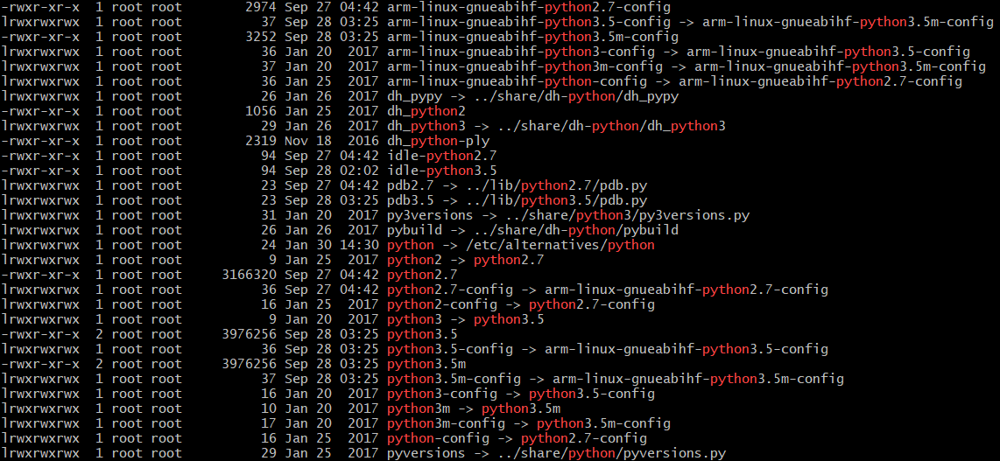
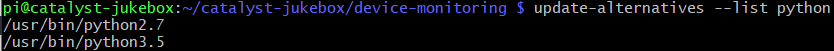
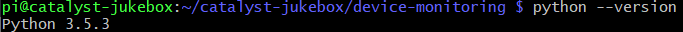
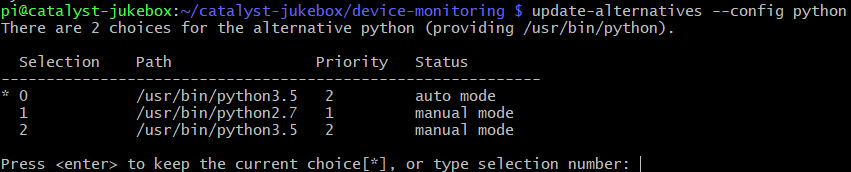
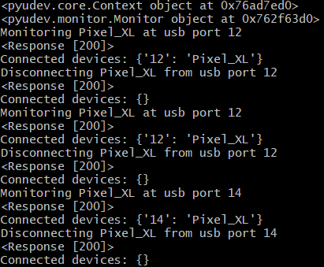
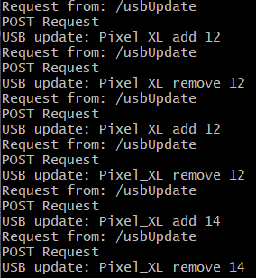

  
<p></p>

#### *In this chapter, finishing the authentication, reducing duplicate code across JS and nodeJS, and lotsa Python*

### Spotify Authentication
In the [last blog](https://cs.anu.edu.au/courses/china-study-tour/news/2019/01/25/brents-update-blog-04/#javascript-to-server-communication), I talked a bit about the Spotify authentication and *server <-> client <-> Spotify auth* communication. In this week I finally finished up the method to get an automated authentication system up and running that only needs to be set once before running by itself and refreshing its own authorization tokens.  
As a small update on this, it turns out my understanding was a little incorrect about how the system actually works. If I had read the [authorization guide](https://developer.spotify.com/documentation/general/guides/authorization-guide/) properly, I would have realised that there are in fact 3 different codes provided by Spotify in this instance:  
* an 'authorize' code, which is provided to you in the url of the initial response from Spotify where the user is prompted to log in and accept the required scope, you then use this once to acquire:  
* an 'access' token which is used to make requests to the API within the scope of the initial authorization code, this has a limited lifetime and will expire
* a 'refresh' token, that is used when you need to acquire a new access token for the API calls

This led to a bit of wasted time and some annoyance as I previously was under the assumption that the authorization *code* was the code you used instead of the refresh token to acquire new access tokens. Fortunately, this wasn't a major issue and only involved a little extra coding to accommodate the refresh token.  
*Note: I have found conflicting information on how long the refresh token lasts for, so this space is a tba on how often user logins will be required, currently I know it at least lasts for 2 days*  
Once I had successfully used the refresh token, I did a little research on [timers in nodeJS](https://nodejs.org/en/docs/guides/timers-in-node/) and [found](https://nodejs.org/api/timers.html) a method called `setTimeout()`, this basically allowed me to queue a function callback after a certain amount of time had elapsed, and because the *access* token is only valid for a limited amount of time (1 hour as far as I have seen) this means I am able to consistently schedule <1 hour refreshes of the access token and leave the process automated without human intervention.

#### Favicon
If you don't know, a favicon is the little image in your browser tab that gives you a bit of a hint as to what site you're on. I didn't have one on the pages in my nodeJS server so I did a little digging and found [this package](https://www.npmjs.com/package/serve-favicon). It requires an `npm install serve-favicon`, and then you simply wrap your server code in the favicon call, and then it will add the icon to all of your pages.  
Here is the icon I made for my site:  
  

### Reducing code
As I am writing a lot of the client side pages in javascript *(specifically in [p5](https://p5js.org/))* and the server side is nodeJS, I have a lot of functions which are exactly the same across the two, so not wanting to make updates in one location and not the other, and then run in to a bunch of inconsistency later on, I set out to find out how I can throw all this code in 1 file, and use it across both applications.  
As it turns out, this is easier said than done.  
After having done [considerable]() research on the topic, I had all but given up, some of the main issues I encountered.  
  
nodeJS uses require, ES6 (javascript) uses import. This is an issue because they are handled very differently, require is synchronous which means that they are loaded one by one which can avoid some issues based on ordering and dependencies but sacrifices performance, whereas import is asynchronous which performs a bit better, but can cause awkward behaviour if not loaded in time for some execution or ordering causing unexpected side effects.  
* [Require vs Import](https://stackoverflow.com/questions/31354559/using-node-js-require-vs-es6-import-export)
* [Import Docs](https://developer.mozilla.org/en-US/docs/Web/JavaScript/Reference/Statements/import)
* [What is require?](https://stackoverflow.com/questions/9901082/what-is-this-javascript-require)
* [Require in JS](https://stackoverflow.com/questions/43468826/how-do-i-use-javascript-require)
* [Using require with modules](https://stackoverflow.com/questions/5797852/in-node-js-how-do-i-include-functions-from-my-other-files)
* [Everything you need to know, requiring modules](https://medium.freecodecamp.org/requiring-modules-in-node-js-everything-you-need-to-know-e7fbd119be8)
* [Using a nodeJS module on client](https://stackoverflow.com/questions/4944863/how-to-use-node-js-module-system-on-the-clientside)

There is experimental support for ES6 functions in nodeJS, it's called the [Michael Jackson Solution](https://medium.com/dailyjs/es6-modules-node-js-and-the-michael-jackson-solution-828dc244b8b), *([also](https://stackoverflow.com/questions/45854169/how-can-i-use-an-es6-import-in-node))*, however this involves renaming files, and did I mention 'experimental'? I think my project is already unstable and experimental enough without throwing more variables into the works just so I can reduce duplicate code.  

Even having a single file is an issue, because the formatting is different across the two, and if I need the fetchAPI in node (which I do) then I need a `require` in this external *'tools'* file.  
My final decision was to have 2 files that were as close as possible, but one would be used for node and the other for javascript.  
This at least means I can keep the crossover functions in "one" place and it will be very quick to debug or find any differences across the two files if issues should arise. However, even this plan is not without issues and drawbacks.  
I struggled for a while with style and formatting, I had only found a single example of how to format modules for functions to be visible when `require`ing the file that they're defined in. Not only was this a hassle to keep renaming and adjusting function definitions between the two files, it lead to issues when functions needed to call each other within that file.  
Thankfully, before I had expended too much effort (and hair), I found [this handy guide](https://gist.github.com/kimmobrunfeldt/10848413), which explained the different ways of formatting modules. Originally I had only found 'style 2', however upon seeing style 1, I knew I would be having a much easier time, as it meant I could leave all function definitions the same format in both files, with the only downside a bit of a verbose module.exports declaration.  
  
The final issue I had, was that I wasn't able to `require` my tools file in to the global scope, this meant I had to do something like this:  
```
const util = require("util.js");
...
var location = util.func(x, y);
```
instead of:  
```
function func(x, y) {
    ...
}
...
var location = func(x, y);
```
While not major, it was an annoyance and it was going to increase the length of lines of code which previously did not need this. I had a look in to how to get past this, [and found some talk on the matter](https://stackoverflow.com/questions/28705866/nodejs-import-functions-from-other-file-and-use-as-if-it-had-them-before), however I didn't want to bring everything in to global scope (cause that sounds like a bad idea), so I decided to leave it and just use the extra bit of text to access the module code.  

To see the two files I'm talking about, you can check the [nodeJS version here](https://github.com/bschuetze/catalyst-jukebox/blob/17d576763fad38ca9b29efda50cc0315b166f0b9/example-web/assets/utilNode.js), and the [javascript version here](https://github.com/bschuetze/catalyst-jukebox/blob/f67caa4e8259fe07499d4f81f48266359ff26344/example-web/assets/util.js).

*Note: I also [found some other method](https://caolan.org/posts/writing_for_node_and_the_browser.html), however I did not spend enough time to understand it, it may be useful to you, so I will leave it here.*

## Python
### Switching from Python2 to Python3 on the Raspberry Pi
The default Python on raspbian seems to be Python2. Now, I wanted to use Python3 *(because the internet told me to)* so I looked into the best way of doing it and from what I found we can simply adjust the alternatives to easily enable switching between Python2 and Python3. 
Here are the basic steps to accomplish it:  
*Note: while doing this you may need to add* `sudo` *in front of some of the operations if you get any permission-based errors*  
1. Check which python version you have for default with `python --version`, if you're already seeing 3.X then there is no need for you to follow on  
2. `update-alternatives --list python`  
*Note: If you are already seeing python3.X in this list then skip to 6*  
3. Assuming default install location, check what python versions you have available:  
`ls -al /usr/bin | grep python`  
  
4. As you can see in my result, I have `python2.7` and `python3.5` installed on my system, but they are not listed as alternatives yet  
5. Using the above result, I can install them as alternatives:  
`update-alternatives --install /usr/bin/python python /usr/bin/python2.7 1`  
`update-alternatives --install /usr/bin/python python /usr/bin/python3.5 2`  
6. We can then check the alternatives available for python again to make sure this was successful  
`update-alternatives --list python`  
  
7. Now we check the current version with `python --version` and with any luck it will be showing 3.X  
  
8. To change between the options (or if it isn't showing 3.X), we can use:  
`update-alternatives --config python`  
to update and switch our current alternative  
  

### Setting up a new Python environment
Pipenv! a great tool to handle your python environment needs, use it!
  
... seriously use it.  
  
* So, we need pipenv to manage the environment, let's install it with  
`pip install --user pipenv`
* If you want to be able to access it globally from the command line *(you do)*. you can add it to path by following these steps:
    * Locate the user base with `python -m site --user-base`, this should respond with something like `/home/pi/.local`
    * Ensure pipenv is there with `ls /home/pi/.local/bin/`
    * If you see `pipenv` in the results then we can move on to the next step, which is to modify our .bash_profile to ensure it gets added to PATH permanently,  
    add the following line to your `~/bash_profile` file:  
    `PATH=$PATH:/home/pi/.local/bin`
    * That's it! On the next time you login to your Pi, you should now be able to call `pipenv` from the command line globally

### USB device detection
A key function in the catalyst jukebox idea, is that we can detect the addition and removal of smartphones via usb ports on the Pi. To accomplish this I need to be able to see and handle connection and disconnection events. Again, I did some searching on this and found [Pyudev](https://pyudev.readthedocs.io/en/latest/), from what I was seeing it seemed like it would accomplish everything I needed for the USB device detection.
* The first step is to install it, and of course we are using pipenv so let's `cd` into the directory we're going to be storing the Python files and run:  
`pipenv install pyudev`
* To be able to use it, we also need to import it (much like a require in nodeJS)  
`import pyudev`
* Now with this module, we have access to 'devices' on the Pi, but we don't want all of them. We can filter for USB devices, and then after looking at the existing *addresses* on the PI, we can see which ports we need to monitor and the patterns that a device connecting will have  
The code will look something like this:  
```
import pyudev
...
context = pyudev.Context()
monitor = pyudev.Monitor.from_netlink(context)
monitor.filter_by('usb')
...
# Define our usb monitoring function
def usb_event(action, device):
...
# Define the observer with the callback function, and start it
usbObserver = pyudev.MonitorObserver(monitor, usb_event)
usbObserver.start()
```
* In addition to this, I have also investigated how connecting a usb hub to the Pi affects the addresses and have accommodated for that (this should also work if the hubs are daisy chained for whatever reason).  
In my testing, the address spaces go from 1.2 to 1.2.1 where the former is a device plugged straight into a usb port on the Pi, and the latter is a device plugged into a usb hub plugged into the Pi
* As for how it works, the basic concept is that we have a function running whenever there is an [action](https://pyudev.readthedocs.io/en/latest/api/pyudev.html#pyudev.Device.action) on a usb device, if that action is an 'add' or 'remove' then we want to make updates to the NodeJS server which will use that information in the playlist management.

Which brings me to the next section, communicating between NodeJS and Python.

### Python to NodeJS communication
There are probably a few ways to do this, but I already have HTTP message communication set up between my NodeJS server and various javascript client pages, so it only seemed natural to make this communication also happen via HTTP.  
To accomplish this form of communication, I first needed to be able to nake HTTP requests in Python. There are a few different options here, but I decided on [requests](http://docs.python-requests.org/en/master/).  
Again we need to add this to our Python environment and import it, which we can do with: `pipenv install requests` and `import requests`.  
Now we just need to parse and handle the 'add' and 'remove' USB device events and generate the corresponding HTTP requests accordingly, here is an example:  
```
r = requests.post("http://destination.com/path", 
        headers={"Content-Type": "application/json"}, 
        json={"model": "Phone", "location": "Port 1.2", "action": "add"})
...
print(r)
```
And with that... (and some extra handling on the server side... and some bugfixes... and some debugging...)

**YAY COMMUNICATION**  
*Python*  
  
*NodeJS*  


Until next time...