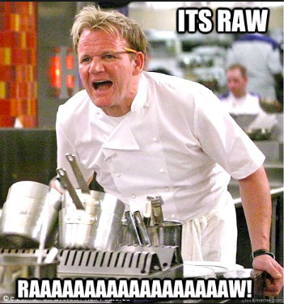

So this week, Adi and I met up a few times to figure out how to read data from the sensor and how to turn it into useful information people want to see.

## ADC (Analogue to Digital Conversion)

The first step was reading the analogue value from the GPIO pins and convert it to a digital voltage. We used the ADC example provided by ESP-IDF to start off and ran into our first problem. The output we got was almost always maxed around - 4095 RAW (Analogue Reading) which converted to 1045 mV.

This was really strange as the sensor was nowhere near any substance that should've been causing its RAW values to go higher. As the values were already maxed out, placing alcoholic substances, predictably, showed no change in the readings. After spending a few hours online, looking at other projects which used similar sensors, we began to think either the sensors could be broken (in which case our project was doomed) or maybe there's a voltage problem.

Typically, the MQ-3 alcohol sensor is plugged into 5V, however, the ESP32 micro controller we're using only has 3.3V output. We began to look for level shifters to bridge the voltage gap but it's not easy to buy a core component this close to the project deadline.

I remembered other people had gotten their sensors to work with their ESP32 boards and began reading their past blogs for some hint on how to solve the problem. While reading [Namitha's Week 8](https://cs.anu.edu.au/courses/china-study-tour/news/2019/01/20/Namitha-Week8/) blog, I saw she mentioned she was using [this website](https://docs.espressif.com/projects/esp-idf/en/latest/api-reference/peripherals/adc.html#_CPPv217adc1_config_width16adc_bits_width_t) to help with writing the code. After opening the website, Adi and I realised the default ADC full-scale voltage is 1.1V. To read the pin-maximum voltage, we had to increase the signal attenuation for the ADC channel from 0dB to 11dB.

After making the changes, we saw the RAW values immediately decrease to around 500. Much better! 

Next step was to see if the sensor picked up on alcoholic subtances. As we didn't have any alcohol lying around we made use of some common day items which contain alcohol such as mouthwash and aftershave. Sure enough, everytime we brought these substances closer to the sensor, the RAW increased, and when we took them away, the readings gradually came back down.

## BAC

This was starting to look good, until we ran into another problem that is...

Our BAC values decreased instead of increasing near an alcoholic source. 

After looking at a few different websites, we tried to use physics to correlate resistance (derived from voltage) with BAC. So as resistance goes down, BAC is meant to go up. Unfortunately it's been a while since either Adi and I have touched physics so we spent a fair bit of time trying to make the maths work. We're still working on the maths, however, if we can't get it work soon, we will have to try another method.

The other method we came up with was to get actual test results by getting drunk people to blow on the sensor and correlating the RAW value with their approximate BAC value. In an attempt to be more accurate, we could plot a graph from those data points and then run linear regression to come with an equation that relates the two things.

## Things to do

Things to do by next week include - figuring out the maths behind resistance and BAC or if that's not possible then start getting test data from people. I have also downloaded the Flutter app which I mentioned a few weeks ago and will begin building an app.

### cu next week...