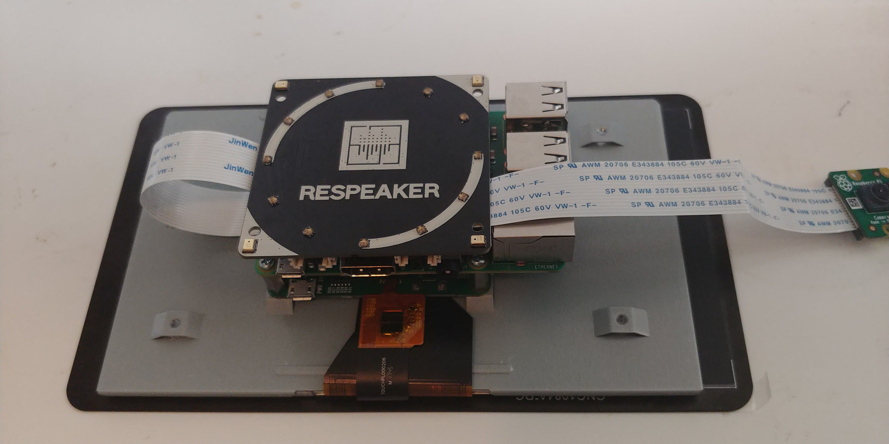
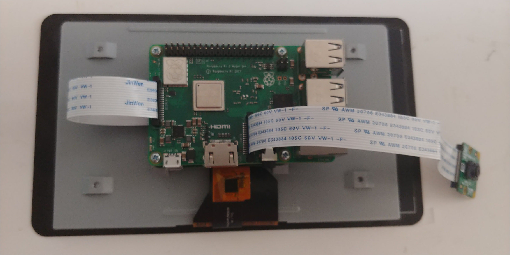

## sudo apt-get break-everything

So, this week has been a bit of a disaster.

It all started with me getting a longer CSI cable for the PiCam so that it could pan and tilt without snagging. I replaced the short cable with a longer one, and plugged it into the Pi, only to find that raspistill couldn't detect it anymore.
I obviously hit DDG immediately and came across a solution on raspberrypi.stackexchange that suggested updating the firmware. I did that, except now when booting the Pi systemd fails to load the kernel modules for my the ReSepaker hat.

```
Feb 01 16:11:53 raspberrypi systemd-modules-load[83]: Inserted module 'i2c_dev'
Feb 01 16:11:53 raspberrypi systemd-modules-load[83]: Failed to find module 'snd-soc-seeed-voicecard'
Feb 01 16:11:53 raspberrypi systemd-modules-load[83]: Failed to find module 'snd-soc-ac108'
Feb 01 16:11:53 raspberrypi systemd-modules-load[83]: Failed to find module 'snd-soc-wm8960'
```

So I unplugged the hat to see what was going on, find out that I had simply not secured the camera's CSI cable in properly.

As the following staged shots show, it wasn't possible to see that the CSI cable wasn't connected properly.





Out of sight and out of mind. So this shoudl have been an easy fix, right?

Wrong.

I plug it in properly and reboot

```
pi@raspberrypi:~ $ sudo vcgencmd get_camera
supported=1 detected=1
```

Seems to be working, except when I raspistill I get an error message

```
raspistill -o asdf.jpg
mmal: mmal_vc_component_enable: failed to enable component: ENOSPC
mmal: camera component couldn't be enabled
mmal: main: Failed to create camera component
mmal: Failed to run camera app. Please check for firmware updates
```

So I hit DDG again, looking for solutions. I try everything suggested, like increasing the memory allocated to GPU, reinstalling specified drivers, unplugging and replugging the camera and so on. As the header image might have hinted already, none of them seem to work.

After spending the majority of yesterday and this morning trying to find out why it wouldn't work, I decided _Fuck it. I'll do it from scratch._ So I flash a new copy of Raspbian onto the SD card, and install the camera again.

Still doesn't work.

After some more head scratching, I decide that I need to come up with something for the blog, so I unplug my Raspberry Pi from my monitor, and plug my desktop back in.

At this point I'm suspecting that I fried the hardware somehow. Maybe via static electricity or something.

I boot it while it is connected to the Pi TFT display, to check if I accidentally fried that too. Fortunately it boots. And somehow the Pi Camera works now.

I plug the HDMI cable in again and reboot, the Pi Camera stops working. Unplug the HDMI cable and reboot, it works.

A detail I had neglected was that in all my previous attempts, I was uploading code over SSH and then downloading the results, so the Pi was not connected to the display directly. But this time, I decided to treat the Raspberry Pi as a standalone computer and hence connected it to my monitor.

So somehow that was causing an error.

At that point I decided to peace out and just write the blog.

## Progress Report

Things are not too bright here either. I have written exactly zero lines of code towards my final product so far.
Iterating on my design has been a major hurdle. Whenever I decide I need anything, I end up having to wait a week before it arrives. For example, I ultrasonic obstacle detection did not work too well, so I ordered IR sensors last week. But they arrived only today.
I've placed 4 orders now, each of them arriving on a Thursday or Friday, leading me to order more parts only Friday evenings, which get shipped on Mondays evenings and arrive Thursday...

But, other than the second robot, I should not need anymore parts now, so my plan is the following

- By 4th of Feb - Communication with Google's Servers, have them process data collected by the surveillance bot.
- 5th to 8th of Feb - Basic Self driving.
- 11th of Feb - Displaying the information returned by Google
- 12th to 15th of Feb - Busy (No IoT work)
- 16th to 17th of Feb - Car #2.
- 18th of Feb - Deisgn Rationale.

**Update 08 Feb 2019:** Added photos showing the CSI cable is hidden from sight during normal operation.
