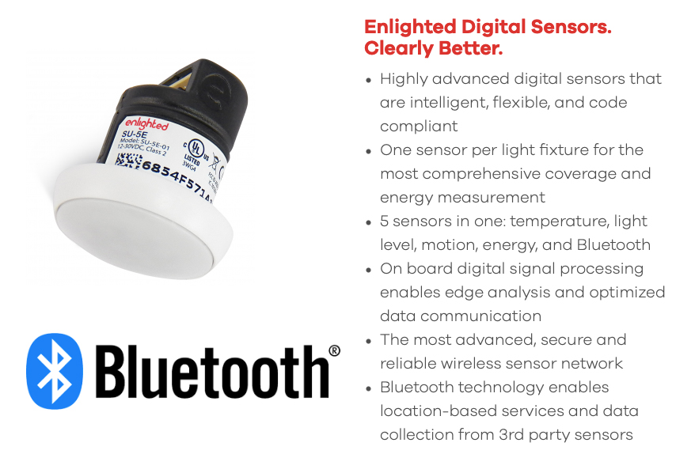
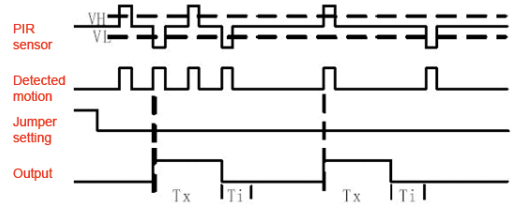
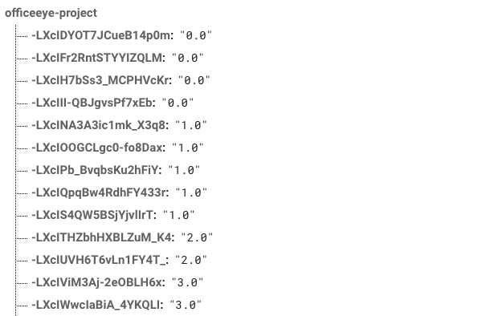
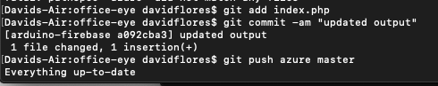

Last week on Ripples in The Red Dragon, I worked on my project, faced unexpected challenges and documented it on my project diary..
This week follow me in a journey as I work on my artifact & explore the field **Internet of Things**,
Delve into my mind as I share my ideas, passion, and knowledge that I steadily built upon my time and experience in Beijing.
I look forward to our time together and to exchanging invaluable concepts. :)
For **LIT** photos documenting my work see below ↓

## Artifact

### Research done this week

This week I have been researching similar IoT solutions to my current artifact.
While researching I found an IoT company called: Enlighted.

### Enlighted Inc

Enlighted is an IoT company whose goal is no less than “redefining smart buildings.” Enlighted sensors collect a vast amount of information about the environment and issues reports in real-time. The dime-sized sensors, are deployed with LED lighting, one sensor per light fixture, with a typical coverage area of 100 square feet per sensor. Also equipped with Bluetooth® Low Energy (LE) technology, the sensor can collect data from other Bluetooth-enabled devices. Overall, this makes for very granular and rich data collection. And because the sensors are attached to lighting, they are always powered and ubiquitous throughout the building.

I thought it was really intriguing how they're making my same idea work except using lighting for power and bluetooth as a connection.

### Infrared Sensor Sensitity

I have also been researching how to go about adjusting the sensitivity of an Adafruit infrared sensor, adjusting the Time and Timeout Length and the retriggering of the LED on the sensor.

### Markdown Research

The last thing i researched was how to add gifs to a markdown file

I was successful

### What i've been working on

This week i've been trying to adjust the sensitivity of my motion sensor as it wasn't as responsive as i wanted it to be, this proved to be quite challenging but manageable in the end. I also worked on the front-end aspect of the web app making things appealing and responsive. Lastly i finally finaized the connection between the arduino UNO and my Cloud Database, and you can see the data the arduino has been sending to my database below. (corresponding to the infrared sensor)

### Problems Faced

Following on from the problem I encountered last week which was: that for some reason I couldn't push remotely to the Azure File Directory, i was able to do it once and then afterwards it just kept saying everything is up to date even though that my local files were ahead by 2 commits.

Following from there I have been looking on multiple forums and message boards trying to find a post about a similar problem however everything that looked similar led me to a dead end. It took me a while but eventually i had an epiphany and thought that what if my azure master branch is tracking my git-hub master branch instead of the firebase-arduino branch that i initialized it with, and so i tested this by pushing a file to my master branch and this was the case. Although it was such a simple solution this was definetly a very frustrating problem i had and i felt incredibly relieved to have solved it.

## Warm Regards

To conclude this post, I look forward to my progress next week in continuing programming and building my artifact.

Ciao.

