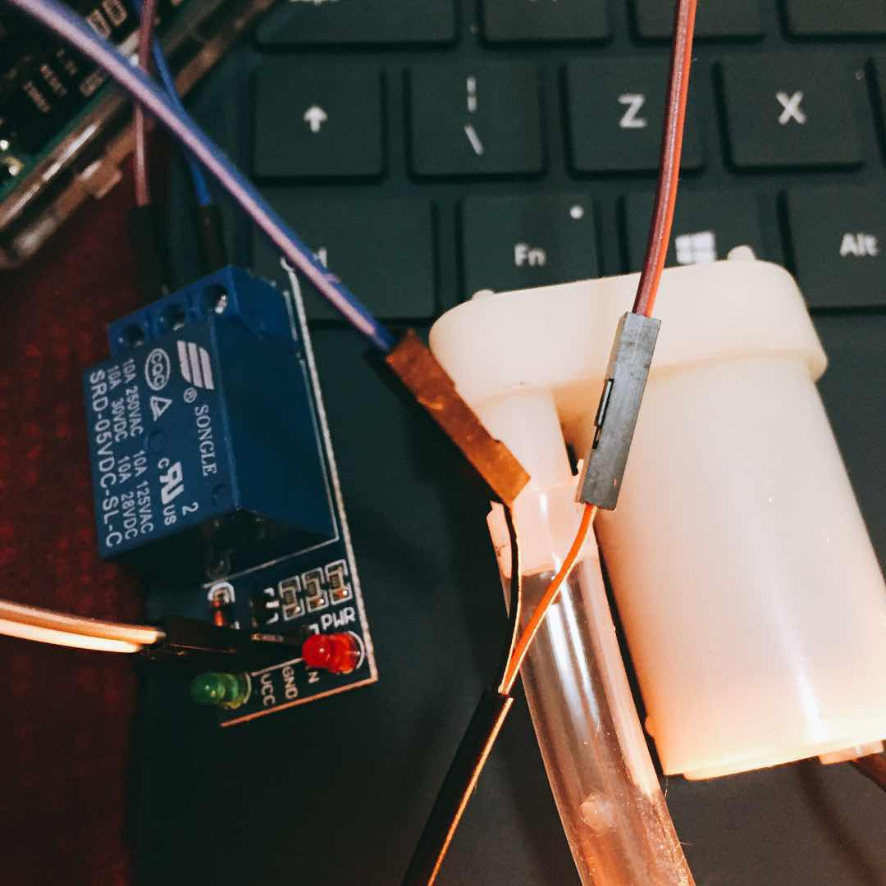
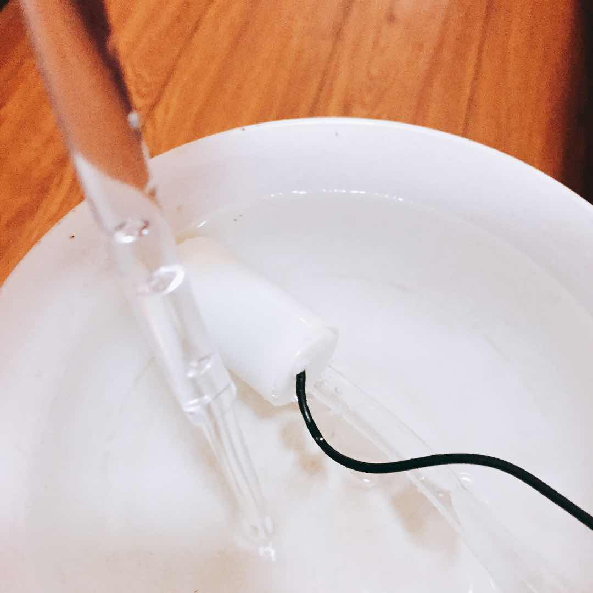
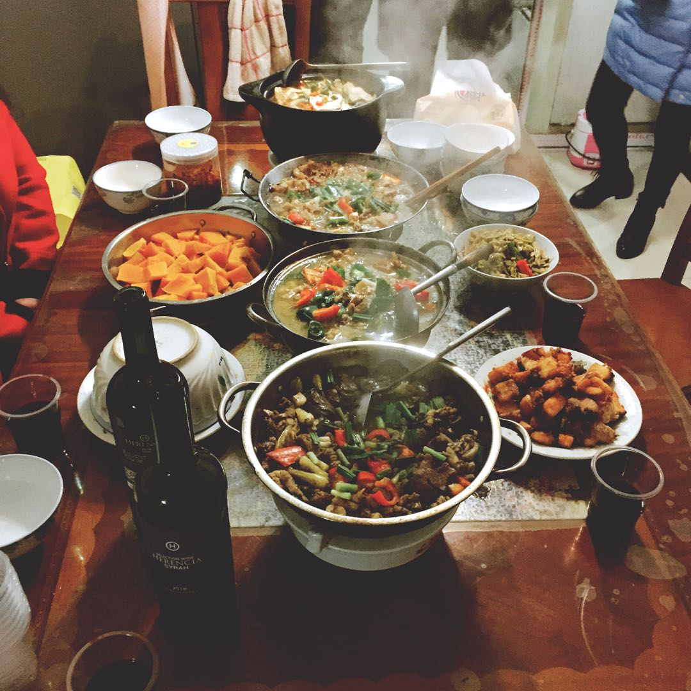

## Updating application of my project

From my previous posts I find my idea about my project is very vague. So I think about it and want to update some information.

Nowadays gardening becomes many people's hobbies. It is a relaxing and pleasant activity to grow and take care of the plants. But sometimes if we are on vacation and need to leave the house for a long time, we might be worried about them. Especially if we grow a lot of plants and they are unmovable. So I am trying to design an automatic watering machine, which can tell you how your plant is going through by sending you messages on your phone. In this way, you can monitor and take care of your plants on your phone while you are enjoying your vacation overseas.

This device is not for replacing the hobby of gardening, it's for people taking care of their plants at inconvenient time, or watering the plants is a work more than a hobby.

For the applications I can think about, it can be used in

- long-distance-from-home gardening
- intelligent greenhouse
- automatic watering in public places(eg. parks, campus, streets)
- flower growers for business
- hotels, offices, and workplaces

The device can be used in many other applications when watering the plants is mass, or the growing process is considered as work more than pleasure.

## Water pump is working

The main task for water pump to control its status. It stays working while connected to a power bank and stops when disconnected. There should be someone telling the water pump to rest for a while rather than working all the time. Therefore, relay is used to control its on-and-off status.

[This](http://www.circuitbasics.com/setting-up-a-5v-relay-on-the-arduino/) website gives some information about the usage of the relay. I connected the wires like the following picture and it works. Notice that there is a pin on the relay that I haven't used. It is a pin for input, for which in my later experiments I will use to control the status of the relay by sending some commands.

This picture was taken when the relay was on, which means the water pump was working. We can see the water moves from the pump and comes to the other side of the tube.

The water pump and relay look working well. But when I had a discussion with Kathleen, she said that the voltage on Arduino is not enough for the water pump to work properly when more electronics are connected to the board. I will combine some tasks and see whether same problem arises later on.

This is all for this week. For now, every single electronic that I use works. My task later will be focusing on combining and coordinating them to perform the final task.

## Happy Pig Year!!

Celebrating the Chinese lunar new year is a very important tradition in China. Everyone comes back from work and get together. It is the time that the countryside is bustling while the cities are empty.

Here is a picture of my family's dinner. Happy new year!˙Ꙫ˙

