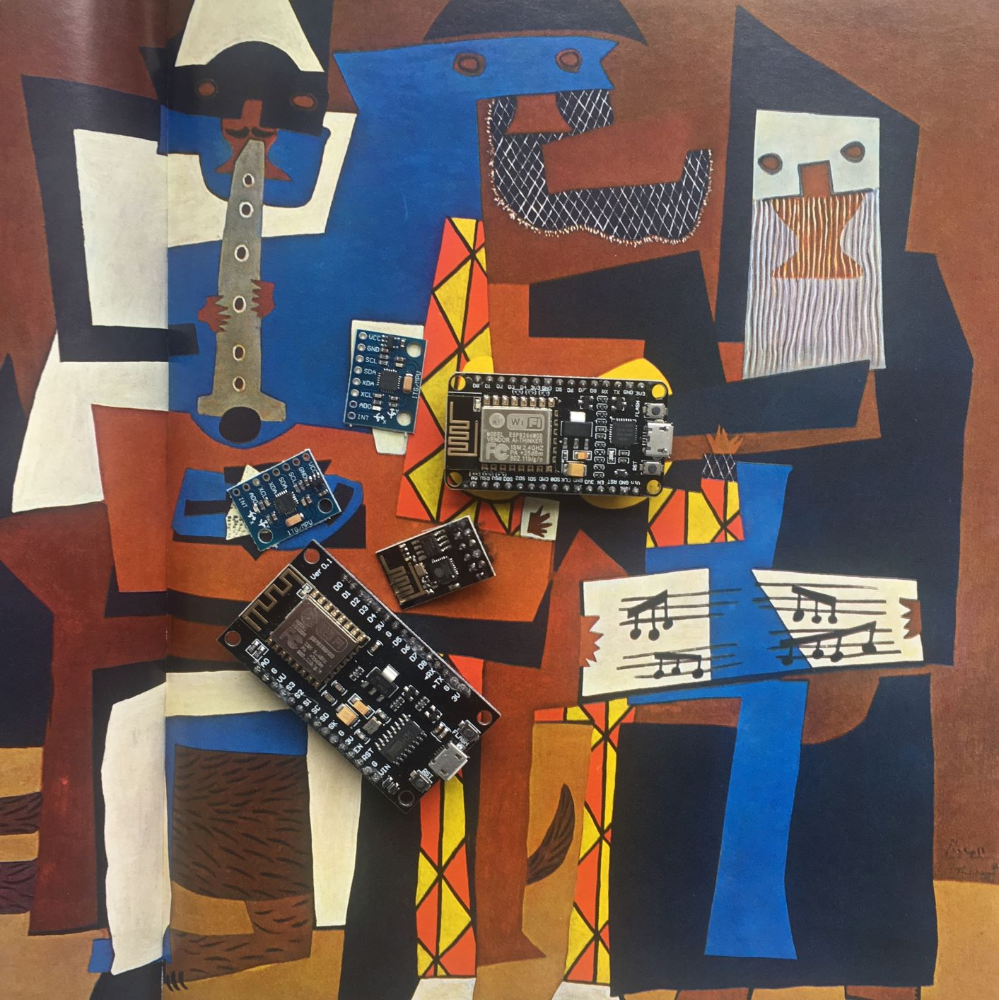

Testing individual components? Czech. Connect everything together and send sensor data? Czech. Finish server side code for aggregating data from all devices? Czech. Dig around in Extempore editor extension to execute changes in volume and tempo? Czech underway. I'd say we're well on our way to a sound Czech, wouldn't you? 

### Welcome to the family

I ordered a few more components which arrived the other day. Hallelijah! I mentioned in [last week's post](https://cs.anu.edu.au/courses/china-study-tour/news/2019/01/25/ushini-week-9/) that I have decided to create 3 devices to demonstrate my proof of concept. I should be able to test that everything is working and get to soldering this weekend. One of the nodeMCU controllers is from a different brand so I'll have to install a different driver for it. I also only have ordered some lithium batteries for two of the devices and some bands I can mount the controllers onto. These should arrive early next week. 

Set up for the MPU6050 accelerometer was fairly straight forward. One thing to note is that, upon powerup, the MPU6050's sleep mode is enabeled, so this had to be disabled by clearing the 7th bit in the MPU6050_REGISTER_PWR_MGMT_1 register, only then can you access the accelerometer/gyro registers. Communication between the microcontroller and the accelerometer happens in I2C via the SDA and SCL pins on the accelerometer. The I2C library I'm using is Wire.h, because it was the first search result :p 

### Serving Up Phat Beats

I'm delighted to inform you that the server side code is not as sparse as it was last week. As mentioned last week, the sensor data values are received on the serverside as a six-tuple. Well, I'm sending it as a string using the sendTXT method because the mehtod for sending binary is restricted to 8bit unsigned integers and given the numerical range of the sensor data values, its not feasible to send them as binaries, let alone send 6 data values at once. So, unless I find a nicer way of handling this, its strings. 

Each bracelet will send data at regular intervals of time. Hopefully, any inconsistencies across the clock speeds of the devices will be fairly small. At the moment, an interval is 1 second. If these inconsistencies become too large, I can shorten the duration of the intervals. 

A single set of values is read from each of the three bracelets. These are accumulated and split into two 1 X 3 arrays; one for accelerometer data and the other for gyro. The absolute value is taken for both arrays and each array is divided by the maximum reading of their respective sensors. I have added two arrays of randomly chosen weights which dictate the amount each axis of sensor data contributes to the overall aggregate value. The sensor data arrays are multiplied by these weights. I may choose to leave out the weights. It depends on whether I want the changes in music to be a direct reflection of the movements of the audience or whether I want to put some damping on motion in certain directions. The latter might lead to richer interactions, so I'll leave the weights in for now. The average is take over both sensor data arrays. We now have two fractional values which can be used to control the volume and tempo. The tempo and volume both have two parameters which dictate the minimum value and range for each parameter. The resultant volume/tempo values are calculated by multiplying the fractional values by the range and adding this to the minimum value. Man, looking back on it, a picture could have been useful here. Let's hope I've put one together when you're reading this friends.

I was hoping I could test out what the final values for volume and tempo look like, but its 5 to 10pm and I'm a morning person, so you will just have to wait 'till next week. *Ooooh antici-                            
 pation*. 

### Plan of attack for next week

Now that I have my new values for volume and tempo, its time to update some muzak. My plan is to have two variables in my extempore code. One to control the tempo of the piece and the other to control the volume of whichever component(s) I'd like. I'll be editing the extempore vscode extension.ts file. This is where the execution of the code in the editor is controlled. There is a command in this file which sends code blocks selected for execution to the extempore process. This takes code blocks in the editor as strings and sends them through a TCP socket to the extempore process. I will create a new command which will open another TCP socket and listen for new volume and tempo values on it. I will add two string which resemble valid extempore code which updates the volume and tempo variables. As new values arrive at the socket, I'll replace the extempore code block and write this to the socket at 'local_host' port 7099, to the extempore process. I will put range checks in for the new volume/tempo values so that noones ears explode, cos that'd be a bummer. I'm knocking on the gamut of woods when I say 'this should go smoothly"; I'm talking Cedar, Pine, Oak, Kauri, . (Cut to next week when things have not gone smoothly). I will just need to play around with the parameters after this is done and try it with all three devices.

I'm fairly happy with the what I was able to finish this week, I really need to get something working by early next week. It should all work perfectly in my head, but you never know what could go wrong when its used in practice. Since it will be a prototype, I imagine there will restrictions for use on the live coders end e.g. the range and minimum values for tempo and volume will be hard coded. I can hear you cringe from here, dear reader. But, to have this flexibility I would need to pass the live coder's chosen min values and ranges from the extempore extension to the python script. This shouldn't be hard, I'm just not sure If I'll be able to do it by the 15th. All other restrictions on devices utilising accelerometers apply, no gigs on Jupiter etc.

### To do next week: 
- Test code on new microcontrollers (By Monday Feb 4th) 
- Await delivery of battries/buttons/wrist bands (by Monday Feb 4th)
- Solder components (by Wednesday Feb 6th)
- Test communication with all three devices simultaneously (by Friday Feb 8th)
- Start draft of design rationale (by Friday Feb 8th))
- Make note of changes to make to code (by Friday Feb 8th)
- Refactor code. Good golly Miss Molly, code needs an overhaul. (by Feb 14th)

See you next week :)
