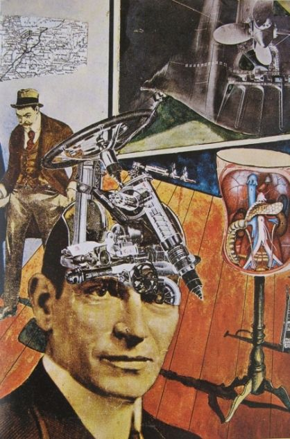
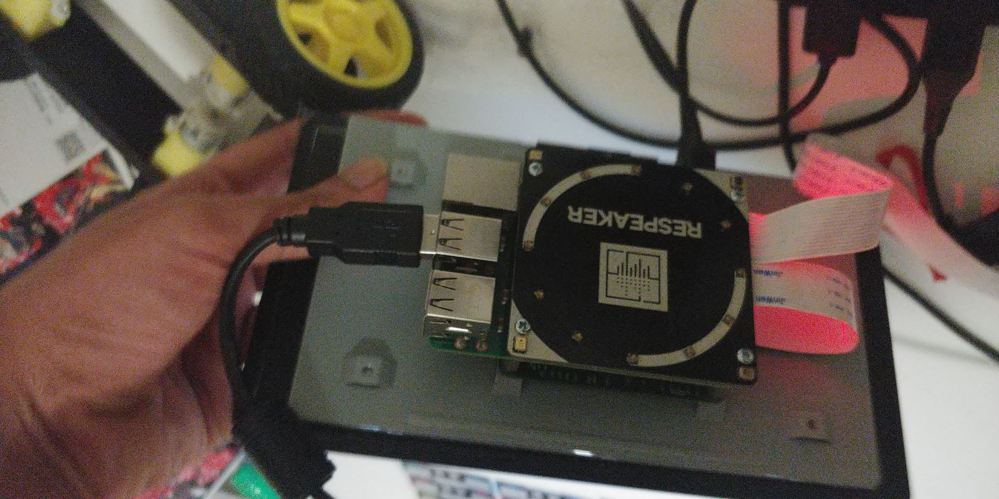
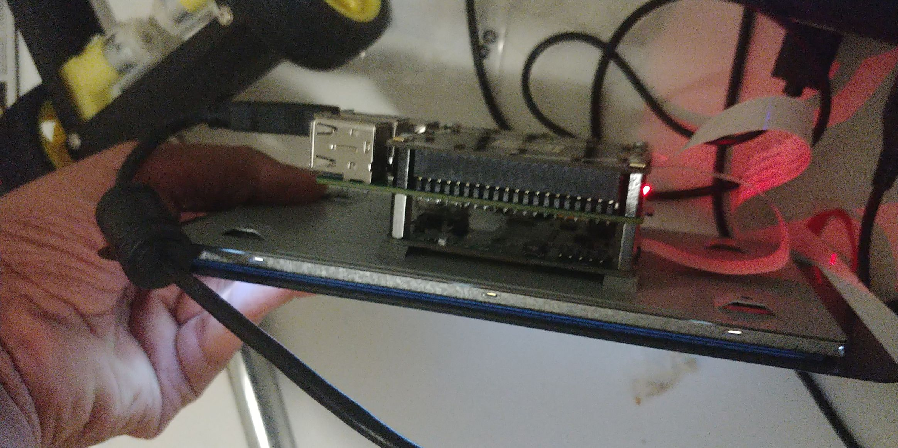
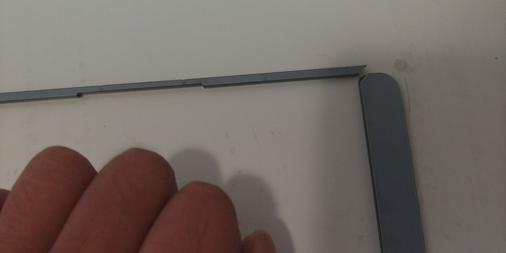

Tatlin at Home by Raoul Hausmann. 

## Privacy and Choice 

I had yet another discussion on privacy over the internet in the previous week that had flared up in response to [the removal of Facebook's Onavo App fromt the Apple App store](https://www.wsj.com/articles/facebook-to-remove-data-security-app-from-apple-store-1534975340). The main positions being argued was whether it is okay for a user to sell a data in exchange for petty cash. Both sides raised excellent points, such as the 'for' side arguing on basis of personal liberty - I shpuld be free to sell my data if I want to. Or the against side arguing against it due to lack of accountability on behalf of corporations, or our inability to restrict the flow of information once it was out there. For example, [mobile service providers indirectly selling location data to bounty hunters](https://motherboard.vice.com/en_us/article/nepxbz/i-gave-a-bounty-hunter-300-dollars-located-phone-microbilt-zumigo-tmobile). Even though service providers selling the data directly would be illegal, the chain of intermediaries was long enough that each sale would pass the sniff test. And in the end any random user could get your (mobile's) location if they had some cash. 

I have [responded to a similar questions in the past](https://cs.anu.edu.au/courses/china-study-tour/news/2018/12/24/chocolatier-privacy/
), opposing consensual corporate surveillance on grounds of chilling effects and the fact that corporations are subjugate to governments. And as interesting as the discussion is, as I mentioned in [Project Diary 2](https://cs.anu.edu.au/courses/china-study-tour/news/2019/01/11/chocolatier-project-diary2/), we often don't have that choice. 

This happens due to a multitude of reasons, in no small part due to to sociteal dynamics I already mentioned in the previous post. You just have to consent to surveillance in order to participate in society. For example, in theory it's completely legal to not own a smart phone. But the the reality is that everyone is expected to have one. So the choice comes down to 

1. Paying way too much and missing basic features like the headphone jack and ability to sideload apps

2. Consenting to get surveilled by Google

Yes, technically it is possible to install custom roms on an Android Phone that do not send all your data to Google, but only a very small minority of customers will have the knowhow on how do that. And manufacturers might void the warranty if you do. 

But there are many other hurdles. Companies often exploit dark patterns in order to have you consent. Privacy settings are often hidden away and bundled. If you try to sign up for Google right now, you'll see that the option to not have your data logged is hidden away under "more options" at the bottom of a decent sized scroll. 

Suppose you are okay with Google maps having your home address, so that you can use their app to get directions easily. Turns out that there is no way to do that without turning all of location history on. Similarly, signing into any Google service will sign you into Chrome. And so on. 
And while it is possible to turn much of the tracking off, to do that you need an account, which involves give them personally identifiable information in the first place. Even if you have [Do not Track on](https://support.google.com/chrome/answer/2790761), Google treats not having an account as a license to track you. 

Even with the GDPR in Europe, which tries to make privacy the default, we find companies [resorting to dark patterns](https://fil.forbrukerradet.no/wp-content/uploads/2018/06/2018-06-27-deceived-by-design-final.pdf) to get the user to consent to surveillance. 

And ultimately it is much easier for companies to enable tracking you than for people to disable it. Microsoft turns on Cortana and other spyware for millions of people with the push of a button in random Windows updates, but it takes each of those users navigating into hidden away options to disable it. 

And due to legislation like Assistance and Access, the governments can force the corporations to surveill you anyway. 

It is worth noting here that the erosion of choice was not a sudden change. The original iPhone was just an iPod that could browse the web and make calls. Something so silly that many tech enthusiasts said it was destined to fail. Far from the central hub it is today. But as time has gone on, it eventually became a necessity.

 <!-- Or more generally, computers have gone from something used exclusively by governments to megacorporations, to something everyone needs access to.  -->

The same trend can be seen with IoT today. Me and [other tech enthusiasts](https://twitter.com/internetofshit) are likely to laugh it off, but in no small part thanks to the corporate push, these devices are becoming ever more popular. And as they do, we slowly lose our choice to not be surveilled. We may just aim to connect together, with our friends, family, and physical belongings, but in that process we give up our right to privacy. And in the process, we effectively cause other people to lose their rights to privacy. So perhaps we should reconsider if we truly need to connect together, and maybe even opt to disconnect. 

Now, I haven't substantially revised the physical appearence of the robot since I initially complained that it didn't look creepy enough. 

And I'm beginning to think maybe making the robot appear creepy isn't the right way to go about it. To that end I've been looking at how artists have surveillance technology throughout the ages. All the results on a DDG or Google search tend to focus on the secuirty camera and/or have a high degree of uniformity. For example, [Jakub Geltner's work](https://theplaidzebra.com/jakub-geltners-creepy-art-installations-reveal-how-the-surveillance-state-is-always-watching-you/), which have the same camera facing or satellite dish, again and again. 

Now, mechanization and uniformity is a very common theme in art about technology, going all the way back to Fritz Lang's Metropolis. And I had unwittingly fallen into the trap of thinking that my deisgn must contain a degree of uniformity. Hence my choice to build multiple robots. 

However, there is another school of art that has been critically examining the relationship humans have with technology - the Dadaists. Most of their art responded more directly to the kind of mechanization that emerged in the Industrial Revolution and after World War 1, and doesn't respond to the digital age directly, they did recognize that technology wasn't uniform. And often created pastiches and photomontages showing the disaparate components of technology, such as in the image I embedded above. 

So I plan to embrace this cacophony - which is a better accurate of real life corporate surveillance anyhow - and use a multitide of distinct devices in order to surveill the surroundings, instead of relying on identical robots. 

I would then like to pipe all the analyzed data to a cloud server and collate the data, but that goes too far into actual surveillance territory. (And I don't want to bother with the security aspects).

## Technical Setup 

### Respeaker Failure 

Continuing my debugging tale from last time, it turns out that the software update I did did actually break the soundcard installation. 

The drivers were compiled for kernel 4.9.28, while I updated to kernel 4.14.94. Which broke the installation. I tried installing it again, which failed with the error

```
Error! echo
Your kernel headers for kernel 4.14.94+ cannot be found at
/lib/modules/4.14.94+/build or /lib/modules/4.14.94+/source.
Error! echo
Your kernel headers for kernel 4.14.94-v7+ cannot be found at
/lib/modules/4.14.94-v7+/build or /lib/modules/4.14.94-v7+/source.
Error! echo
```

Fortunately just `cp`-ing the old headers from `/lib/modules/4.9.28[-v7]+/build` to `/lib/modules/4.14.94[-v7]+/build` and running depmod again was enough to fix the problem. 

I then installed the [ReSpeaker Python Library](https://github.com/respeaker/respeaker_python_library) and using the [Google Speech to Text API](https://cloud.google.com/python/docs/reference/) examples as a reference, spun up some code to test voice recognition. 

The code I tested was essentially [this example](https://github.com/GoogleCloudPlatform/python-docs-samples/blob/master/speech/cloud-client/transcribe_streaming_mic.py). 

It works pretty well, more or less recognising what I dictate to it. However, I failed to test how it would perform in a noisy environment. 

I tried to test it using various movie clips, but Google always ignored the movie clip. I tried the club scene from the Social Network to test noisy voice detection, but no transcription. I thought maybe it was a bit too much, so I tried something clearer, like Bane's speech at Blackgate Prison from the Dark Knight Rises. No luck here either. However, if I ever spoke over either clip, it would pick it up and transcribe. (Given I didn't speak too softly). 

Perhaps it recognised the bandpassed nature of the output due to my crappy speaker or used some fancy machine learning technique to determine that this would normally be background noise.

However, the end result was the same - I was unable to test how Google Speech to Text would work in a noisy environment. 

## Physical Setup 

Now, to work around the lack of space, I've decided to mount the Pi on the back of the screen and the Mic Hat on top of the Pi Screen. Like So. 





I would then put it in a frame, and mount that frame on the rover, but the frame arrived broken.



So I have to wait for the replacement to arrive before I can mount the setup on the robot and get it to self drive. 