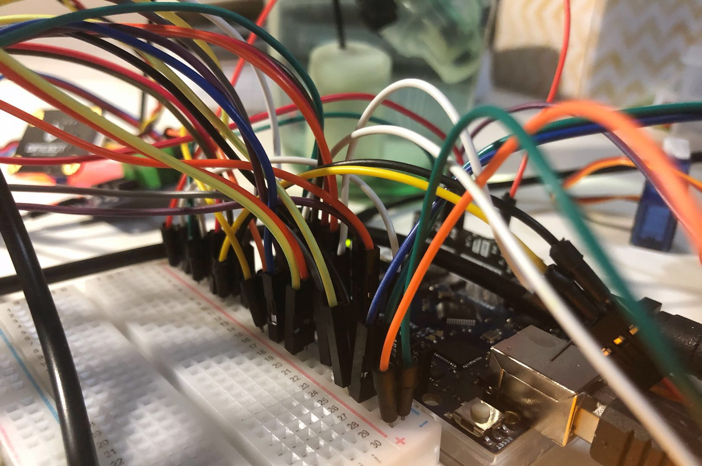

When I realized it's the last project diary post, I really hope I could finish the majority of artefact, so that the later design rational and final post could only be (two different-style) summary, and I'd have chance to show the whole interesting project process through "regular" posts. It must be especially meaningful when one day I look back... Luckily, I did it!

## Current Process

As mentioned in _last section of last-week post_, I planned to finish the Wi-Fi connection build early this week, and late this week I'll begin "html" work -- i.e. combining the separate function codes with my "website" framework.

I thought I've just finish approximately 2 functions when I'm writing this-week blog, while actually, I finish all 5 functions late last night! It's actually the first time in the whole project process that I feel I'm much more efficient than I thought, (considering I spent so much time on moving and new-year celebrating this week as well). Walking on air then~ ;)

I'll then separately share my experience through the general _"Wi-Fi connection"_ and _"separate functions"_ two parts, as it's really an exciting journey~

## Wi-Fi Connection

Luckily, I've got my **new Arduino Uno WIFI R2 board** last Friday as plan~ It costs a lot and finally comes to me as the 4th delivery attempt with a great many contacts with the delivery company... But it's worthy!

I know it's hard to connect the board with the campus "WPA2 enterprise" network. When I _scan networks_, it will show several available networks with the same name "Resnet". I'm not sure whether it corresponds to some settings that also cause the "campus Wi-Fi connection" problem. While anyway, after trying but fail all the time, I directly to choose to use my own hotspot instead -- it is also enough for artefact test~

As I mainly design to use the "Wi-Fi function" to **build a simple website showing the current sensor data, the current device condition and do some remotely control**, I mostly study **"WiFiWebServer" codes** in _WiFiNINA library_.

Instead of stuck in "Wi-Fi connection" for more than half a week as estimated (due to the shadow from "ESP32" board :( ), I spent only one day finishing the _"html_framework"_ -- **editing a little on "WiFiWebServer" and finding the main area to add the "html format"**.

It's not that complex, while it's really my most scary part...

After finishing the framework, my next job is to combine the 5 separated function codes with the "html framework" respectively. **For each function**, I will **copy relative codes to reasonable place for sensor reading and device operation**. I also **add some "html thing" to the "html format" area**.

To make the whole process clearly and no re-debugging, after adding each function, I'll test its actual operation and website effects. I'll come to the next function, until the previous combination version gets all my general design expectation. The whole process codes are shown in _my "combination" folder_ in GitHub.

It's a big workload, while I enjoy it~ My previous efforts on _"separate_function"_ help me familiar with different components, and make the whole combining process smooth. There are only a few problems I'll share below. They are mostly caused by the new board setting or huge components number.

## Separate Functions

The story says in the actual working sequence... (As I talked quite a lot previously about the design and actual realization for each function, here, I will only directly share the problems, assuming you pay attention to my project through the way ;)~)

### Temperature

As Week10 ["Water Temperature" section](https://cs.anu.edu.au/courses/china-study-tour/news/2019/01/31/cbr-continuing-project-diary/) shown, I added an OLED screen module to the function. It's initially a creative point that suddenly booms last week, while it becomes the first problem this week.

Even if the new board looks the same as _Uno R3_ and no documentation specially pointed out _Uno WIFI R2_ cannot cover all _Uno R3_ functions. I faced the unexpected problems many times this week that **the new board cannot support many previous libraries (tested with Uno R3)**, such as OLED screen, real-time clock module and "warning" for micro servo (although it can work well).

I could not find any information about the library coverage for "Uno WIFI R2" online, maybe due to its newest version. I also emailed to Arduino support team to check, while they also didn't notice the problem before.

For my real-time clock module _DS1302_, without specially pointed out which library can be used for _Uno WIFI R2_, I finally **tried every library available** on Arduino IDE for "DS1302", after trying the 4th version, success comes!

For micro servo, I just **ignore the warning**, as it doesn't have actual negative effects~

While for OLED, I found almost all projects online still use my previous _Adafruit_GFX_ and _Adafruit_SSD1306_ libraries and I also cannot find any other suitable library through Arduino IDE searching. So my final decision is giving up OLED as the initial plan~ We can still get temperature information online. Considering real-time situation, it is not that important to know the precise temperature all the time if you're at home -- touch the water directly, finger is enough!

### Water Changing

This function takes me the longest time in the whole "combination" process.

Besides the **real-time clock library thing** I mentioned above, another problem I met is **water temperature sensor cannot work at the same time with pump**. I tried many ways, such as extending the website refresh time and delay time in the "loop", while whenever the pump is ON, the temperature sensor reads nothing (sometimes just showing some extremely high value).

Luckily, I finally think of a way handling the problem, and the whole design looks even more efficient after the change~

Three functions of the whole artefact, "temperature", "water changing" & "land-water swap", need regular sensor data reading. In common, the outside environment will not change that quickly, so it's **energy-wasting** to make sensor and operating components work all the time. Also, there will always be some boundary values that determine whether the corresponding device will work. If everything is checked all the time, the possibility that the device will switch between open and close quickly is higher (when the sensor value is close to the boundary value). It's also bad for **product life**.

I separate the above 3 functions in 2 groups: We will judge real-time minute first, then **"temperature" and "land-water swap" functions only work for even minutes, "water changing" function only works for odd minutes**. Thus, we can guarantee all the relative temperature, brightness and turbidity data is **2-minute latest**. We also ensure **not all devices will work at the same time**~ Hope the separation make sense.

### Lighting

The relationship between "lighting" and website is the closest among all functions -- as LED is **remotely controlled by corresponding buttons on website**. The owner can choose any of the 3 LED level or turn it off directly.

I stuck in the "html button" aspect as well this week, while after trying several versions, I finally successfully made it, referring from [a "html" basic information website](https://www.w3schools.com/html/html_forms.asp) and the "SimpleWebServerWiFi" example in WiFiNINA library. It really gives me sense of achievement, as I even know nothing about "html" before this summer~

Another problem is still **power** as I mentioned last week in [LED Lighting](https://cs.anu.edu.au/courses/china-study-tour/news/2019/01/31/cbr-continuing-project-diary/). With combination, the port choice will always disappear no matter the 9V battery is brand new or not.:(

When I previously talked to Yuze about my power problem, he gave me an suggestion to **use the portable battery** (always 5V as well). It works this time! I will **first upload the program without connecting the VCC line of LED lamp**, after it's done, I'll then connect the USB port with a portable battery and connect the power line of LED as the last step~

Although I need to **change the LED level index to small value** as well for the power problem (may make the brightness level change not that obvious for the exhibition), at least, the lamp can work well with all other functions at last through this way! :)

### Feeding & Land-water Swap

Most interesting things for these last 2 functions are shared in last 2 weeks' posts or even before, there is nothing special happen in this-week combination process. Smoother than expected again~ :)

## Stage Summary

The finish of "land-water swap" functions **_marks the end of my initial completed version codes_** -- now, all 5 functions can work at the same time, the corresponding data or device state will real-time shown on website, the remotely control for lighting is also added successfully!

From the picture of last night's final test, you may find the line connections are quite messy! :( While ignore how complex and inconvenient it looks like, at least, currently, it works as expected...

Actually, I'm also excited to show my **website page**! While it's also always my style to keep it mysterious in the current stage~ You will have chance to see it later. (Although it's very simple without any specific layout, I feel satisfied enough as my first attempt. ;) )

## Later Plan

It nearly comes to the end of our project timeline. For next week,

- Some small edit _may_ have in overall codes, depending on the left time~ (I _may_ improve some detail, thinking whether each function is practical enough in real life.)
- _Early next week_, I will pay attention on the **physical part**, especially for "feeding" & "land-water swap". I will **link the relays for "land-water swap" with the pulley system** and **test the actual positions for different components**. Hope after that, the line connection will not look that messy!
- (Besides the above tasks,) in _the second half of next week_, I will pay attention to **write the final "design rationale"**.
- I _may_ write documents in GitHub and make it more completed as well.

## Other Interesting Finding

### Tortoises VS. Turtles

I found the situation several times since I was in Beijing: when I chat with someone about my project general idea, they always think it's for turtles rather than tortoises. I preciously thought it's only my pronunciation mistake. :( While when I search some Australian pets’ website recently, I suddenly find some culture difference~

I know it's not very common in Australia to keep tortoises or turtles as pet, while through my recent finding, even if there's some place selling them, it will always be turtles rather than tortoises!

Things are opposite in China. It's common to keep tortoises as pets (although never compared with cats, dogs or birds), while I never see turtles in market! Actually, you need to have special national license to feeding turtles in China~ Considering Australian beautiful sea, it makes sense~

That also explains why I do not prepare large water box for final exhibition (tortoises are usually much smaller than turtles) and why I pay much more attention on "land-water swap" function and even ignore the "water components" problem (such as PH value and salinity)~ Tortoises do not always need to stay in water and some most common and easily-feeding varieties in China usually live in low water level~

For the whole project, I try to make it practical and meaningful for daily life -- in the "smart home" theme, trying to make your life better with technology. If I have to relate each function with pets’ habits in detail, I need to say, I **specially design the artefact for the Chinese common pet tortoise varieties**~ _(I know I would never have chance to have any pet in Australia, especially for I live on campus...)_

### Ending Words

It comes to the end of the extremely long post... With diary records, every day has its special meaning to somehow. I've already learnt much more than I thought through this mysterious journey...

Overall, hope more pleasant surprises would come up in the left days. See you then!
