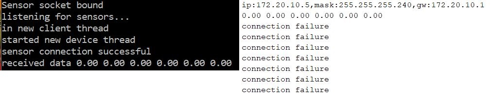

I just want to say stank you very much for putting up with these bad puns week after week. I have managed to scrape together an IoT device resembling what I envisaged building 9 weeks ago in a BIT cafeteria while downing a bowl of chong qing xiao mian. It's not perfect, it's not complete, but it does the thing and with that, I'm content. I hope this device is the one, if not... it is the prototype.

I should really be more specific about what I accomplished this week since I may have used the word 'prototype' just to make the Outkast reference. I was able to get end-to-end communication with a single bracelet device, meaning, the accelerometer data was sent to the python process, new parameters for volume in a live-coding piece were calculated and updated at regular intervals of time in the extempore vscode extension. This results in changes in the volume of the live coding music every 5 seconds. But, as with any weekly post of mine, there were problems galore. Grab your forks ladies and gents and lets get stuck in.

### Extempore Edits to the Extempore Extension

I was under the impression that I could activate the extempore vscode extension from within the vscode extensions folder and hack away at it to my heart's content. But for some reason this didn't work. I guess you cant activate the packaged version of an extension which is published. So I gave it a go with a clone of [vscode-extempore](https://github.com/extemporelang/vscode-extempore) using [Yeoman](https://yeoman.io/) and followed these [helpful instructions](https://code.visualstudio.com/api/get-started/your-first-extension) from vscode. Cool, that worked. Then I set up a command which establishes a socket for communication with the python process. Each time data is received on this socekt, if it's interpretable as new parameters for volume (just working with volume for now. Baby steps), an extempore pattern is generated with the new volume and passed to the sendToProcess() function. This function sends code blocks to the running extempore process. Unfortunately, I have to use a predefined extempore pattern for all the music making and here's why. Initially, I thought I would be able to define a volume and tempo variable in my extempore code and have the extension only update these variable. These variable values would then be accessed by a temporal-recursive function of the live-coder's choosing. But the variable values are only accessed once when the first call to the temporal recursion function is made. So for the updated volume/tempo to take effect, the definition of the recursive function would have to be re-evaluated. This is janky, for the following reason. As far as I know, the temporal recusion would have to be predefined in order for it to be evaluated behind the scenes in the extension code. Hard coding an entire function in the extension code gives little freedom to the live coder. If I find a workaround, you'll be the first to know, I promise.

Btw, the tempo stuff should be fairly similar. The tempo can be updated with the _(\*metro_ 'set-tempo 75)\*, this requires the live coder to define a metronome in their code.

Edit: I completely forgot that you can set a variable value with _(set! vol1 70)_, so there is no need to have a predetermined pattern/function. You just need to define the vol1 variable in your code. Silly me.

### Talking Threads

I wasted a lot of time trying to change the design of the way the aggregations stuff was working on the server side. Originally I was going to have a matrix 3x6 to store the sensor data for each device. The tasks/corountines associated with each client connection would update their respective rows in the matrix. Then I got this overwhelming urge to implement a single buffer and have each client's data accumulate in this buffer as it arrives. A 4th task which is responsible for calculating the new parameters and sending them to the extempore process would clear out this buffer each time it send the data off to the extempore process. I tried using the asycnio python library, and although I was able to create the three client tasks, when I tried to add the 4th task to the eventloop I couldn't see any of the aggreation functionality when I ran the code. It might have somthign to do with the way I was accessing the eventloop. Impatient me switched to the python threading library. This library had no eventloops and I just used a simple lock to manage access to the buffer. This time all tasks were running as expected. Well... sort of. There were occassions where data would arrive late and the calculations of the new parameters would not be far too small since some sets of data would be zero. As the last sliver of COMP2310 content leaves my brain, I give up all hope. Simultaneously, in some underground lair, Uwe sighs an efficient sigh of dissapointment. These are unrelated events.

I went back to my original idea of having 3 global buffers. Each thread just updates its own buffer and the 4th task aggregates every 5 seconds. This solution does not scale well at all with a large number of devices, so I'll defintely have to come back to the single buffer design. This whole process had my undivided attention for I'm-embarassed-to-say-how-many days. I was yet to test end-to-end communication. I really should have made sure I got all communication working end-to-end before I handled the details of how the aggregation works.

### A Side Note

Forgot to mention this the other week, but the websockets library only works with python 3.6 so I just set up a virtual env with the appropriate python version with pipenv. Again, the websockets library isn't necessary, I'm pretty sure this will work with the socket library too just couldn't be bothered changing it. It would actually probably be better with the socket library, no overhead of the special types of communication that can be used on websockets.
Edit: Yep, so I just updated it to use the socket library and everything is dandy.

### She Tries to Solder

I tried to solder... this will be a short paragraph. I'm a first timer so early last week I practiced soldering some wires on a copper board. It was a giant mess. My hands were constantly shaking (coffee withdrawals) and I didn't have those suction pen-things to clean up as I go (Blame your tools! and lack thereof).I still need some time to get the hang of this. Those youtube tutorials make it look so easy. Grrrrr angry face. I will get there next week!

I changed the client side implementation from using websockets to the WiFiClient which uses TCP sockets, but when I did this the following happened.
On the client side, in the main loop, I check to see if the socket is connected and then proceeded to send data to the server. But I got a sweet error saying the connection fails after the first set of data is sent.
I wasn't sure if I should be checking the socket connection status by using socket.connect(). This might be trying to reconnect the socket in each iteration of the loop which could be causing the connection status to be disconnected. So many examples I saw on the internet were creating a new client in each iteration of the loop and destroying it at the end of hte loop. This made no sense to me, but I thought If it worked for them, It'll work for me. It didn't work for me. I'm going to fix this over the weekend and hopefully future me will make an edit and add a video of the device in action. But for now, enjoy this tasteful assortment of errors.

##### An edit from the future:

So the reason why the connections was lost after the first packet was sent is this. I guess the type of socket/connection established with client.connect in the wificlient module is not suitable for streaming data. So the connection must be (re)established at the beginning of each iteration of the main arduino loop and closed at the end of the loop. Meanwhile, on the server side I was expecting the connection to be streaming so I pre-set the socket to only listen to one connection. This meant that I received data after one iteration of the loop only, the first iteration. After that the server stopped listening and so the client connection status became 'disconnected'. Since esp8266 arduino doesn't seem to have many streaming library that are well documented or robust, I will change my server-side code to allow unlimited connections and kill each client thread once a single set of data has been received.

##### Nevermind, I was wrong:

Well, not entirely wrong. That was the reason why the socket kept disconnecting, but it wasn't an inherent problem with the socket type. All I had to do was create a single client before the client's setup function and check if the connection is still alive with the convenient client.connected() function. How sad is that? In my defence I didn't know such a method existed (although you'd expect it to) since there were 3 different docs for this library and only one had the 'connected()' function defined and also, reading is hard.

Here is a video showing the end-to-end communication. The accelerometer data isn't being used to calculate the new parameters at this stage. Though the sensor is being read on the server side, the server is merely sending a constant volume to the extempore extension. On the extempore extension end, the volume of a specified pattern is triggered to change each time it receives new parameter data. Each time data is received, the handler alternates between evaluating the pattern with the volume it receives, and a preset volume of 90.

<iframe src="https://player.vimeo.com/video/316361781" width="640" height="282" frameborder="0" webkitallowfullscreen mozallowfullscreen allowfullscreen></iframe>

<a href="https://vimeo.com/316361781">IoT Project Demo: End-to-End Communication</a> from <a href="https://vimeo.com/user94933414">Ushini Attanayake</a> on <a href="https://vimeo.com">Vimeo</a>.

### Looking back over plan from last week

- I have answered some of the basic questions for the design rational, so we're on track there.
- I just received the battery covers yesterday and the end to code still wasn't working so I haven't had the chance to test all three devices together. (cries in binary)
- I have refactored some parts of the code around how the threads are managed on the server side, but there is still some cleaning up to do on the client side.

The end is so near! I really hope I can polish this project up in the next two weeks, get the tempo working with all three devices and tighten some screws in the aggregation code. Two weeks. Should be good, yea? See you then :)
