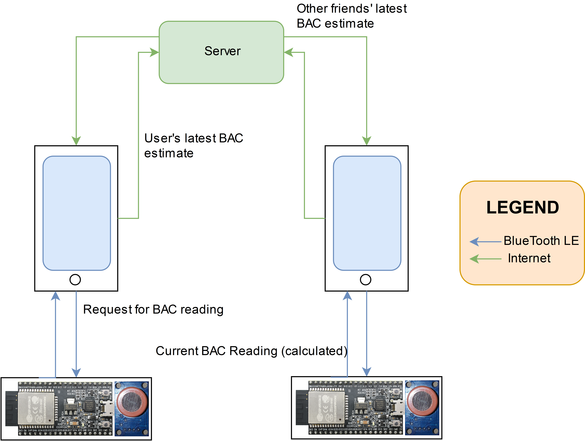
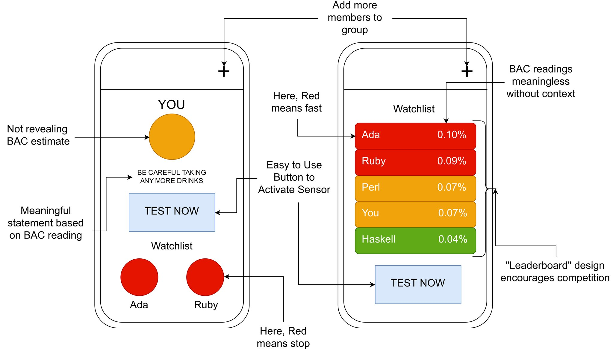

In this design rationale, I discuss the development of our project: from inspiration to the final reveal, with reflections along the way.

## Inspiration

After coming back from China, Chinmay and I had several great ideas for our project. Chinmay and I don't drink, and frequently, Chinmay is the one in his friend group responsible for everyone on a night out clubbing. We thought a passive blood alcohol content (BAC) sensor device could be an idea to help people manage their alcohol consumption—we called it the Party Safe Band (PS Band). Communicating users' alcohol readings between friend groups would help friends look out for each other—so group safety wouldn't be the job of one person, like Chinmay.

Another use for the PS band would be as an entry "ticket" into night clubs—clubs could use these bands as a way to decide when to serve drinks to patrons or arrange rides home for overly intoxicated users based on their up to date BAC readings. This would improve safety at nightclubs by making it easier for club security to look after the party-ers.

## Ideation for Implementation

During our discussion with Ben, I had the idea that passive blood alcohol readings could be measured from sweat. Intrigued by the possibility of working with actual hardware and the chemistry of alcohol (I'd spent a semester in high school on this topic and eventually had a published report on Wine oxidation/spoiling mechanisms — this field is interesting to me), we focused on researching sweat based BAC sensor technologies in Weeks 6 and 7.

Interestingly, sweat based alcohol sensing became a hot topic in c.a. 2016 when researchers from UC San Diego published [this](https://pubs.acs.org/doi/abs/10.1021/acssensors.6b00356) paper on alcohol measuring skin patches. Simultaneously, [start-up companies](https://www.telegraph.co.uk/technology/2016/05/23/this-wristband-can-measure-your-alcohol-history-from-sweat/) used this technology in smart wristbands to allow users to monitor their alcohol consumption. We were excited by these findings — passive BAC sensing devices were similar in function to our prototype idea.

I pursued research into sweat-based alcohol monitoring. While the hardware required seemed relatively easy to procure—electronic potentiometers and similar chips are standardised by Texas Instruments, for example—the chemicals required in facilitating a potentiometric response from the alcohol in sweat wouldn't be available to two enthusiastic undergrads with no formal chemistry training.

We realised by the end of week 8 of the course that we couldn't feasibly pursue sweat-based BAC monitoring. This was a major setback for our prototype. Passive alcohol monitoring was very important to our original idea, as we would have consistent, up-to-date BAC data on all users.

As it was late into the project, we continued working as planned, using our "back up" breath-based alcohol sensors. I briefly discuss the limitations of this design choice in the Final Product section.

## Project Development—Challenges and Compromises

The dictum for the design decisions I made in this project: Form follows function—I want to focus on the parts of the project that structurally set it apart from an ordinary breathalyser, while also focusing on the artefact's function of monitoring the intoxication levels of its user. I wasn't interested in the app-dev/UI-dev aspect of the project (unless it helps aids the function of the device, as discussed later), and wanted the skeleton of a shippable product working for the exhibition.

Chinmay and I decided to use the MQ3 Alcohol sensors for our prototype — these were the cheapest alcohol vapor sensors available. While we would like to have used more accurate sensors like the MQ135, our budget did not allow us to. This limited the sensor accuracy—we ran into several problems detailed in the Week 10 and 11 blogs in calibrating our inaccurate sensors. The inaccuracy stemmed from the highly varying raw readings at which the sensor would stabilise when exposed to clean air. We investigated both theoretical methods of converting raw readings to BAC values (by exploiting relations derived from the alcohol sensitivity graph for the MQ3 sensor) and the practical method of drinking standard drinks of alcohol and measuring the change in raw reading (see Week 11).

Chinmay and I thought about the theoretical approaches, and found that the relation between voltage reading and BAC by [Hymel](https://www.hackster.io/ShawnHymel/diy_breathalyzer-1efe13) prescribed a 0% BAC at a voltage reading of ~1.9V. We adjusted the function by shifting it horizontally so that the "zero" value of the BAC function fell on the raw reading taken in clean air. Using this approach resulted in reasonable BAC estimates for tests under varying levels of alcohol vapour—this was our final, working solution for the "Drawing Meaning from Data" problem discussed in Week 10.

We decided on the network architecture shown below.

As a simpler alternative, we considered a BlueTooth-only mesh network between the ESP32 microcontrollers. But we decided against this as the range of BLE is around [100m](https://blog.nordicsemi.com/getconnected/things-you-should-know-about-bluetooth-range), but can be much lower in crowded environments—we didn't want to risk losing connectivity between any users in a friend group.

With the decided upon network architecture, all users can keep track of each other contingent only on mobile network or WiFi availability for phones—more reliable than BlueTooth connections.

I wanted to put most effort into thoroughly following through on the network architecture. This meant we had less time for front end app development. However, discussions with Ben and Kieran revealed a major concern in our design—the possibility for misuse of the product for competitions between friends.

We needed to design our app to reduce the possibility of people using the app in drinking games. We decided that displaying classifications of drunkenness as opposed to numerical values would make it difficult for users to create a race for who's the most drunk.

The design on the left was our aim for this project — we are able to get the core elements of this user interface working by presentation date, but a final product will fully implement the design shown, as well as push notifications for alcohol sensing and for when people enter the red zone.

Due to the time constraints, we weren't able to make the device battery powered and mount it to a wristband as we hoped to. But this wasn't important to me — I only hope to convey the raw structure of our idea.

## Final Product

To present day, and the artefact is (nearly) finished. Here are some limitations and successes of our prototype.

**Limitations:**

- We weren't able to make a passive BAC monitoring system—this means we need to frequently prompt the user to breathe into the alcohol sensor. This isn't likely to work when users become very intoxicated, or if the users ignore notifications/prompts to breathe into the sensor. This is a design problem in our artefact but a final shippable product would be using transdermal sweat-based sensors.
- The artefact's UI isn't convenient or well-polished.

**Successes:**
- Succeeded in showcasing our network architecture—our design choices mean that we can keep devices connected regardless of distance, as long as internet connection is available.
- We overcame the major social problem with our project implementation—we removed the possibility this product could be used for drinking games with our solution for converting BAC readings to presentable data.

Our prototype is designed to the criteria we valued the most—in limited time, we created the skeleton of the Party-Safe Band. I've also made a list of nice-to-haves we would have liked to include given the time:

- Encrypted message passing: Data security is a serious challenge for IoT and the PS Band is no exception: I discuss this further in Reflections.
- A physical wristband isn't implemented: this isn't too interesting from a technical perspective, and not necessary for our prototype per our criteria.

## Some Broader Reflections

### My stance on IoT and Data Privacy

Before I started this project, I was highly sceptical of the data privacy concerns from IoT. The artefact exemplifies the dangers to data privacy posed by IoT. The party safe band could be provided by night clubs upon entry. While it would help clubs monitor and manage severely drunk patrons — by giving information on when to stop serving drinks or call cabs for people—this data could be mishandled. My argument isn't only a values based, subjective one for the fundamental right of privacy. BAC readings of club patrons, if sold to data companies, would be particularly useful for insurance companies, who could in the extreme case be able to identify individuals who frequently get drunk and raise their premiums. Our project is only one example of how seemingly innocent technology aiming to improve quality of life can help collect data about us that's potentially valuable to somebody else, usually to our detriment. I continue my skepticism of IoT. IoT is a quagmire of data privacy issues—and frequently the convenience, safety or "coolness" benefit of these technologies is far outweighed by the risk of surrendering our valuable data.

### (Dis)connecting together

My aim with this project was to help friends look out for each other when out clubbing. We're providing a new way for friends to bond. But the device can only protect you and your mates in so far as its used the right way. Which of your friends do you trust with your BAC readings? Who would look out for you if you're very drunk? How would you use this cool gadget—to see which of your mates can get to the red-zone fastest or to actively avoid getting to the red-zone? These are all questions I hope to raise with this artefact.

### Final thoughts

Our artefact is far from a shippable product. From a technical perspective, there's a lot more I would like to have done as discussed in the previous sections. When I took on this project, I had the noble vision that our idea could truly help people stay safe. But there was a lot of thought we needed to put into our design to discourage the artefact being misused to run competitions on who gets the most drunk. This is a case study in considering how (frequently irrational) human action plays into tech product design. The data security/privacy standpoint is also troubling. Considering all of this, I believe IoT ideas can make life convenient, or even safer—but specific issues like data privacy and user-interface design decisions need to be considered in evaluating the overall worth of the specific product.