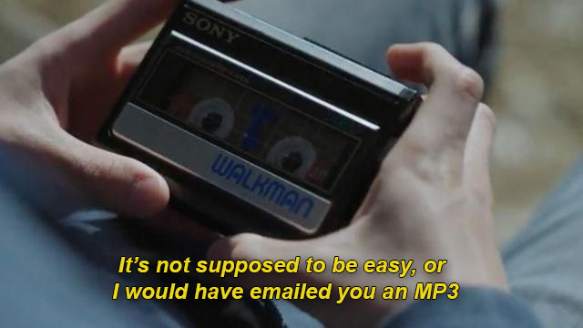
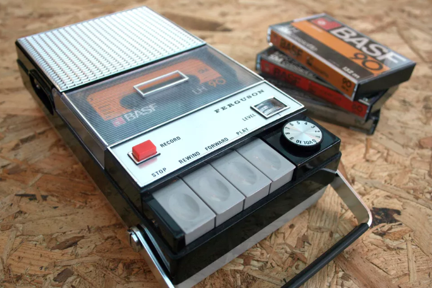

### what ideas or existing projects inspired your work?

The main driving idea, _or rather question_, that inspired my work was ‘how can I bring jukeboxes, or the main concepts behind them, back in to the modern age?’. The current era we live in is hyper-connected, and music is more accessible than ever with the likes of [YouTube](https://music.youtube.com/), [Spotify](https://www.spotify.com/) and [Soundcloud](https://soundcloud.com/) etc.  
However, even with services like this so readily available, the ability to share and connect over music seems to be almost non-existent in public settings. Gone are the days where you could request songs in bars, eateries (etc.) on a jukebox and have a conversation with a stranger because they happen to _‘love this song’_.

Even when considering more private settings, things such as the art of creating a mixtape have died, replaced by playlists on streaming services that, when compared to creating a mixtape, take much less time and effort to make and are still changeable after the fact. And while this is very convenient, it removes a lot the care and thought that goes in to the process, “It’s not supposed to be easy, or I would have emailed you an MP3”[[1]](#point-1).

Drawing on existing projects for inspiration, I found [this project](https://www.cnet.com/news/rewind-this-raspberry-pi-cassette-player-plays-spotify-tunes-on-actual-tapes/) by [Matt Brailsford](https://circuitbeard.co.uk/).  
The device is a cassette player that streams Spotify. It accomplishes this with NFC tags embedded in the tapes that link to a specific playlist and the player simply reads these tags when inserted, and then the existing controls are linked back to the Spotify player.  
This project showed me that people are interested in bringing back these older technologies in new ways, by integrating them with things we use in the modern day or reimagining them in a modern setting, and that gave me the confidence to pursue my idea further.

When I had decided on re-creating a jukebox style _IoT thing_, I used these older devices _(mix tapes and jukeboxes)_ as inspiration. I wanted to recreate the same feelings and interactions that they did, but at the same time I didn’t want this to just be a nostalgic device, it needed to be relevant for the modern age so that it would be used, but not as uninspired and boring as something like a collaborative bluetooth speaker, it needed to be its own unique device to create the experiences I was seeking.

### how does your project explore the theme?

When I thought over the theme _(dis)connecting together_ and the general project specs, the main concept I wanted to explore was ‘how could IoT devices bring people together without being the point or active component in the interactions’. I believed this was important because if the device was the key interaction, then it didn’t really feel like disconnecting, even if people were ‘together’.

My project tackles this by removing one of the biggest antagonists to in-person social interactions, smart phones. To request music the user must surrender their smart phone to the jukebox if they want their music to play, and if they remove it early then the music will be removed from the playlist, or even cut off midway.  
By doing this I am putting users in a much more open and approachable state, when considering body language alone, they will be sitting up and looking around, not slouched over looking at a screen, this openness is already a step forward to facilitating social interactions, and the first step is always the hardest.

To build on this, the user takes a ‘restaurant pager’ with them when they hand over their phone. This allows them to be located by pressing a button on the jukebox that will make the pager light up and buzz, which means anyone who wants to chat about the music currently playing is able to do so with the person who requested it.  
This further encourages interactions as it means that, not only is it easier to locate the person who requested the song, it normalizes the fact that you are able to approach them and ask questions and have a conversation because there is a method already in place for you to do so, which means that is almost expected (this is also something that would not have been possible with old jukeboxes without the help of the IoT).

These two points aim to bring back more wholesome social interactions, unimpaired by the existence of smartphones and to facilitate real connections over the art of music. This also shows the direction I am taking with exploring the theme: IoT connected devices facilitating interactions away from IoT connected devices, feels like (dis)connecting together to me.

### what was your design process? how did your project develop over time?

My design process for this project shifted somewhat over time, when I began and my idea was only in the inception stage, I drew a lot of design cues from jukeboxes of old and what I could do with current technology to capture that same feeling but also produce a truly modern device, and not just a nostalgia machine.  
I thought about what was special about them, what interactions they facilitated and where those were missing in current times. I then considered how I could recreate or emulate that feeling. This helped me get off the ground and led me in to the next design phase.

Once I was rolling, my process started to lose track of my original vision and I started thinking in a more practical sense, what features would I expect of a modern device, what would improve user experience _(UX)_ and what was available to me to implement them.

This led me somewhat astray until I had a chat with [Kieran Browne](https://kieranbrowne.com/) about the current state of my project, he helped me refocus on the theme and helped draw out what I was really trying to achieve. That was when I went back and analysed a lot of the features I had decided on but were still not implemented. I then evaluated them for relevance to the theme and initial concept and adjusted or removed them accordingly. This really helped get the project back on track and moving towards my initial vision.

### what design criteria did you choose to prioritise? which criteria did you have to sacrifice?

With the deadline approaching I had to start prioritising the remaining features that engaged with and were important for the theme and leave behind ones that were just about extra functionality and polish.

This led to me ditching some additional coding as well as physical design criteria for the project. For example I had some UX designs planned, such as not being able to repeat the same song within a certain amount of songs and also using the Spotify suggestion API to generate new songs to play when no one was interacting with it, allowing it to basically act as a radio.

While these are nice features in an automated playlist, they didn’t engage with the theme, worse they even took away from it. If the device restricted what songs people could and couldn’t listen to, it would discourage them from interacting with the jukebox further.  
Additionally, having the jukebox manage its own playlist by adding suggested songs to it could cause users to feel that there wasn't anything required of them to have music play, it could also discourage use of the 'locate' button because it may just be the jukebox itself that picked the current song, so there'd be no point trying to find who requested it. Both ideas had outcomes that weren’t in line with the theme, nor the interactions I wanted to bring about.

Instead, I decided that the previous design solution was a missed opportunity to lean in to the idea of encouraging interactions without being forceful. The current jukebox design will repeat the last song in the ‘playlist’ until a new one is added, where it will not add any songs without user interaction apart from the initial song to start things off.

### what were the challenges you faced in developing your ideas and prototype?

One of the challenges I encountered when developing my project came about when implementing the Spotify playlist functionality. After I had already finished most of the implementation, I discovered that when dynamically changing playlists, Spotify did not update the currently playing 'queue', so in my implementation I would be stuck with the initial song in the playlist looping, while all new songs that were added later were ignored.

This was a bit of an issue, because that functionality was not something I could fix as it was a limitation with the Spotfiy API, not my own framework. To get around this, I decided that I would need to roll my own playlist handler within the nodeJS server.  
This was annoying, but not too much of an issue as I had already implemented handling for tracking which user requested what song. I then used this framework and extended it to be in charge of controlling what Spotify plays, which meant the context would always only be 1 song and not a playlist, eliminating the dynamic update issue.

However, when it came to design this change meant that no external playlist is produced by the jukebox, which means that there is no way to know what songs have played, and if you find the playlist during operation, no way to know what is and what will play.  
These points actually add to the idea of encouraging these social interactions, because once a song has ended, your chance to find out anything about that song or the person who requested it is lost, so the idea of not wasting your chance is a lot more apparent. While this change came out of necessity, it actually ended up contributing to the overall project concept.

### how has this project changed the way you think about IoT?

Initially, I thought the IoT was a mixture of some helpful devices and a lot of crap, enabling internet access on everyday objects that had no real business being internet enabled, but one thing I didn’t consider was how they could be used in an artistic or social context without some ulterior motive (like grabbing data or helping sell a service).  
Through my own experience and reading through other blogs, I can now see that there are many applications for IoT devices I would never have even considered before, and that these little devices can really have an impact and make a difference if they’re created with good intentions behind them.

  
**[1]**: Image from ‘13 Reasons Why’, quote by Hannah Baker when talking about why she used tapes to record her message
