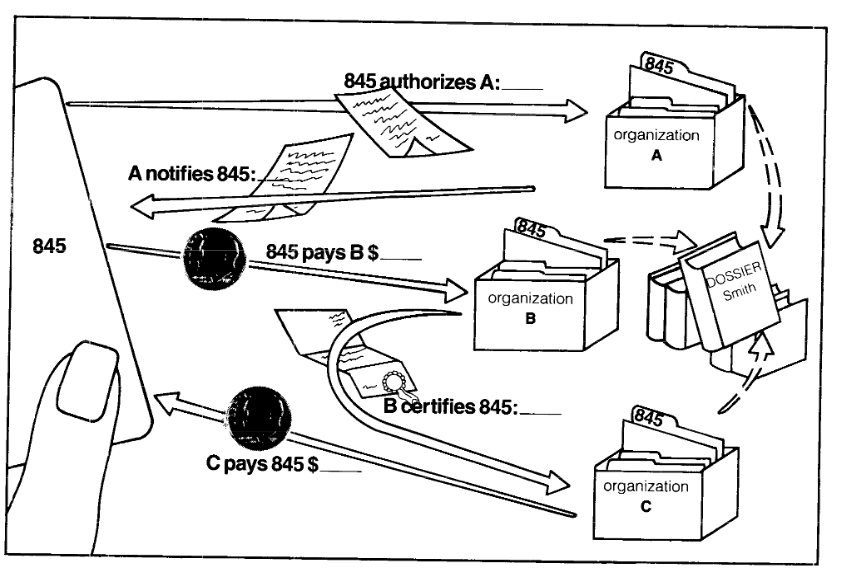

  <iframe
      src="https://player.vimeo.com/video/245961596"
      width="500"
      height="281"
      frameborder="0"
      webkitallowfullscreen
      mozallowfullscreen
      allowfullscreen>
  </iframe>

## Privacy and the Internet of Things

Going into the course, my primary interests lay in the area of security and privacy in relation to the Internet of Things. I toyed around with numerous ideas, such as a meshnets or automatic exploitation, before settling on a surveillance system.

Seen on a low level, the Internet of Things is just a massive grid of sensors and actuators connected to the internet. These sensors are [often not secured properly](https://www.shodan.io/), and many times just hand everything they sense to unscrupulous corporations like Google or Amazon. I believe that this privacy loss is actively harmful due to [chilling effects and the ability it gives corporations to manipulate us](https://cs.anu.edu.au/courses/china-study-tour/news/2018/12/24/chocolatier-privacy/) (cf. Filter Bubbles and Cambridge Analytica). Further, due to the gradual dependence of society on technology, we do not have a [real choice on being surveilled](https://cs.anu.edu.au/courses/china-study-tour/news/2019/02/08/chocolatier-project-diary6/). For example, smartphones slowly became a necessity. At no point was it legislated that everyone needs a smartphone, but not owning one, and hence not being tracked, is not a choice we have today. Even though that very much was a choice in 2008.

I believe that the Internet of Things is still in it's infancy, but we see a similar adoption trend. More and more people are voluntarily buying Google Homes and FitBits and Amazon connected Smart Fridges and so on. While it is possible to opt out of the IoT for now, it will become less possible in the future, as homes/cities become "smart" by default, and society expects you to have access to the utility afforded by these devices.

These devices are often sold under the guise of assistive devices that help people "[connect together](https://www.youtube.com/watch?v=OsXedJq1aWE)". But needless to say, the marketing ignores the negative externalities these devices have.

So I chose to explore the privacy implications of such sensor networks in an attempt to dissuade people from doing so, and perhaps even actively disconnect.

## Prior Art

The lack of privacy has been a staple in Sci-Fi since the start of the 20th Century, the most famous example being George Orwell's Nineteen Eighty-four. That and other works like [Paranoia](<https://en.wikipedia.org/wiki/Paranoia_(role-playing_game)>), [The Trial](https://en.wikipedia.org/wiki/The_Trial), [Brazil](<https://en.wikipedia.org/wiki/Brazil_(1985_film)>) etc. provided background influence on the direction of my project. By highlighting the surveillance risks IoT devices pose, I want people to experience the low level anxiety Winston or Sam Lowry felt. I want to dissuade people people from connecting together by pointing out that when they choose to connect with their friends or family, they end up connecting to less scrupulous entities as well.

More directly, I took inspiration from cyberpunk and cypherpunk ideals from the late 20th Century. Primary influence being the concept of the [Dossier Society](<(https://www.cs.umd.edu/class/fall2015/cmsc414-0201/papers/chaum-identification.pdf)>). Coined by David Chaum in the 1980s, it denotes a society where information about individuals is collected by various organisations who trade it with each others, forming dossiers on individuals containing information about every facet of their life.[^NF]

[^NF]: While Chaum did coin the term, the concept is older. For example, it is a part of the aforementioned book The Trial, by Franz Kafka. We even real life examples like the KGB and Stasi. The main difference Cyber/Cypherpunk texts have is that it involves corporations doing the spying, instead of/along with the government.

Illustration taken from [Security without Identification](https://www.cs.umd.edu/class/fall2015/cmsc414-0201/papers/chaum-identification), by David Chaum.

We already see this through the existence of credit reporting agencies like Equifax, and the on the "normal" internet through companies like Google and Facebook which compile information on people and then sell it to the highest bidder (albeit indirectly). I wanted to highlight the privacy violating potential this has when combined with the internet of things, and by doing so, persuade people to disconnect.

## Cocteau

To that end I built Cocteau. It is a collection of cameras and microphones that go around recording the activity of people around them. On a conceptual level, the cameras and microphones can be part of anything. However, I chose to mount them on rovers so that they can follow people around, as a metaphor for the way Google follows us around.

My design process largely consisted of seeing what others were already doing and using that as a base to build my idea. Technology can be quite painful to troubleshoot, so I wanted to go with devices that have the largest communities. A main design priority was that it be easy to build, and iterate upon. Largely for my own benefit, but also because open hard/software is pointless if nobody can hack on it.

As such I chose using the Raspberry Pi Model 3 B+ as the primary onboard computer, the PiCam and ReSpeaker Hat as cameras, and an Arduino Uno based controller, the DFRobot Romeo. I did not experiment with alternatives like the BeagleBoard or the ASUS Tinkerboard, even though they might have been better alternatives. The Raspberry Pi + Arduino combination worked on the first try, so I stuck with it.

I also went with the Pirate Rover kit by DFRobot, because I have zero robotics/engineering experience, and figured that learning how to design one was only tangentially related to this project.

I haven't built the 2nd robot yet, because the parts are yet to arrive. But I plan to use the Pololu Zumo rover as a base, an standard Arduino Uno to control it. With a Raspberry Pi Model 3 A+ as the onboard computer.

My primary constraint throughout the design process was cost. Building something like a [Guardian from the Breath of the Wild](https://www.youtube.com/watch?v=bNWJUdPfx6k) would be wicked cool, and terrifying to boot (even minus the death rays). Nothing evokes dystopia quite like an car sized octopod racing towards you the moment it notices your presence, while recording everything you do. But that would be prohibitively expensive.

The design of the car itself only required some minor iteration. I had to buy additional wiring because the one that came with the kit was insufficient, and I replaced the ultrasonic sensor HC-SR04 with an IR sensor, the Sharp GP2Y0A21YK0F, because the ultrasonic sensor wasn't good at detecting non-solid obstacles.

The only major iteration was adding a display to the first rover. In order to invoke the dossier society, my plan is to have each robot transmit the video and audio to my laptop. The audio will be transcribed using Google's Speech Recognition API, and conversation logs displayed on my laptop. I will look up images using keywords detected in the conversations and display it on the screen of the robot. (As an analogue to the kind of ads that would play)[^proc].

Another thing I iterated on was using Google's Vision API to analyse select frames from the video. I changed that due to ethical issues rather than technical. I was justifying sending data to Google to myself by saying that it would be only used in public for two hours. But even so, I am not at all comfortable sending images, especially of people's faces to Google.

I'd also like to not use Google's Speech API, but I fear it's too late to strip that out.

I did not find the project very challenging from a technical perspective. Most of what I want to do has been done before, and I intentionally chose widely supported, well documented work to build on.
However, it did challenge me artistically. I haven't been able to find an effective way to get my point across to people who don't already subscribe to my world view.

## Effectiveness

I am not happy with how the project has turned out at all. It really isn't much more than a webcam duct taped to a Roomba. And a network of cameras recording you and logging everything you do is an incredibly common system that is an accepted part of society - a CCTV system.

In retrospect, the key failure of my system ([and many other similar art installations](http://www.artandsurveillance.com/)) is with the expectation of privacy. The reason IoT devices are insidious is that they violate privacy in the, well, privacy of our own homes. But once you are in public, that expectation is gone. It certainly would be nice to not be spied upon, but nobody expects that them walking into the local convenience store will go unrecorded. So when you see such an installation in public that is just recording what you say or do, it's effect is dulled heavily. It's effectively just a CCTV system, except at eye level.

If we examine other dystopian literature focused on privacy, we see that it does take advantage of this distinction. We find Big Brother so creepy in Nineteen Eighty-four because the telescreen spies on Winston even in his own room. Brazil manages to invoke the same sense of dystopia, even without explicit telescreens, because we are shown that the government/Central Services can and do invade homes.

Another aspect that is missing is simply the amount of data that companies and governments have. In dystopian Sci-Fi and in real life, it is possible to tag and identify people in photos and footage, because governments/companies already have that information. People voluntarily upload their photos on Facebook. Amazon tracks all your purchasing habits. Google tracks you much more closely than a CCTV system you'd look at for 5 minutes at most before moving on ever could. There simply is no effective way me getting my hands on that data.

And on some level, people have already accepted living under constant surveillance. [Room 641A](https://en.wikipedia.org/wiki/Room_641A) has been public knowledge since 2006. Information on the PRISM and Five Eyes programs were leaked by Snowden. The Cambridge Analytica scandal happened, and Facebook has repeatedly had news about their carelessness/callousness regarding user data surface (going all the way back to the "dumb fucks" comment). There certainly was outrage when those leaks happened, but basically nothing changed, and people went back to their lives, just accepting the lack of privacy. To the point where it has become background knowledge in internet culture.

So, although it tries to convince people to (dis)connect together by highlighting the privacy risks of IoT, it falls flat because reality is worse than what I created, and people just accept it. This project will probably make people who already think that this surveillance society sucks that this surveillance society sucks. But that's just preaching to the choir, and is meaningless when it comes to convincing people to not adopt IoT in general.

## Broader thoughts on IoT

The process of building this project hasn't really affected my beliefs with regards to IoT devices. The only difference is that thinking about this further has caused me to become more extreme in my opinions about privacy. I used to think that it was possible to minimise the harm done by these devices, but I'm not so sure anymore. I've gone from believing that I shouldn't use Google or Facebook or Amazon to believing that they should be actively broken and abandoned. In terms of IoT adoption, thinking about gradualism has made me go from "might have some uses" (NGL, being able to turn the lights off without leaving my bed is pretty cool) to believing that we should reverse the trend of IoT.

More broadly, I used to believe that tech was inherently neutral, and it was the humans using the tech that were responsible for good or evil. But now I don't think you can separate the human aspect from the code. Some tech will inherently be used in manners where the negative consequences outweigh the positive. I no longer believe that it is fair to separate the two.

[^proc]: None of this is implemented yet (as of 18/02/2018). Last minute panic is the only thing that can motivate me enough to do something as tedious as writing glue code, even if that is all the project is.
