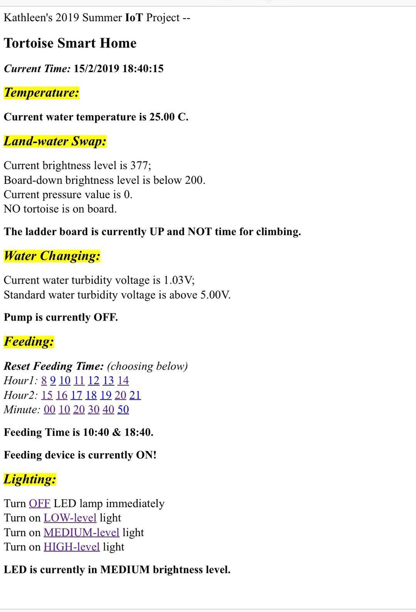

Hello all, here is Kathleen's design rationale for the IoT artefact "Tortoise Smart Home"~

## Artefact Introduction

In general, my project is meant to design a smart home device specially for pet tortoises. _(It's common to feed tortoises in China, if pet turtles' feeding is more usual in Australia, you could consider the whole idea is quite similar and transferable~)_

It **combines 5 main functions** -- _(not in significance order)_ **_temperature_**, **_land-water swap_**, **_water changing_**, **_feeding_** & **_lighting_** **into a small aquarium**. These functions are relatively **separate** from one to another. Generally, in each of them, **the actuators will be controlled through the corresponding sensors' data or remote website command** -- there are program judgements on whether the data is in a specific condition range or there is html "button" control.

Besides remote control and setting, our **website** also shows **some real-time sensors' data and actuators‘ condition**.

## Inspiration & Broad Theme Relation

In BIT tour, I found "smart home" is an important IoT application area. The **IoT technique** could collect precise data from outside world (through sensors), handle them (checking with specific conditions & making them human readable), send commands to actuators with automatic inside-program analysis or software feedback, upload device real-time condition to outside world through "Internet".

Through this way, the IoT artefact could help us make decisions more **scientifically** and keep working with prior setting even if the owners are **away from home**.

Through research, I found most IoT smart home devices consider human-being requirements. There are some designed for more common pets, such as dogs and cats. But how about other pet species, such as my pets - tortoises?

Maybe because of added water-proof requirement, I found only a few IoT products designed for industry-level fish feeding, while seldom for family daily life and not an exact one for tortoises feeding.

As a tortoise owner for more than 10 years, I'm familiar with specific tortoises' habits (such as special "land-water swap" requirement). As an international student who can never take care of my pets by myself, even if I know my parents could help me look after them, I'm still worried that they are busy and not as careful as me.

Thus, the initial point for my design **is not to simulate actual feeding** - for me, nothing could take the place of real touch feeling of pets. I want to **set the project targets as tortoises, rather than human beings**. The artefact could help the tortoises enjoy better living environment and the owners can thus be less worried about tortoises' life even if they are away from pets.

That's why I think my artefact satisfies the **"connecting together" theme** - once the intelligent "babysitter" specially works for your pet tortoises and you can monitor the real-life situation through website as well, you'll feel relieved and convenient~

For **user experience**, I think tortoises may find it is super fun! ;) For owners, they do not need to learn specific instructions to use the artefact in real life - the basic important information is straight forward shown on the website and the device can operate well by itself through inside setting~

While considering the exhibition, I think viewers still need my explanations about how it actually works. The artefact looks complex and **the design principle and structure for each function cannot be easily figured out from appearance**, especially for people who are not familiar with tortoises' habits. (It's a **trade-off** to consider tortoises more than human for the project.) While once they understand the separate functions, I hope they'll find the artefact is thoughtful and practical~

## Separate Function Descriptions & Implementation Process

As mentioned before, all 5 functions work separately. In "final version" codes, various functions could be split easily in both function implementation and website building parts.

Considering my **project process**, after getting familiar with single sensor or actuator, I wrote **separate function codes without Wi-Fi connection** first. It's the most important and time-consuming section through the whole project. The later **Wi-Fi connection** work and **codes combination with "web server" framework** is smoother than expected.

For Wi-Fi connection, I previously studied hard to try to use ESP32 development board as a Wi-Fi module and connect it with Arduino Uno R3 but failed at last. It's even my most scary part through this summer... My new Arduino Uno WIFI R2 board really saves me further efforts on "Internet" part~

Separate folders in [GitHub repository](https://github.com/KathleenQ/tortoise-smart-home) could show my progress throughout. I'm also glad to invite you to read [my previous blogs](https://cs.anu.edu.au/courses/china-study-tour/news/#kathleen-qian) to go through the interesting detailed journey full of inspiration, challenges and changes!

### Temperature

Given efficiency and product life consideration, I separate 3 no remote-control needed functions into 2 groups: We judge real-time minute first _(time is got from DS1302 real-time clock module)_, and then **"temperature" & "land-water swap" functions only work for even minutes**, **"water changing" only works for odd minutes**.

The "2-minute latest" guarantee is enough for temperature, brightness and turbidity data in real-life situations. We can also ensure not all devices will work at the same time - it could handle the "strong power demand" problem~

"Temperature" function itself is simple: We **get data from water temperature sensor and update message on website**. Considering safety issue, I **do not make my own heating device**, but instead, to let owners take further action after reading real-time temperature by themselves, such as controlling existed heating device using "smart socket" _(it's another IoT topic)_.

Overall, the common slow temperature change won't affect tortoises' normal life. This factor is not as important for amphibious tortoises as for aquatic animals (like fish)~

### Land-water Swap

"Land-water swap" is specially designed for tortoises’ **amphibious habit** - besides swimming in water, they also need to come on dry land enjoying basking. It's good for health~

There are mainly 2 boards for the function: **a rotatable ladder board & a fixed above-water flat board**. The "ladder board" is **controlled by a pulley system** - whether it is up or down depends on the direction of current flow through the system engine. **Two relay modules with opposite current directions are monitored through light sensor's data judgement**: if it's bright enough, the board will be dropped down to enable tortoises climbing up, and vice versa. We guarantee the 2 relays never work at the same time and ladder board won't be repeatedly up or down~

A **water-proof pressure sensor** is added on the flat board as well to make the function more reasonable~ We could know whether there're tortoises currently on board and ensure the ladder board will never be pulled up if some tortoises are on board no matter how bright the environment is, to **enable those tortoises safely climbing down**. _(To simulate pressure test easily, I'll leave pressure sensor outside the aquarium in the exhibition~)_

### Water Changing

Pump will be on when the water is more turbid than pre-set turbidity standard. **A turbidity sensor** and **a pump with an Arduino controllable MOS module** are used here.

### Feeding

The feeding device is made up of **a food container with a bottom hole** and **a micro servo with a rotating board**: The rotating board usually stays static and exactly hides the container's hole. While once it comes to the feeding time (a 60s period), if the water is not too turbid, the micro servo works, and the board will rotate without hiding the hole any more. Food can then drop down from the hole to the aquarium. The design idea booms up from [a "micro servo" introduction video](https://www.youtube.com/watch?v=iH9_xtulyws) _(at about 3:58)_~

Handcraft for "feeding" is also a challenge~ I spent much time in China making the device from used plastic products - it's always hard to cut, while a good **recycling** way~

**Feeding time can be remotely chosen and changed through website**. I adjusted it to be not fixed recently~

### Lighting

**The 3-brightness-level LED lamp is totally remotely controlled through website commands**.

The **html building** is a brand new study section for me - fortunately, I finally made a simple one!

Strong power demand for lamp also increases test difficulty - once the LED "VCC" port connects to the Arduino board, the "port" option is missing in Arduino IDE! Luckily, I found a solution to the problem: first upload program without connecting the lamp, then connect the USB port with **a portable battery** and connect the power line of LED as the last step.

## Critical Conclusion & Further Thinking

For **design criteria**, I think I pay more attention on _Things_ side while _Internet_ side is weakened relatively. I try to build rigorous operating logic for every single function, concentrate on relations between various sensors and actuators. Thus, **each function can even operate separately**. I spent time on handcraft devices for exhibition as well. While for Wi-Fi connection and website framework parts, I simply use the board **as a "web server" to show real-time information and only do a few remote control interactions**. _(It seems like I tend to work more on the area that I think I'm better at...)_

In summary, I think my project is good as it's a relatively completed IoT artefact with function combinations and simple website monitor. Although messy line connection makes the artefact look rough, its design idea can be figured out already and I couldn't find similar IoT product in market maybe because of its special "pet tortoises" targets.

There're still 3 challenges left for future explorations:

- It's better if we can **directly input feeding time and** turbidity or brightness **standard value onto website**, rather than only be able to choose through "buttons". While I didn't successfully make it because of time limitation...
- The **"strong power demand"** is still a problem for the exhibition - sometimes, some sensors or actuators cannot operate **steadily** due to it.
- At the same time the owners know their pets' condition, outsiders could learn the tortoises' information as well. **Privacy exposure concerns** still exist in this stage and need to be taken seriously~

Overall, I'm grateful for the meaningful summer experience~ Before the project, I nearly know nothing about "Internet of Things", while the project helps me learn deeply about different sections' job of IoT technique _(as said above in "Inspiration & Broad Theme Relation" section)_ with self-doing a completed artefact. I was even confused how could the "Internet" involved previously. Now, the whole IoT idea becomes much clearer with practice~ Hope after I learn more computer knowledge (e.g. about machine learning & computer version), I could explore more IoT aspects as I was shown in Beijing. As now I know IoT does surround us~ :)
