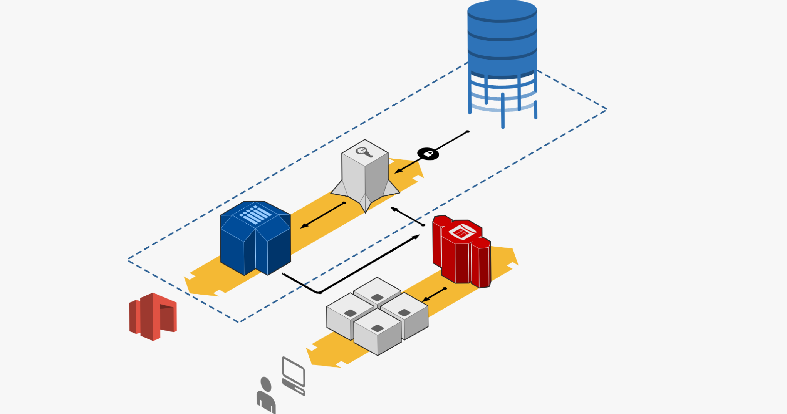
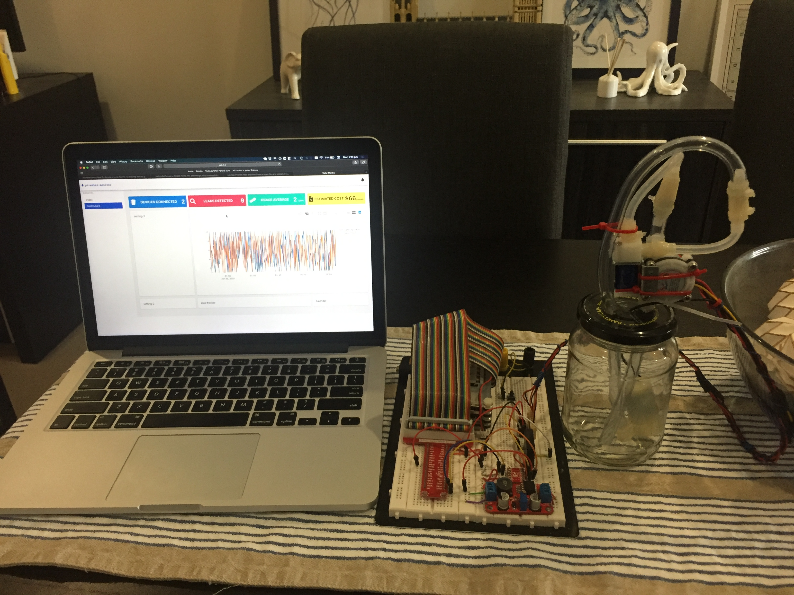

## Design Rationale

The design and implementation of my water flow monitoring system was carried out in early 2019, the design process and iterations are presented here. The project consists of a number of systems, both hardware and software;

### Software Systems

- **Interface**: a web interface to view collected data and change setting on the remote device.
- **Server**: consumer of data collected by the hardware systems, the interface talks to this system to retrieve the stored data.
- **MQTT Broker**: communication platform for sending data between software systems (specifically the reporter and the server)
- **Reporter**: a service that runs on the remote device (IoT device) that collects and reports back data on water flow.

### Hardware Systems

- **Microcontroller** (network connected): a [Raspberry Pi](https://www.raspberrypi.org/) that interfaces with both software and other hardware systems, and acts and the _reporter_.
- **Water flow system**: a network of tubes that route water through components used to measure and control the flow of water.
  - Vinyl tube, water flow sensor, fluid solenoid and a pump to simulate water pressure for demo purposes.
- **Circuitry**: used to route power to components and connect data lines to the microcontroller.

These systems come together to form a network connected and controlled water monitoring solution with a variety of use cases and benefits to users - such as whole-home leak detection, sprinkler monitoring, automated plant watering and many more.

### Inspiration

The inspiration for and motivation for this project came from a few places. A conversation with a Downer engineer and home builder brought the initial idea. Their main motivation behind wanting something like this was to have the ability to detect leaks in their various water systems, to minimise the damage they can cause. The motivation behind pursuing the idea came from my own thoughts on what I want from an IoT device in my home. In previous blog posts, I have introduced the idea of "Home as a System". The main themes in that idea are:

- Many systems underpin our lives, but they can become distracting or require time investment to get the most out of them.
  - One of my goals was to create a system that can give you maximum benefit with no interaction.
- The information available to us can help us to make better choices.
  - I wanted to design a system that keeps people up to date on their water consumption, so they can make more informed decisions about their usage.

The existing water monitoring systems on the market are mostly targeted towards specific use cases such as farming and irrigation. My water monitor is targeted for home use and is designed to be integrated into people lives to keep them informed of their usage and prevent damage by detecting leaks.

### Design

The way my project explores the theme - (dis)connecting together - is through its design philosophy. One of my goals was to help people be more informed about elements of their lives that make a difference to them and the environment. By connecting people to their homes, to monitor and control their usage of resources, they can make more informed and environmentally conscious decisions about the way the live their lives. In the same way I wanted this to be a background process, requiring no interaction to stay informed, as not to distract from other things. By being more connected to our resource usage, with limited necessary interaction, people can make more informed decisions.

These ideas were the basis for the two main design criteria I decided to adopt in my design process, they are the goals for the finished product. The other criteria are all implemented with those two in mind. Initially my design included a platform software package, that would allow users to connect different kinds of monitoring devices that all report back to a central service. A kind of hub for home analytics. Some remnants of that exist in the interface design but due to time constraints a less feature-rich software package will be presented in the demonstration. Another sacrifice that was made relates the the level of configurability. For demo purposes the configuration and control options are fairly limited. If work were to continue, a full device configuration system would be implemented, allowing users to control remote devices and use analytical results or time of day to trigger actions. I understand the risks involved in having a device connected to the internet, and as such I know that it is important to take necessary security precautions to ensure that the system can not be used without authorization. For demonstration purposes, no security has been implemented but it is certainly a design requirement to consider. Time constrains were the main obstacle in achieving my design goals, but the underlying idea remains the same and it works well as a proof of concept. I did not want to compromise on my main two design criteria, so my work prioritised these criteria as those were overarching design goals.

The way it is meant to be used should require little interaction, it collects statistics about water usage and makes them available to view. Users should be able to completely ignore the system if they wish. In the case of leak detection an alert would be given, but otherwise no time or effort is needed to operate or get benefit from the device. It is very much a background process, a user can monitor it as much as the like or use it to gain insight on their water usage. I hope that it would, in parallel with similar devices that monitor other usage, prompt people to be more environmentally conscious, be able to reduce their bills or even stop their house from flooding due to a leak. Some may think of it as a safety precaution, some as a tool to track their usage and associated costs (monetary and environmental) or both.

### Implementation

The implementation of the water monitoring system has three distinct subsystems to consider. The software, the electronics and the water loop. Each within their own paradigm, presenting their own challenges.

#### Water loop

The water loop is a linear network of tubes with a flow sensor and solenoid, and a pump to simulate water pressure. For the purposes of the demonstration, the system is a closed loop, such that the water "used" returns to the tank so no continuous water input is required. In a real-world installation, the pump would not be needed as the water pressure would normally already exist form upstream sources (mains water, taps, tanks with their own pumps etc.)

#### Electronics

The electronic components route power and data between the water loop components and the microcontroller/power supply. There are three main sections to this:

- Pump power supply: dedicated variable voltage DC power supply
- Water flow sensor: the flow sensor is powered with 5V, but the Raspberry Pi handles inputs of 3V3, so a logic level switcher was used to convert 5V to 3V3 on the data input line.
- Solenoid: the solenoid requires 12V to close, se a DC→DC step up module was used to convert the available 5V supply to 12V. Since the solenoid is controlled by the micro controller, a relay is used as an electronic switch to supply 12V to the solenoid. The relay is triggered by 5V, but the Raspberry Pi outputs 3V3 on GPIO pins, so the same logic level converter was used to convert the logical signal up to 5V.

#### Software

The software package includes four main components, the web interface, server, MQTT Broker and reporter. The language of choice for this project is python, implementation details for each part are outlined below:

- **Web interface**: Runs on [Flask](http://flask.pocoo.org/), uses the [Bulma](https://bulma.io/) CSS framework and [plot.ly](http://plot.ly) graphing framework.
- **Server**: a MQTT client python script that consumes data send from the reporter, uses [Paho MQTT](https://www.eclipse.org/paho/).
- **MQTT Broker**: a service called [mosquitto](https://mosquitto.org/) running in a local network accessible location.
- **Reporter**: multi-threaded python script running on the raspberry pi, acts as a MQTT client to send data and receive commands. It uses [Paho MQTT](https://www.eclipse.org/paho/) and [RPi.GPIO](https://pypi.org/project/RPi.GPIO/) to control the devices pins.

The implantation went though a few iterations, where I would try different things and validate them against my design goals, the biggest changes between iterations were due to time constraints, where plans for features were put on hold to make time for the essentials of getting the system working.

### Reflection

The main challenges I faced when developing the prototype were to do with the electronic components in the system. The water loop was straight-forward to build, and I am comfortable with developing software systems. Routing power and ensuring things had been connected properly and safely were my biggest challenges. I have limited experience with electrical systems and as such it required a lot of research and double-checking to implement. Another difficult challenge was creating something novel, coming up with original ideas or genuinely useful devices is not easy. I spent weeks deciding on an idea that I could differentiate from similar devices.

This project has given me the opportunity to think critically about what I think an IoT device should be. There are so many useless things on the market that are expensive with no real benefits or uses. I think that IoT devices should provide benefits to users, whether it be function or entertainment. I really like the idea of having a connected home, one that I can keep track of for various reasons. I think IoT should be useful, practical and help people make more informed decisions in their lives, and project has helped me solidify that idea.
