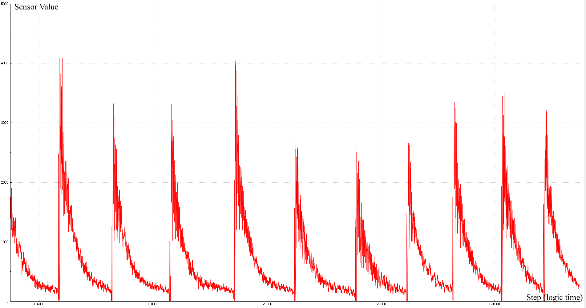
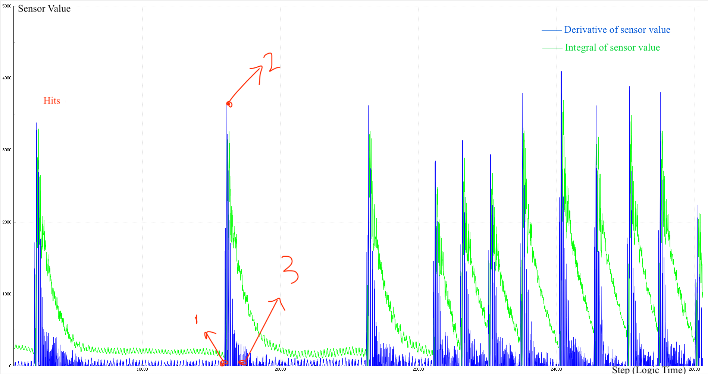
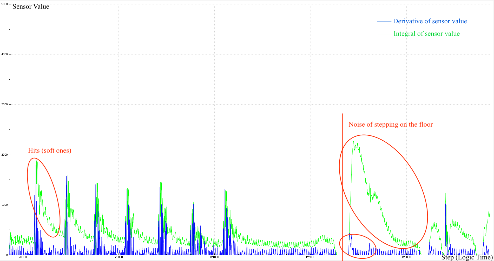

The Drum Transcriber is an IoT device designed by William Cashman and Zhuo Zoey Chen, which captures and translates drum inputs into drum sheet music. In other words, it is able to interpret the drum hits graphically on website. With the WiFi feature, the Drum Transcriber is able to be physically disconnected (no cable) from the server.

## Origin of the Idea

> It was a hot summer afternoon, a girl was practicing drums in the music room all alone. The temperature kept climbing and the girl was soaking wet but she kept going. She swang slower and slower and her brain was turning off. Suddenly, a cool breeze came in. The girl woke up, she hits the drums hard and nice in an upbeat mood. "That is beautiful. Which music did you play?" A sweet voice came from her back, from the kind stranger who brought in the breeze - it was a girl her age with big eyes filled with joy. "Ugh..." she tries to remember but the feeling was gone, "it was a random sparkle and it is gone." The end.

What if the drum girl had something that could record her performance? Would the story be totally different? Those two girls can happily share the music the drum girl played and listen to it over and over again!

This is where the idea of Drum Transcriber came from. An artefact that would save all the sparkles the music creator comes across when they are creating new music. An artefact that would connect people both friends and strangers through music.

## Similar Existing Works

There are some existing works related to musical sound. Some focus on read in and compare the input frequency (could be of instrument or human voice) to the frequency it should be according to the music sheet. They are developed as mobile apps, e.g. [Simple Piano](https://www.joytunes.com/simply-piano) and [Smule](https://www.smule.com/). Smule aims at "Connecting the world through music" - wise people think alike! Another similar work is called [Mogees Vibration Sensor](https://www.kickstarter.com/projects/mogeesplay/mogees). It reads in the vibration of the object it is attached to and transforms that into instrumental sound.

## After the Ideas: Our Artefact - Drum Transcriber

Our work is based on our orginal idea, while referencing some techniques from existing works. We read in sound waves and determine their property but we record the value and convert it into musical note rather than comparing it to a given value. We detect the sound waves by using vibration sensors to analyse the waves rather than converting our input into other form of music.

Drum Transcriber is highly interesting, particularly for music lovers. It is fascinating for professional drummers: you can create your own music while leaving your mind free - don't have to memorize or write down any new bars you created. For people who don't play drum, it is also a fun first time experience of producing your original drum sheet. The Drum Transcriber disconnects you from the world and gives you a free space to create music. It connects you back to real life when you want to, by enabling you to look and share all the music sheets generated by you on the website.

## Design Process

### Simple Ideas

The Drum Transcriber were originally called "Drum Sheet Generator" and then "Music Sheet Generator" because we wanted to use it for all the instruments. The initial decisions we made were:

- Use ESP32 instead the micro-controller built upon STM32F103C8 by Will. The built in WiFi feature of ESP32 is very handy since Will's micro-controller does not have that feature;
- Use vibration sensor or microphone to detect hits.
- Boolean inputs for drum hits according to the value the vibrations sensor returns; Record all the data via microphone and do fourier transform.
- Develop a nice UI which shows the users the music sheets created by themselves and other functionalities such as sharing, commenting, etc.
  (discussed in more details in [week4's blog](https://cs.anu.edu.au/courses/china-study-tour/news/2018/12/16/zoey-week4-blog/))

The most challenging part of this period is that we don't have the actual equipment to do any experiments to confirm our assumptions.

### Actual Implementation

The actual implementation was completed seperately by Will and me. Will implemented the network and UI part and I implemented the physical connection part and the analysing part.

#### Network

The biggest challenge was that we've never built a website or used WiFi transmission before. Six languages we've never learnt before were used in the network development and it was challenging but also fun to learn. In the end we are able to transmit the data via WiFi from the micro-controller to the server via HTTP with security checks for privacy issues.

#### UI

The UI presents the music sheet and enables the user to share with friends online. It has less functionalities than originally planned because we decided to put more effort into wireless connection and transcribing the drum hits.

#### Physical Connection

The position where the sensor is placed is extremely important. When we put the sensor on the surface of the drum, noise will be introduced when we hit the other drums which causes the testing drum to start resonating. This problem is solved when we put the sensor on the frame of the drum, but it also introduces stronger noise from the ground (e.g. the noise of people walking). In the end, we put the sensor at the frame of the drum to avoid the resonating noise as the noise introduced from the ground is more distinguishable.

#### Analysing

We modified [Serial_Plotter](https://gitlab.com/2b-a2/serial-plotter) and plotted the sensor value. From the plot, we used math to analyse the wave.

In order to make the hits more obvious and easy to distinguish from white noise, we choose to process the raw data. By taking the derivative and the integral of the wave we introduced 2-point-hit-detection method(2PHD), 3-point-hit-detection method(3PHD) and 4-point-hit-detection method(4PHD) to detect a wave change of an actual hit on the drum. The analysis is focused on hit detection rather than drum technique distinguishing because the hit detection is the more fundamental problem.

##### 2-point-hit-detection

Register (start) the current hit when both integral and derivative go to 0 (point 1 on the graph) and sets the flags. Record (end) the hit when the derivative goes higher than the integral (point 2 on the graph) and flip both the flags back (the derivative always higher than the integral when there is nothing playing).

##### 3-point-hit-detection

2PHD ends the hit when the peak occurs, while 3PHD adds one extra step at the end to make sure the hit has actually stopped. The extra step checks if integral goes back to be greater than derivative (point 3 on the graph) while derivative goes down and hits the floor.

##### Dealing with Noise

- 4PHD: One extra step was added to 3PHD to pick up the noise by recognising the pattern below. We can see that the integral goes much higher than the derivative when it is a stepping noise compared to when it is a hit. The extra step recognises this fact and reports the 'hit' as noise, recovering all the flags and does not record it as a hit.

- One failed attempt was putting one sensor on the drum and one sensor at the foot of the drum or on the floor, subtracting each other and try to get rid of the noise. It didn't work because the noise level received is different for each of them and by subtracting, it breaks the patterns between integral and derivative, which breaks the algorithm of the detecting hit.

## Evaluate

### Testing and analysing

We tested each technique with 20 hits from soft to hard gradually. With 2PHD, 19 of 20 hits were successfully detected, while 9 of the hard hits were recorded as multiple hits. With 3PHD, 16 of 20 hits were successfully detected, while 2 of the hard hits were recorded as multiple hits. With 4PHD, 1 of 20 hits was successfully detected, while 0 of the hard hits were recorded as multiple hits. 2PHD works fine with soft hits since it is able to correctly capture all the soft hits. However, with the heavy hits, the drum keeps vibrating for much longer and produces a noise by itself. Thus the value comparison of derivative and integral does not work anymore. 3PHD gets rid of this problem and works much better for strong hits than 2PHD, while still works almost as well as 2PHD for soft hits.

We have successfully implemented Drum Transcriber which is able to detect drum hits, transmit via wireless connection to the server and represent the hits in a graphical way. We dealt with the white noise. However, there still exist some problems. 4PHD is too strong and always confuses the logic and tricks it into thinking a normal hit is 'noise'. The other two methodologies of hit detection gets easily interfered when the noise is too loud. The existing works are doing different things from us, so our product is new! Compared to Mogees vibration sensor, we further analyse the wave and observe the trend of the wave. Our Drum Transcriber is also way cheaper! (~$13 while Mogees is $169.00)

## Future work

- (UI) Enable newsfeed, more interactive, more aesthetic.
- (Raw data and analyse) Use microphone to read in sound wave and do fourior transform on it to determine if hit or not.
- (Network/Wireless transmission) Use TCP to transmit the data directly between the micro-controller and the server instead of transmit via HTTP calls.
- (Drum Technique Detection) Rolling can be detected by setting a limit and when the hits per unit time is faster than the limit, then all the hits would be recorded as a roll.
- (Noise Cancellation, sensor) Apply an [active low-pass filter design](http://www.ti.com.cn/cn/lit/an/sloa049b/sloa049b.pdf) on the vibration sensor using operational amplifiers.
- (Noise Cancellation, math) Decrease the strength of 4PHD, or, make the noise filter more general.

## Reflection

The current IoT products are all focusing on collecting as much data as possible and making people's life easier. However, is it as good as it sounds like? The use of IoT enables the people to live a much easier life: click "water the plant" when the IoT tells you the plants needs to be watered, click "turn on the air-con" and the IoT device will turn on the air-con for you ... You rely on technology so much that you don't even do any physical work or go out anymore, you are disconnected from the world and feel even more lonely. Is this what we really want?

The ultimate goal of Drum Transcriber is not only being an IoT device but also an **idea** that motivates people to create new music as well as feel the connection between them and the rest of the world via sharing their own work. We would not say this Drum Transcriber is the final product we would present, but it contains all the frames we built and the ideas we think of, and with this, we want to tell young generation to never stop dreaming and never back off just because you don't have enough experience - we've never touched IoT before and we built this artefact. Always try to do what you want to do immediately, even if the thing you create is not that perfect or it is totally different to what you wanted it to be, just by keep doing it, you will be motivated by your creation, you would learn more through the way and you would create a new art called youth of you.

## Reference

- Simple Piano: https://www.joytunes.com/simply-piano;
- Smule: https://www.smule.com/
- Mogees Vibration Sensor: https://www.kickstarter.com/projects/mogeesplay/mogees
- Serial_Plotter: https://gitlab.com/2b-a2/serial-plotter
- Active low-pass filter design: http://www.ti.com.cn/cn/lit/an/sloa049b/sloa049b.pdf
