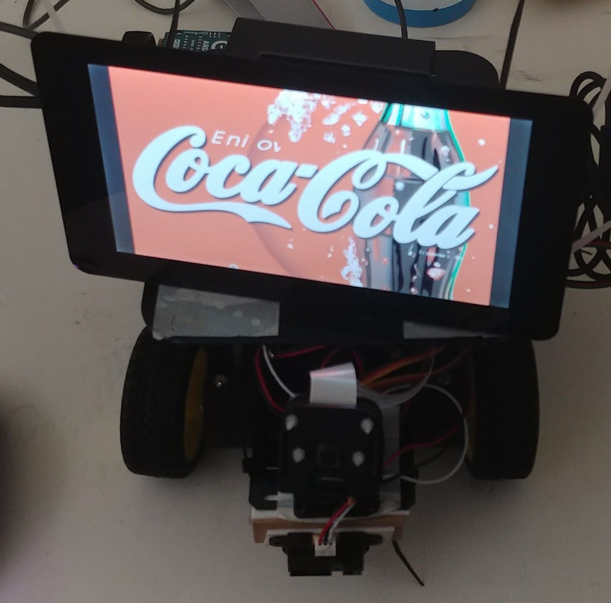
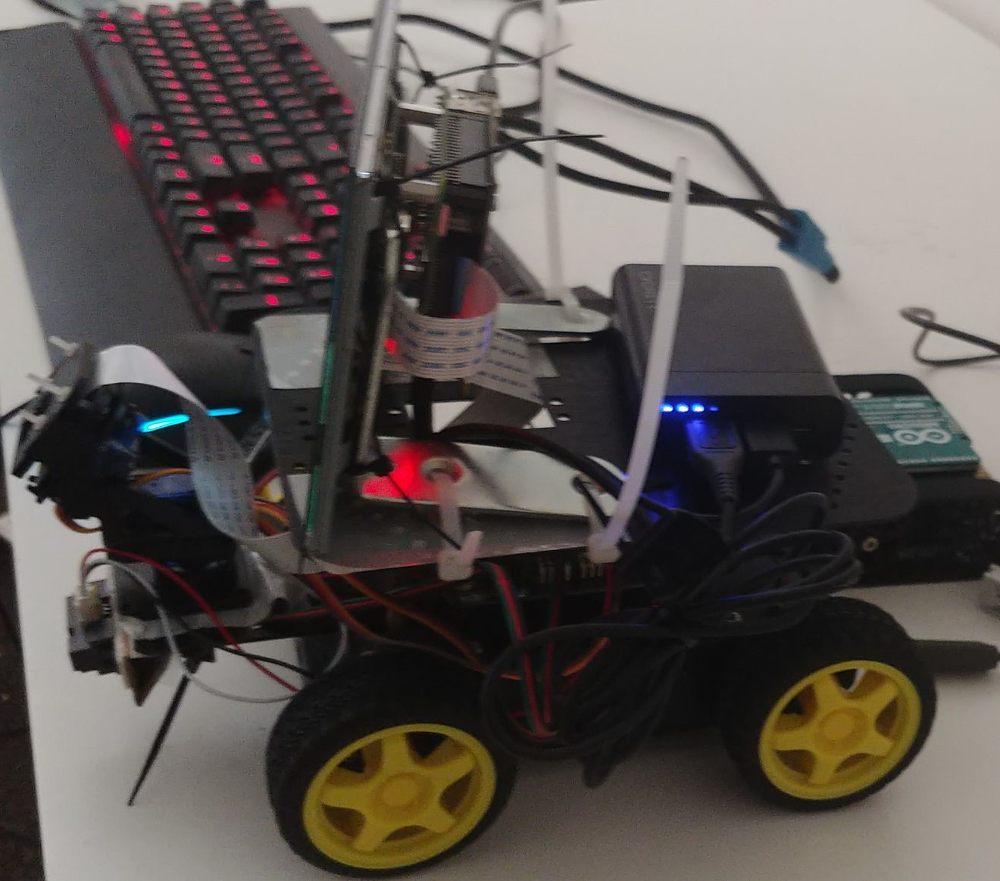
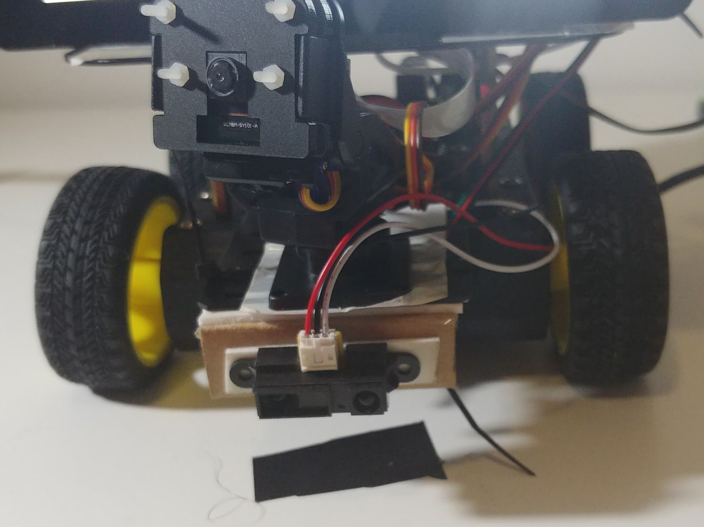

## Nightmare on venv Street

I;m done. Not because I've *finished* the project. Not by a long shot. But because I'm *done*. I'm done with Computer Science. I'm done with Hardware. I'm done with any real world programming. I'm so done that, if I were a Ninja Turtle, I'd be Done-atello

This week I tried to implement the person tracking that was going to be the core of my project. To that end, I amalgamated Pimoroni's [Face Tracking Tutorial](https://learn.pimoroni.com/tutorial/electromechanical/building-a-pan-tilt-face-tracker) into Cocteau. The first issue I faced was getting numpy to work. I don't believe I had mentioned it previously in the blog, but I had been having issues with numpy for weeks now. 

I bought a directional mic (The ReSpeaker 4-Mic Array) for the Raspberry Pi so that I could do some direction of arrival estimation. Now, the libraries they provide depend on numpy, and in spite of having it installed, I would get the error 

``ImportError: numpy.core.multiarray failed to import.``

when I tried to run their Direction of Arrival example. I had tried all the obvious solutions like reinstalling, force reinstalling, installing different versions, [building from source](https://i.imgflip.com/ngmz0.jpg) and so on. None of it worked. I knew it couldn't be my installation, because a script that just consisted of `import numpy` or `from numpy.core import multiarray` (and variants thereof) would work flawlessly. Having no clue what went wrong there, I sidelined that particular direction.

Needless to say, this exact same error popped up again when I needed to use OpenCV for the video. Cue another 24 hours of trouble shooting. Most of it just repeating what I had done previously. Obviously, this made no difference. That is until I accidentally ran the script without sourcing my virtualenv. And viola, my script worked. Well, not worked, but failed due to a different error. run `source ~/venv/cocteau/bin/activate` and then my script, it fails due to the import error. 


I've installed all the dependencies present in the virtualenv in the "normal" environment, and my code still works. Both venv and non-venv have the version of Python. All the venv packages are present in non-venv. I don't see any package present in non-venv that has anything to do with numpy. The only real difference between the two environments is that `python` calls Python 3 outside the venv, and only Python 3 within. It is unlikely that *this* is the cause of the import error. So I have no clue why the code was failing when run in a virtual environment. 

When I was using the Pan and Tilt Hat and just running the example, I did not use virtualenv. I also didn't realise that opencv relies on numpy deep down, so I failed to make that connection when I ran into issues trying Direction of Arrival. 

When I ran the code the last time, all the camera saw was my face and a white wall. So face tracking worked fine in 100p. Which also wasn't very CPU intensive. But testing against a noisier background - it seems to detect faces *everywhere*, making the tracking almost pointless. I had up the resolution to 720p for it to have a low enough false positive rate. But that just hogs all the CPU, leaving little room to do anything. 

After all, As a weird man once said, [It's all about the Pentiums](https://www.youtube.com/watch?v=qpMvS1Q1sos). 

I did modify the code so that it would check only 1 in 10 frames, and that keeps the CPU load at ~90%. But I was already running the code at 1FPS, so that is far too slow. 

## Audio killed the Video Star

Since I couldn't do the video processing I wanted (without resorting to external APIs), I decided to focus on the audio. I adapted the indefinite transcription example in Google's Documentation so that it would use Google's API to transcribe the audio.

It then does sentiment analysis on the transcription. And does some entity identification using Google's API. The code then selects the most interesting entity and looks up an image based on it. The most interesting being defined as the most salient entity that isn't a common object or unknown/others.

If there is no such entity, it just searches the entire string. 

In a real world context, it might work as keyword based auctioning, much like the Google or Facebook ads. If they over hear you mention soft drinks, then Coke or Pepsi or Dr. Pepper might bid on the advertising slot to display their ads[^ads].  

[^ads]: Although, in a realistic situation all the technology might as well not be there, because chances are, Grammarly would just occupy all the slots anyway.

## The Motion Picture

I also wrote some code so that the rover can explore. Originally I had planned for it to be tied into the face tracker, but that isn't happening. So I have written a series of if else statements. 

Like `if on precipie move backwards`. Not the most stellar algorithm, but gets the job done - as long as we are on a flat, plain white surface. One interesting problem I did find was that because I use an IR sensor for precipice detection, it will detect any dark material as a precipice. The light the distance sensing module emits never bounces back. And if I place it on a carpet (and I'm guessing other uneven surfaces), the IR sensor will read random values for whether it is stuck on a precipice or not. Given that the precipice check happens in each `loop()` iteration, the rover just gets stuck in place. 

Another issue is the lack of sensors. Right now, the distance and precipice sensor can only check right infront of them. Works for most things, but I occasionally have to drive in reverse, where it just falls off. 

Something totally dumb that caused issues for me was that even though we have a lot of pin outs on the Arduino, not all of them can be used simultaneously. Specifically, both the M2 Motor controller and a pin I had selected for the Tilt controller map to Pin 7.

So 

```arduino
digitalWrite(7,HIGH)
```

Would affect both the M2 Motor and the tilt module. So when I tested panning and tilting, and driving separately everything was dandy. But the moment I tried to use them together, it went haywire. 

I had aliased the motor and tilt pins, so it took me stupid long to notice my error.

```arduino
int M2 = 7;     //Motor 2
#define TILTPIN 7
```

(Now that I think about it, there was no reason to not `#define M2 7` in the first place, instead of taking up a valuable space with a global variable.)

## Split Personality

The face tracker does work, even if it can only analyse 1 frame every 10 seconds. So I thought I would mix it with my sound code, by simply running the two scripts in parallel. 

But unfortunately when I try to launch each of `panandtilt.py`, that tracks faces, and `audio.py`, that does the listening in a script, by launching a separate thread for each script, it just segfaults. Since I literally found this on the last day (2019-02-22), I did not even attempt to debug this. 

## Real Steel 

I finally finished the build. Instead of relying on prefabricated frames or 3D printing exactly what was needed to put everything together, I took the programmer route and just approximated it with the tools I had on hand, no matter how inappropriate for the task. 

So the Pi-Screen Assembly is zip-tied to a pair of L Brackets, which is then zip-tied onto the top plate of the rover.



In order to create a mounting for the front IR sensor, I literally just folded some cardboard into a triangle, and taped the IR sensor onto it. Before taping the cardboard triangle onto the sensor plate. 

Similarly, I just taped the pan and tilt kit onto the sensor plate, and zip tied the precipice detection sensor to the bottom of the plate. 



# To Infinity and Beyond!

There is a lot of work to do before the artefact is complete, which I also have no plans to do. See the launch post for details. 
