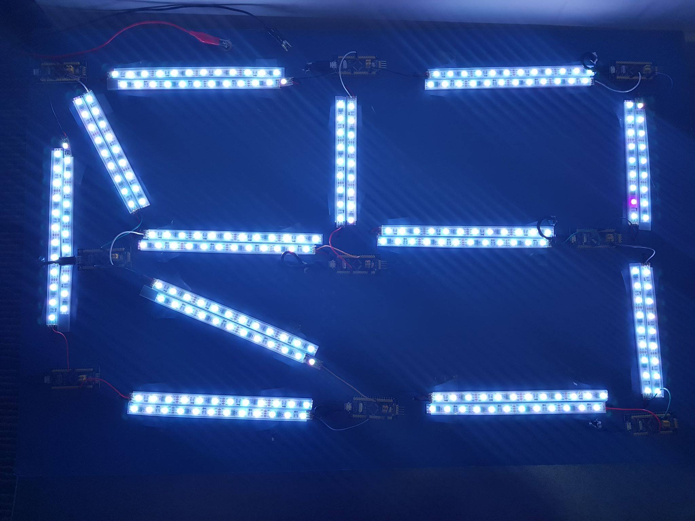

We finally reach the end of the course, and the (formal) development of this artefact. It's been a long ride, with a lot of potholes!

[Here is the final Github Repo](github.com/tztimlee/meshlight)

We're releasing our project code, as-is. It has a long, interesting history. We tried integrating embedded concurrency frameworks, before running into (unavoidable, but unforeseen) shared memory issues when accessing peripherals1. We had to scrap this, and move to an entirely new structure. We crashed into roadblocks of difficult-to-configure clock speeds, and unreliable USART communications.

All in all, it was a fantastic journey, and I learned significantly more than I have in other (gentler, less ambitious) projects & courses. I had to fight for the knowledge, but I have the braincells (and scars) to prove it!

For an explanation on why I pushed this project, and how it was designed,

For an explanation on *why* I did this project, and *what* it's support to signify, please read my [design rationale](https://cs.anu.edu.au/courses/china-study-tour/news/2019/02/18/harrison-turton-design-rationale/).

*Interesting further reading:*

- [Examples of my out-of-control ambitions (feature creep?)](https://cs.anu.edu.au/courses/china-study-tour/news/2019/01/05/harrison-turton-week-6/)
- [Writing Rust on the Discoboard](https://cs.anu.edu.au/courses/china-study-tour/news/2019/11/01/Tim-Rust-Discoboard-guide/)
- [My initial thoughts on IoT, which influenced my project](https://cs.anu.edu.au/courses/china-study-tour/news/2018/11/27/harrison-turton-week-1/)

1 Rust's borrow-checker strikes again!
