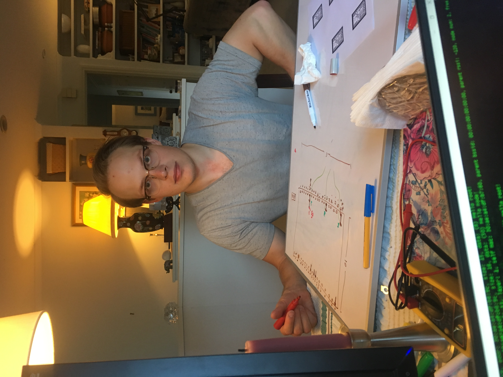

# SoundOut

This week we say goodbye to musical individuality and finally succumb to democratically selected music. As Churchill the great musical critic once said, of the the mediocrity that Democracy provides:

>_"Many forms of Government have been tried, and will be tried in this world of sin and woe. No one pretends that democracy is perfect or all-wise. Indeed it has been said that democracy is the worst form of Government except for all those other forms that have been tried from time to time. ... "_

It has been a fantastic journey these last twelve weeks. From ideating on the crowded Beijing Metro to finally demonstrating our DJ on Friday's exhibition, I have learned alot about IoT and a lot about myself. You can get your hands on the product at our github that has just gone public: [https://github.com/oliverwljohnson/iot-stick](https://github.com/oliverwljohnson/iot-stick).

I'd highly reccommend anyone who wants to get involved to go, fork our repo and try to improve it. I honestly think that it could make for a terrificly fun activity if extrapolated out to a few hundred people. And ESP can support those sort of numbers.

We did have to make some last minute adjustments, we've replaced BLE Mesh with ESP Mesh because of some bugs in the Beta BLE code, but aside from that our artefact remains very close to what we pictured way back in week four.

I'd like to thank David Horsely for being a fantastic support and dedicated partner. I have thoroughly enjoyed the independence of this project, but I doubt it would have been half as enjoyable without him.

I'd also like to thank Ben Swift and Kieren Browne, course convenors, for championing a pedagogy that balances self-driven learning with the support and guidence to fulfill a very satisfying goal. It's been a terriffic course and to any future students reading this I'd highly suggest taking it, if only for the project, let alone the travel.

Please enjoy our artefact, and this picture of David in the middle of a late night of work.

